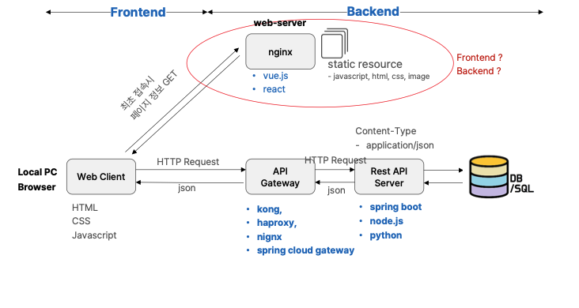
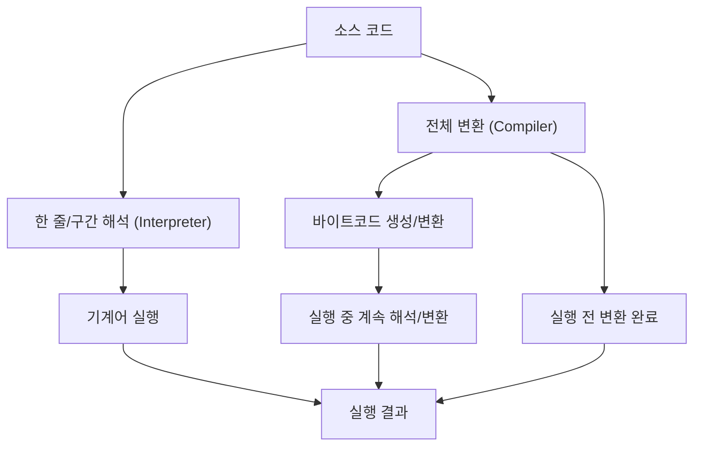
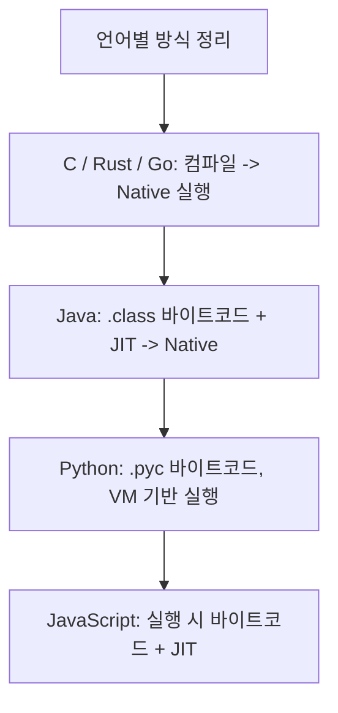
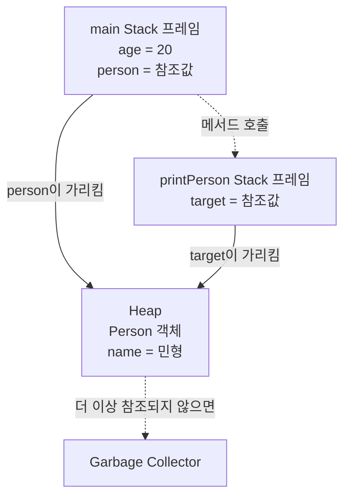
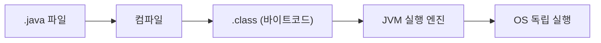

## IP와 Port

통신을 하려면 IP와 포트 정보가 모두 필요합니다.  
네트워크에서 프로세스 통신을 식별하는 기본 식별자는 `IP + PORT`입니다.

|항목|설명|
|---|---|
|IP 주소|인터넷에서 특정 호스트를 식별하는 논리적 주소|
|Port|해당 Host에서 실행 중인 서비스 또는 프로세스를 구분하는 번호|
|예시|`http://168.126.63.42:8080` (`168.126.63.42` = IP, `8080` = Port)|

### Localhost vs 127.0.0.1

동일 호스트 내에서 프로세스 간 통신할 때 사용하는 이름:
`localhost` (도메인 이름), `127.0.0.1` (IP 주소)

### Process와 Port

|구분|값|
|---|---|
|현재 메모리에 로드되어 CPU를 할당받고 실행 중인 예시|예시 실행|
|내부 실행 명령|`python webserver.py`, `npm run dev`, `java -jar ./target/ideoperators-0.0.1-SNAPSHOT.jar`|
|외부 프로세스 간 통신|`172.8.32.9:8080`|
|내부 프로세스 간 통신|`127.0.0.1:8080`, `localhost:8080`|

```bash
python webserver.py
npm run dev
java -jar ./target/ideoperators-0.0.1-SNAPSHOT.jar
```

## Process vs Thread

|항목|프로세스 (Process)|스레드 (Thread)|
|---|---|---|
|정의|실행 중인 프로그램의 인스턴스|프로세스 내에서 실행되는 작업 단위|
|메모리|공간 독립적인 메모리 사용|프로세스의 메모리 공간 공유|
|생성 비용|상대적으로 크고 무겁다|낮고 가볍다|
|통신 방법|IPC(파이프, 소켓 등) 필요|공유 메모리로 비교적 쉽게 통신|
|충돌 영향|다른 프로세스에 영향이 적음|다른 스레드에 영향 가능|
|예시|브라우저, 게임, IDE 등 독립 실행 환경|웹 페이지 렌더링, 백그라운드 다운로드|

한 프로세스 내부에서 여러 스레드를 실행할 수 있습니다.

## Public IP와 Private IP

|구분|설명|
|---|---|
|Public IP|인터넷 전역에서 접근 가능한 IP 주소|
|Private IP|특정 private network 내부에서만 유일하게 사용되는 IP (보통 내부용)|

## Gateway, Router, Load Balancer

|구분|역할|
|---|---|
|Router|네트워크를 연결·확장하여 경로를 만드는 장비. 인터넷은 라우터들의 집합|
|Gateway|서비스/애플리케이션 진입점 역할, 외부 IP를 내부 IP로 연결/변환, 프로토콜 변환, 인증/필터/헤더 처리 등 계층 처리|
|Load Balancer|트래픽을 여러 노드에 분산/배분. 대표적으로 L4, L7 라우팅 역할|

## Frontend / Backend

### Frontend

|구분|내용|
|---|---|
|역할|사용자가 직접 보고 조작하는 UI/UX 영역을 설계·구현|
|구조 작성|HTML을 통해 페이지 뼈대 구성(제목, 단락, 버튼, 이미지 배치)|
|디자인|CSS로 색상, 글꼴, 여백, 애니메이션 처리|
|동작 처리|JavaScript로 클릭/입력/드래그 등 사용자 반응 처리|
|데이터 처리|API 연동 후 백엔드 응답을 화면에 노출|
|UX 개선|빠른 조작 경험을 위한 화면 흐름 최적화|

|구분|예시|
|---|---|
|기본 언어|HTML, CSS, JavaScript|
|프레임워크/라이브러리|React, Vue.js|
|패키지 관리자|npm, yarn|
|빌드 도구|Webpack, Vite|

|용어|의미|
|---|---|
|Endpoint|서비스의 종단점, 경계 지점|

### Back end

|구분|내용|
|---|---|
|역할|프론트엔드 요청 처리, 비즈니스 로직 수행, 응답 반환|
|핵심 기능|서버 운영, DB 연동, API 제공, 보안/권한 관리, 성능 최적화 및 로깅|
|프로그래밍 언어|Java, Python, Node.js, Go, Kotlin|
|프레임워크|Spring Boot, Django, Express, FastAPI|
|데이터베이스|MySQL, PostgreSQL, MongoDB, Redis|
|API 형식|REST API, GraphQL|
|배포 환경|AWS, Docker, Nginx, GitHub Actions|

## 현대적 Frontend/Backend 구조

최초 1회 HTML을 로드한 뒤에는 페이지 전체 새로고침 없이 JavaScript가 동적으로 화면을 바꿉니다(SPA 구조).  
Client side에서 상태와 변수 데이터를 생성·처리하여 화면을 갱신합니다.



## JSON Format

|항목|설명|
|---|---|
|정의|키-값 쌍을 사용하는 경량 데이터 교환 형식|
|특징|언어에 구애받지 않음, 읽기/파싱이 쉬움|
|주요 사용|API 응답, 데이터 저장 및 전송|

### JSON (JavaScript Object Notation)

|요소|설명|
|---|---|
|객체(Object)|`{}`로 묶인 키-값 쌍|
|배열(Array)|`[]`로 묶인 값 목록|
|값(Value)|문자열, 숫자, 객체, 배열, true, false, null|

```json
{
  "name": "John Doe",
  "age": 30,
  "isMarried": false,
  "children": ["Anna", "Ben"],
  "address": {
    "city": "Seoul",
    "zipCode": "12345"
  }
}
```

### YAML Format

|항목|설명|
|---|---|
|정의|YAML은 "YAML Ain't Markup Language"의 약자로, 사람이 읽기 쉽게 설계된 직렬화 형식|
|표현 방식|들여쓰기를 통해 계층 구조 표현|
|특징|JSON보다 간결하고 가독성이 높은 편|
|주석|`#`으로 작성 가능|

```yaml
name: John Doe
age: 30
isMarried: false
children:
  - Anna
  - Ben
address:
  city: Seoul
  zipCode: "12345"
```

### JSON vs YAML

|특징|JSON|YAML|
|---|---|---|
|표현 방식|중괄호 기반의 구조화|들여쓰기 기반의 구조화|
|가독성|딱딱한 편|사람이 읽기 매우 쉬움|
|주석 지원|지원 안 함|`#` 주석 지원|
|사용 사례|API 응답, 데이터 교환|구성/설정 파일|
|파싱 속도|보통 빠름|상대적으로 느릴 수 있음|
|유연성|형식이 엄격함|덜 엄격하고 유연함|

# 좋은 소프트웨어란?

|개념|설명|
|---|---|
|응집도 (Cohesion)|모듈/서비스가 하나의 책임에 집중하는 정도가 높을수록 변경·이해·재사용이 쉬움|
|복잡도 (Complexity)|로직과 아키텍처의 복잡도를 의미, 낮을수록 유지보수와 확장이 용이|
|단독 실행 (Standalone Execution)|시스템의 일부를 독립 실행/테스트할 수 있는 능력. 분산 개발·배포·복구에 유리|
|결합도 (Coupling)|요소 간 의존성. 낮을수록 개별 변경의 영향이 작고 확장 용이|

## 소프트웨어 아키텍처 비교

|기준|Monolith|MSA / Microservice Architecture|
|---|---|---|
|응집도|역할과 책임이 혼재하기 쉬움|기능별 책임 분리가 쉬워 응집도 개선|
|복잡도|로직/아키텍처 복잡도가 높고 통합 부담 큼|서비스 단위 분리로 관리 범위가 명확해짐|
|단독 실행|전체 실행 의존도가 커 테스트가 어려울 수 있음|개별 서비스 단위로 실행/테스트가 상대적으로 용이|
|결합도|변경 시 전체 영향이 큼 (Tightly Coupled)|독립 배포·확장 가능, 변경 영향 범위 제한 (Loosely Coupled)|


---- 여기부터 다듬어야 한다. 

# Java의 역사

## Java 등장 이전의 주요 어려움 (1990년대 초반)

- 플랫폼 종속성 묹제 (OS 하드웨어 의존)
- 메모리 관리의 어려움
- 메모리 직접 접근 및 OS 권한을 가지는 프로그램으로 인한 보안 취약
- 네트워크 / 분산 프로그램 개발의 어려움

## Java의 등장

하드웨어와 OS 중심 개발에서 "플랫폼 독립적, 네트워크 중심, 엔터프라이즈 중심 개발"로 패러다임 전환을 위해 등장

|구분|내용|
|---|---|
|1. 플랫폼 독립성 해결|write once, run anywhere, 소스코드 -> 바이트코드, JVM, 윈도우, Linux, Unix|
|2. 메모리 관리 자동화|Garbage Collection 도입, 개발자가 메모리 해제 신경 쓸 필요 없음, 메모리 누수 감소, 서버 장기 실행에 안정적|
|3. 강력한 보안 모델|포인트 없음, 샌드 박스 실행 모델, 클래스 로딩 시 검증|
|4. 네트워크를 기본 전제로 설계|java.net 패키지 제공, socket, http, URL 추상화, 예외 기반 오류 처리, 웹서버, WAS, 분산 시스템으로 확장|
|5. 대규모 엔터프라이즈 개발에 적합|강제적 OOP, 명확한 타입 시스템, 패키지 구조, 멀티스레딩 표준화, 비동기 처리 기반의 대용량 처리 지원|

```mermaid
flowchart LR
  S0["Java 등장 이전 (1990년대 초반)"]
  S1["플랫폼 종속성 묹제"]
  S2["메모리 관리의 어려움"]
  S3["보안 취약성 (직접 메모리 접근/OS 권한)"]
  S4["네트워크/분산 개발의 어려움"]
  S5["Java의 등장"]
  S6["write once, run anywhere"]
  S7["Garbage Collection"]
  S8["샌드박스 + 클래스 로딩 검증"]
  S9["네트워크 중심 설계 (java.net, socket/http/URL)"]
  S10["대규모 엔터프라이즈에 적합"]

  S0 --> S1 --> S2 --> S3 --> S4 --> S5
  S5 --> S6 --> S7 --> S8 --> S9 --> S10
```



|구분|내용|
|---|---|
|이력|Sun Microsystems의 제임스 고슬링James Gosling과 팀이 가전 제품용 언어 개발 시작|
|인수|2010년 Oracle이 SUN 인수하여, Java의 상품권, 저작권, 브랜드가 Oracle로 이전|

### Java 버전/시스템 정리

|항목|내용|
|---|---|
|1995|Java 1.0 공개 , Write Once, Run Anywhere|
|1998|Java 2 J2SE 1.2 Swing UI 도입, JVM 안정성 강화|
|2018|Java 11 Oracle이 LTS Long Term Support 정책 발표: 6개월마다 새 버전, 3년마다 LTS|
|2025 기준 최신 버전|GA: Java SE 25|
|2025 기준 LTS|Java SE 21|
|SE|standard Edition : 자바 언어의 기준이 되는 표준 플랫폼|
|EE|Enterprise Edition: WAS 같은 기업용 서버의 표준 사양 Jakarta EE로 이전|
|GA|General Availability: 정식 릴리즈. 검증된 안정 버전으로 새로운 기능이나 변경 사항을 포함. 최신 기술을 빠르게 경험하고 싶은 개발자용|
|기타|일반적으로 다음버전까지 6개월 단기 지원 신규 기능이라도 deprecated 될 수 있음|
|LTS|Long Term Support: 장기지원 버전. 몇년간 안정적이고 지속적인 보안/버그 패치, 호환성 검증된 버전이며, 기업, 프로덕션 환경용|

## Interpreter 와 Compiler

소스 코드를 기계가 이해할 수 있는 기계어로 변환 파일을 여기 저기서 바로 실행  
소스 코드를 한 줄(또는 일정 단위)씩 읽어서 해석(interpret) -> 기계어 실행 -> 실행

|구분|특징|
|---|---|
|Compiler|프로그램 전체를 먼저 변환 실행하면서 조금씩 변환|
|Interpreter|실행 전에 완료 실행 중 계속 수행|
|공통점|한 번만 컴파일 실행할 때마다 해석 및 변환|

|항목|내용|
|---|---|
|ByteCode|`.pyc`, `.class`|
|JIT|Just In Time|
|의미|Compiler의 기기 의존 관계 à 컨테이너로 해결|



### 언어 방식/실행 방식 정리

|언어|바이트코드?|JIT?|실행 방식|
|---|---|---|---|
|C|컴파일|X|X Native 실행|
|Rust|컴파일|X|X Native 실행|
|Go|컴파일|X|X Native 실행|
|Java|.class|O|O Bytecode JIT Native|
|Python|.pyc|O|X|
|외부 C/C Lib|호출|Bytecode|Python VM|
|JavaScript|혼합|O|O Bytecode JIT Native|



## 언어별 Position

|역할|언어|
|---|---|
|엔터프라이즈 비즈니스 로직|Java, kotlin|
|클라우드 인프라 / 플랫폼|Go|
|시스템 핵심 / 고성능|Rust|
|AI / 데이터|Python|

## 언어별 Position (중복 정리)

|역할|언어|
|---|---|
|엔터프라이즈 비즈니스 로직|Java, kotlin|
|클라우드 인프라 / 플랫폼|Go|
|시스템 핵심 / 고성능|Rust|
|AI / 데이터|Python|

## Java 프로그램의 구조 자바 둘러보기

|항목|내용|
|---|---|
|클래스 구성|Class를 기본 단위로 구성|
|최소 단위|가장 간단한 자바 프로그램도 최소 하나 이상의 클래스를 포함|

```java
// 패키지 선언 (선택 사항)
package edu.skala;
// 클래스 선언
public class HelloSkala {
// main 메서드 (프로그램의 시작점)
public static void main(String[] args) {
// 실행할 코드 작성
System.out.println("Hello, Skala!");
// 다른 메서드들 (선택 사항)
public void anotherMethod() {
// ...
}
}
}
```

## Java 메모리 구조

Java 프로그램이 실행될 때 메모리는 여러 영역으로 나뉘어 사용됩니다. 그중 초보자가 가장 먼저 이해할 영역은 `Stack`과 `Heap`입니다.

쉽게 비유하면 다음과 같습니다.

|영역|쉬운 비유|주로 저장되는 것|특징|
|---|---|---|---|
|Stack|현재 작업 중인 사람의 책상|메서드의 호출 정보, 지역 변수, 기본형 값, 객체를 가리키는 참조값|메서드가 끝나면 해당 메서드의 공간이 자동으로 정리됨. 스레드마다 별도의 Stack을 가짐|
|Heap|여러 사람이 함께 사용하는 창고|`new`로 만든 객체와 배열|여러 스레드가 공유함. 더 이상 사용하지 않는 객체는 Garbage Collector가 정리함|

### 아주 간단한 예시

```java
class Person {
    String name;
}

public class MemoryExample {
    public static void main(String[] args) {
        int age = 20;
        Person person = new Person();
        person.name = "민형";

        printPerson(person);
    }

    static void printPerson(Person target) {
        System.out.println(target.name);
    }
}
```

위 코드가 실행되는 과정을 순서대로 보면 다음과 같습니다.

1. `main()`이 시작되면 `main`용 Stack 프레임이 만들어집니다.
2. `int age = 20`에서 `age`와 숫자 `20`은 `main` 프레임 안에 저장됩니다.
3. `new Person()`은 Heap에 실제 `Person` 객체를 만듭니다.
4. `person` 변수에는 객체 자체가 아니라 Heap에 있는 객체를 찾아가기 위한 참조값이 저장됩니다.
5. `printPerson(person)`을 호출하면 새로운 `printPerson`용 Stack 프레임이 쌓입니다. 매개변수 `target`도 이 프레임에 저장됩니다.
6. `printPerson()`이 끝나면 `target`이 들어 있던 프레임은 제거됩니다.
7. `main()`까지 끝나고 더 이상 `Person` 객체를 가리키는 변수가 없으면, 해당 객체는 나중에 Garbage Collector의 정리 대상이 됩니다.

즉, `person`은 Stack에 있는 “창고 위치 메모”이고, `new Person()`으로 만들어진 실제 객체는 Heap에 있습니다.



### Stack과 Heap의 차이 기억하기

- 메서드가 호출되면 Stack에 작업 공간이 생기고, 메서드가 끝나면 사라집니다.
- `int`, `double`, `boolean` 같은 기본형 지역 변수는 보통 Stack 프레임에서 바로 관리됩니다.
- `new Person()`, `new int[3]`처럼 만든 객체와 배열은 Heap에 생성됩니다.
- 객체 변수는 객체 그 자체가 아니라 Heap의 객체를 가리키는 참조값을 담습니다.
- Heap의 객체를 더 이상 아무도 사용하지 않으면 Garbage Collector가 정리합니다.

```java
static void example() {
    int number = 10;          // Stack 프레임에 값 저장
    Person p = new Person();  // p는 Stack, 실제 Person 객체는 Heap
} // example()의 Stack 프레임은 제거됨
```

여기서 `example()`이 끝나면 `number`와 `p`는 사라집니다. `p`가 가리키던 `Person` 객체도 다른 곳에서 사용하지 않는다면 Garbage Collector가 나중에 Heap에서 정리할 수 있습니다.

## 자바와 JVM

```text
JVM Java Virtual Machine 자바를 실행하기 위한 가상 머신
Java 어플리케이션은 JVM 위에서 동작하기 때문에 OS에 종속적이지 않음
```

```text
Java 어플리케이션
   ↓
JVM
   ↓
OS Windows, MacOS
   ↓
컴퓨터
```

## Java 파일과 컴파일

|구분|설명|
|---|---|
|.java 파일|소스 코드 파일 개발자가 작성하는 텍스트 기반의 Java 프로그램 소스 코드|
|.class 파일|바이트코드 파일 컴파일 결과물 JVM이 읽고 실행할 수 있는 중간 언어로 변환 플랫폼 독립적|
|JVM|Java Virtual Machine: 실행 엔진 바이트코드class 파일 을 실행하는 가상 머신|


