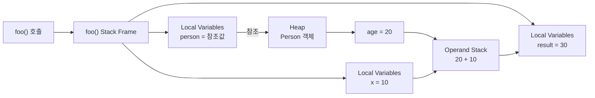
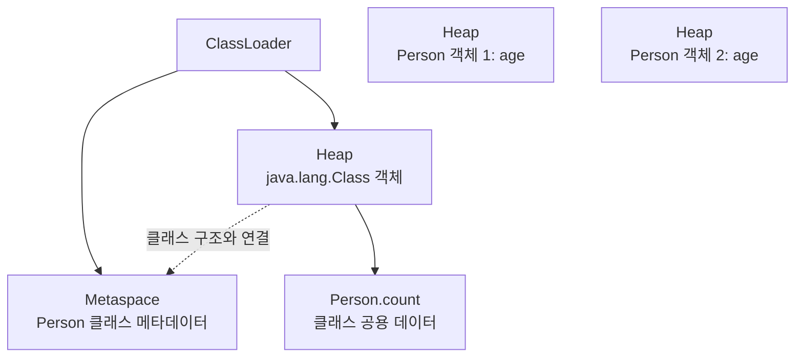

# Java 실행과 JVM Part 2: 메모리와 데이터 흐름

Java 프로그램이 어떻게 실행되는지, 변수와 객체가 메모리에 어떻게 연결되는지, 그리고 문자열과 멀티스레드를 어떻게 다루는지 한 번에 정리한다.

## 1. Java 개발 환경

### 필요한 도구 설치

```bash
brew install jq curl maven gradle node git kubectl
```

### Java 21 설치와 환경 변수 설정

```bash
brew install openjdk@21
java --version
export JAVA_HOME=/opt/homebrew/opt/openjdk@21
```

매번 설정하지 않으려면 `~/.zshrc`에 추가한다.

```bash
echo 'export JAVA_HOME=/opt/homebrew/opt/openjdk@21' >> ~/.zshrc
source ~/.zshrc
```

`JAVA_HOME`은 Java가 설치된 위치를 알려 주는 환경 변수다. 실제 경로는 설치 환경에 따라 다를 수 있으므로 `brew --prefix openjdk@21`로 확인할 수 있다.

## 2. Java 코드가 실행되는 과정

Java는 소스 코드를 바로 실행하지 않는다.

```text
App.java
   │  javac 컴파일
   ▼
App.class  ← JVM이 이해하는 바이트코드
   │  java 실행
   ▼
JVM이 main() 메서드를 찾아 실행
```

```bash
mkdir -p bin
javac -d bin src/App.java
java -cp bin App
```

- `javac`: `.java`를 `.class`로 컴파일한다.
- `-d bin`: 컴파일 결과를 `bin` 폴더에 저장한다.
- `java`: `.class` 파일을 JVM에서 실행한다.
- `-cp bin`: 클래스를 찾을 경로를 지정한다.
- `main()`: Java 애플리케이션의 시작 메서드다.

즉, JVM이 `javac`를 실행하는 것이 아니라 `javac`가 만든 바이트코드를 JVM이 실행한다.

## 3. Java 프로그램의 기본 구조

Java 코드는 보통 클래스 안에 작성한다.

```java
public class HelloSkala {
    public static void main(String[] args) {
        System.out.println("Hello, Skala!");
    }
}
```

- `class`: 데이터와 기능을 묶는 기본 단위다.
- `main`: 프로그램이 시작되는 메서드다.
- `System.out.println`: 콘솔에 값을 출력한다.
- `static`: 객체를 만들지 않아도 클래스에 소속된 형태로 사용할 수 있다는 뜻이다.

## 4. 기본형과 참조형

### 기본형

기본형은 숫자, 문자, 참·거짓처럼 값 자체를 저장하는 타입이다.

| 타입 | 의미 | 크기 |
| --- | --- | --- |
| `byte` | 작은 정수 | 1 byte |
| `short` | 정수 | 2 bytes |
| `int` | 일반적인 정수 | 4 bytes |
| `long` | 큰 정수 | 8 bytes |
| `float` | 실수 | 4 bytes |
| `double` | 정밀한 실수 | 8 bytes |
| `char` | 문자 하나 | 2 bytes |
| `boolean` | `true` 또는 `false` | JVM 구현에 따라 다름 |

### 참조형

참조형 변수는 객체 본체를 직접 담는 것이 아니라, 객체를 가리키는 참조값을 저장한다.

```java
int age = 20;              // age에 값 20 저장
String name = "Skala";     // name에는 String 객체를 가리키는 참조값 저장
int[] scores = {90, 80};   // scores에는 배열 객체를 가리키는 참조값 저장
```

쉽게 말하면 다음과 같다.

```text
name ── 참조값 ──▶ "Skala" String 객체
age  ── 값 20
```

### 주의: 기본값과 지역 변수

- 클래스의 필드에는 선언하지 않아도 기본값이 들어간다. `int`는 `0`, `boolean`은 `false`, 참조형은 `null`이다.
- 메서드 안의 지역 변수는 자동으로 기본값이 들어가지 않는다. 사용하기 전에 반드시 값을 대입해야 한다.

## 5. JVM 메모리 구조

메모리를 설명할 때 자주 등장하는 영역은 Stack, Heap, Metaspace다.

### Stack

메서드가 호출될 때마다 해당 메서드의 Stack Frame이 만들어진다. 메서드가 끝나면 Frame도 사라진다.

Stack Frame에는 다음과 같은 정보가 들어간다.

- `Local Variables`: 지역 변수와 매개변수
- `Operand Stack`: 바이트코드 연산에 잠시 사용하는 값
- 반환 주소 등 메서드 실행에 필요한 정보

### Heap

`new`로 만든 객체와 배열의 본체가 저장되는 영역이다. 객체는 메서드가 끝난 뒤에도 다른 곳에서 참조하고 있다면 계속 살아 있을 수 있다. 더 이상 참조되지 않는 객체는 Garbage Collector가 정리한다.

### Metaspace

클래스의 이름, 메서드 정보, 필드 정보, 바이트코드 등 클래스 구조에 대한 메타데이터가 저장되는 영역이다.

`java.lang.Class` 객체도 Heap에 존재하며, Metaspace의 클래스 메타데이터와 연결되어 있다고 이해하면 된다.

## 6. 코드로 보는 데이터 흐름

다음 코드를 기준으로 각 값의 위치를 살펴보자.

```java
class Person {
    static int count;
    int age = 20;
}

void foo() {
    int x = 10;
    Person person = new Person();
    int result = person.age + x;
}
```

### 실행 순서

1. `foo()`가 호출되면 `foo()` 전용 Stack Frame이 만들어진다.
2. `int x = 10`의 `x`는 Local Variables 영역에 값 `10`으로 저장된다.
3. `new Person()`이 Heap에 `Person` 객체를 만든다.
4. `person`은 Stack에 저장되고, Heap 객체를 가리키는 참조값을 가진다.
5. `person.age`의 `20`과 `x`의 `10`이 Operand Stack으로 전달되어 계산된다.
6. 계산 결과 `30`이 지역 변수 `result`에 저장된다.
7. `foo()`가 끝나면 `x`, `person`, `result`가 들어 있던 Stack Frame은 사라진다.



### 핵심 정리

```text
person ─────────────▶ Heap의 Person 객체
  Stack                  age = 20

x = 10 ──┐
age = 20 ─┴─▶ Operand Stack에서 20 + 10 계산
                    │
                    ▼
              result = 30
```

- `person`: Stack의 지역 변수 슬롯에 참조값이 저장된다.
- `new Person()`: Heap에 객체 본체가 만들어진다.
- `age`: Person 객체의 인스턴스 필드이므로 Heap 객체 안에 저장된다.
- `x`, `result`: 메서드의 지역 변수이므로 해당 Stack Frame의 Local Variables에 저장된다.
- 연산 중간값: Operand Stack을 사용한다.

### `static` 필드는 어디에 있을까?

```java
class Person {
    static int count;
    int age;
}
```

`age`는 각 객체마다 따로 존재하지만, `count`는 Person 클래스 전체가 하나만 공유한다.



- 인스턴스 필드 `age`는 객체마다 Heap에 하나씩 생긴다.
- `static` 필드 `count`는 객체가 아니라 클래스에 소속되며 모든 인스턴스가 공유한다.
- 정확한 물리적 위치와 구현 방식은 JVM에 따라 다를 수 있다. 따라서 `static` 필드를 무조건 “Heap의 `Class` 객체 안에 있다”고 단정하기보다, “클래스 단위로 관리되고 클래스 메타데이터와 연결된다”고 이해하는 편이 안전하다.

## 7. 변수 저장 위치를 판단하는 방법

“기본형은 Stack, 참조형은 Heap”이라고 외우면 틀릴 수 있다. 변수의 종류와 실행 위치를 함께 봐야 한다.

| 코드 | 무엇인가? | 쉽게 이해하면 |
| --- | --- | --- |
| `int x = 10` in method | 지역 기본형 변수 | Stack Frame에 값 저장 |
| `Person person` in method | 지역 참조형 변수 | Stack Frame에 참조값 저장 |
| `new Person()` | 객체 본체 | Heap에 저장 |
| `int age` in `Person` | 인스턴스 필드 | Heap 객체 안에 저장 |
| `static int count` | 클래스 필드 | 클래스 단위로 공유 |

예를 들어 다음 코드에서 `score`는 지역 변수가 아니라 인스턴스 필드다.

```java
class Student {
    int score = 100;
    String name = "Min";
}
```

`Student student = new Student()`로 객체를 만들면 `score`와 `name`은 Student Heap 객체의 일부가 된다. 반대로 `void study() { int minutes = 30; }`의 `minutes`는 메서드의 지역 변수이므로 Stack Frame에서 관리된다.

## 8. 불변 객체와 Wrapper 클래스

### 불변 객체

불변 객체는 생성된 뒤 내부 값을 바꿀 수 없는 객체다. 대표적으로 `String`, `Integer`, `Long`, `Double`, `Character`, `Boolean`이 있다.

```java
String text = "Java";
text = text + "!";
```

위 코드는 기존 String 객체에 `!`를 붙이는 것이 아니다. `"Java!"`라는 새로운 String 객체를 만들고 `text`가 새 객체를 가리키게 된다.

### Wrapper 클래스와 오토박싱

Wrapper 클래스는 기본형을 객체처럼 사용할 수 있게 감싼 클래스다.

```java
Integer number = 10; // int 10이 Integer 객체로 자동 변환
number = number + 1;  // 값을 바꾸는 대신 새 Integer 객체를 가리킴
```

컬렉션은 객체만 저장할 수 있으므로 다음처럼 Wrapper 클래스를 사용한다.

```java
List<Integer> scores = new ArrayList<>();
scores.add(100);
```

## 9. StringBuilder와 StringBuffer

String은 불변이므로 문자열을 반복해서 더하면 중간 객체가 많이 만들어질 수 있다. 이때 문자열을 수정할 수 있는 버퍼를 사용한다.

| 구분 | `StringBuilder` | `StringBuffer` |
| --- | --- | --- |
| 문자열 수정 | 가능 | 가능 |
| 동기화 | 하지 않음 | 메서드에 동기화 적용 |
| 일반적인 속도 | 빠름 | 상대적으로 느림 |
| 사용 상황 | 대부분의 단일 스레드 코드 | 여러 스레드가 같은 버퍼를 공유하는 경우 |

```java
StringBuilder builder = new StringBuilder();
builder.append("Hello").append(" ").append("Java");
String result = builder.toString();
```

실무에서는 공유하지 않는 문자열 조립에는 보통 `StringBuilder`를 사용한다. 여러 스레드가 하나의 버퍼를 직접 공유해야 하고 동기화가 필요하다면 `StringBuffer`를 고려한다.

## 10. `synchronized`와 공유 자원

여러 스레드가 같은 값을 동시에 수정하면 실행 순서에 따라 결과가 달라질 수 있다. 이런 문제가 발생하는 코드를 임계 영역이라고 한다.

```java
class BankAccount {
    private int balance = 1000;

    public synchronized void withdraw(int amount) {
        if (balance >= amount) {
            balance -= amount;
            System.out.println("출금 성공: " + amount);
        } else {
            System.out.println("잔액 부족");
        }
    }
}
```

`withdraw()`에 `synchronized`를 붙이면 같은 계좌 객체를 대상으로 한 출금 메서드 실행에 한 번에 한 스레드만 들어간다. 따라서 잔액 확인과 차감이 중간에 끊기지 않도록 보호할 수 있다.

다만 `synchronized`는 모든 문제를 자동으로 해결하는 기능은 아니다. 어떤 객체를 잠그는지, 여러 메서드가 같은 공유 자원을 다루는지까지 함께 확인해야 한다.

## 11. 마지막 요약

```text
소스 코드(.java)
      │ javac
      ▼
바이트코드(.class)
      │ JVM 실행
      ▼
┌────────────────────────────────────┐
│ Stack      : 메서드 실행, 지역 변수   │
│ Heap       : 객체와 배열의 본체       │
│ Metaspace  : 클래스 구조 정보         │
└────────────────────────────────────┘
```

- 기본형과 참조형은 “무조건 Stack과 Heap”으로 나누지 말고, 지역 변수인지 필드인지 먼저 확인한다.
- 지역 변수는 Stack Frame에서 관리되는 경우가 많다.
- 객체와 배열의 본체는 Heap에 저장된다.
- 참조형 지역 변수에는 객체 자체가 아니라 객체를 가리키는 참조값이 저장된다.
- 인스턴스 필드는 객체마다 존재하고, `static` 필드는 클래스 전체가 공유한다.
- 메서드 내부 계산에는 Operand Stack이 사용된다.
- 더 이상 참조되지 않는 Heap 객체는 Garbage Collector가 회수한다.
