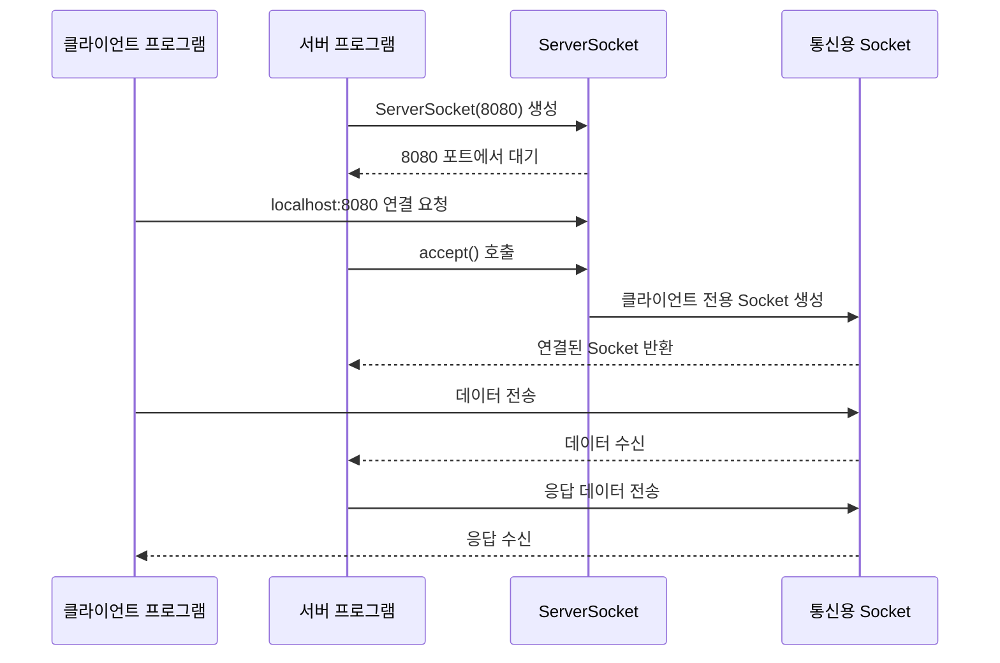
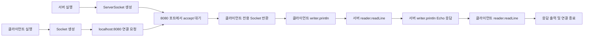
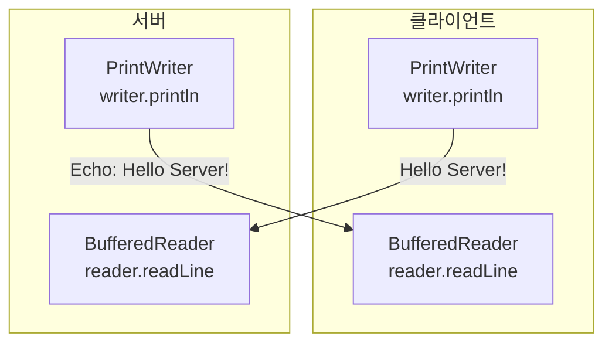

## Socket이란 무엇인가

소켓(Socket)은 프로그램이 네트워크를 통해 다른 프로그램과 데이터를 주고받을 수 있게 해주는 통신 창구입니다.

쉽게 말하면 다음과 같습니다.

> IP 주소가 건물의 주소라면, 포트 번호는 건물 안의 특정 방 번호이고, 소켓은 그 방에서 실제로 대화하기 위한 연결 통로입니다.

### 공부에 필요한 핵심 용어

| 용어 | 정의 | 쉬운 예시 |
|---|---|---|
| 네트워크 | 여러 컴퓨터가 데이터를 주고받는 연결 환경 | 내 컴퓨터에서 다른 컴퓨터의 웹 사이트에 접속하는 것 |
| 호스트(Host) | 네트워크에 연결되어 통신하는 컴퓨터나 장치 | 내 노트북, 웹 서버, 스마트폰 |
| 클라이언트(Client) | 서비스를 요청하고 사용하는 프로그램 | 웹 브라우저, 채팅 앱 |
| 서버(Server) | 클라이언트의 요청을 기다리고 서비스를 제공하는 프로그램 | 웹 서버, 채팅 서버 |
| IP 주소 | 네트워크에서 컴퓨터를 식별하는 주소 | `192.168.0.10`, `127.0.0.1` |
| `localhost` | 현재 사용 중인 컴퓨터를 가리키는 이름 | 내 컴퓨터에서 실행한 서버에 접속할 때 사용 |
| 포트(Port) | 한 컴퓨터 안에서 통신할 프로그램을 구분하는 번호 | `8080` 포트에서 실행 중인 서버 |
| 프로토콜(Protocol) | 통신할 때 지켜야 하는 약속 | 데이터를 어떤 순서와 형식으로 주고받을지 정하는 규칙 |
| TCP | 연결을 먼저 만들고, 데이터의 순서와 전달을 확인하는 통신 방식 | 상대방에게 메시지가 정확히 도착해야 하는 채팅 |
| UDP | 연결 과정 없이 빠르게 데이터를 보내는 통신 방식 | 약간의 손실보다 빠른 전송이 중요한 실시간 영상 |
| 소켓(Socket) | 두 프로그램 사이의 통신 연결을 표현하는 객체 또는 통신 끝점 | 서버와 클라이언트가 메시지를 주고받는 통로 |
| 서버 소켓(ServerSocket) | 서버가 특정 포트에서 클라이언트 연결을 기다리기 위한 객체 | 식당 입구에서 손님을 기다리는 직원 |
| 스트림(Stream) | 데이터를 순서대로 읽거나 쓰는 통로 | 물이 흐르듯 바이트나 문자가 차례대로 이동하는 통로 |
| 바이트(Byte) | 컴퓨터가 데이터를 처리하는 기본 단위 중 하나 | 문자나 파일을 네트워크로 전송할 때의 데이터 단위 |
| 바인딩(Binding) | 서버 소켓을 특정 포트에 연결하는 것 | 서버가 `8080`번 방을 사용하겠다고 예약하는 것 |
| 리스닝(Listening) | 서버가 클라이언트의 연결 요청을 기다리는 상태 | 식당이 손님을 받을 준비를 하고 있는 상태 |
| `accept()` | 연결 요청을 기다리다가 연결되면 통신용 소켓을 반환하는 메서드 | 대기 중인 손님을 맞이해 자리를 안내하는 동작 |
| 파일 디스크립터 | 운영체제가 소켓 같은 입출력 자원에 부여하는 식별 번호 | 운영체제가 열린 통신 통로를 관리하기 위한 번호 |

### 소켓 통신에 사용되는 주소

소켓 연결은 보통 다음 세 가지 정보로 대상을 구분합니다.

```text
프로토콜 + IP 주소(또는 호스트 이름) + 포트 번호

TCP + localhost + 8080
```

예를 들어 `localhost:8080`은 현재 컴퓨터의 `8080`번 포트에서 기다리는 프로그램을 의미합니다.

| 구성 요소 | 역할 | 예시 |
|---|---|---|
| 프로토콜 | 통신 규칙을 결정 | TCP |
| 호스트 주소 | 어느 컴퓨터에 연결할지 결정 | `localhost`, `192.168.0.10` |
| 포트 번호 | 그 컴퓨터의 어느 프로그램에 연결할지 결정 | `8080` |

### 클라이언트와 서버의 연결 구조

서버는 먼저 서버 소켓을 만들고 특정 포트에서 연결 요청을 기다립니다. 클라이언트가 연결을 요청하면 서버의 `accept()`가 통신용 소켓을 반환합니다.

중요한 점은 `ServerSocket`과 `Socket`의 역할이 다르다는 것입니다.

- `ServerSocket`: 새로운 클라이언트의 연결 요청을 기다립니다.
- `Socket`: 연결이 완료된 클라이언트와 실제 데이터를 주고받습니다.



### Java에서 사용하는 주요 클래스

#### `InetAddress`

`java.net.InetAddress`는 호스트 이름과 IP 주소 정보를 표현하는 클래스입니다. 도메인 이름을 IP 주소로 바꾸거나 현재 컴퓨터의 주소를 확인할 때 사용합니다.

| 메서드 | 기능 | 쉬운 예시 |
|---|---|---|
| `InetAddress.getByName(host)` | 호스트 이름을 조회해 `InetAddress` 객체 반환 | `localhost`의 IP 주소 확인 |
| `InetAddress.getLocalHost()` | 현재 컴퓨터의 호스트 정보 반환 | 내 컴퓨터 이름과 IP 확인 |
| `getHostAddress()` | IP 주소를 문자열로 반환 | `127.0.0.1` 출력 |
| `getHostName()` | 호스트 이름을 문자열로 반환 | `localhost` 출력 |

#### `Socket`

`java.net.Socket`은 TCP 클라이언트가 서버와 연결된 뒤 데이터를 주고받는 통신용 객체입니다.

| 생성자 또는 메서드 | 기능 |
|---|---|
| `new Socket(host, port)` | 지정한 호스트와 포트에 TCP 연결 요청 |
| `getInputStream()` | 서버에서 클라이언트로 들어오는 데이터 읽기 |
| `getOutputStream()` | 클라이언트에서 서버로 나가는 데이터 쓰기 |
| `close()` | 소켓 연결 종료 |

#### `ServerSocket`

`java.net.ServerSocket`은 TCP 서버가 특정 포트에서 클라이언트 연결을 기다릴 때 사용하는 객체입니다.

| 생성자 또는 메서드 | 기능 |
|---|---|
| `new ServerSocket(port)` | 지정한 포트에 서버 소켓을 열고 연결을 받을 준비 |
| `accept()` | 클라이언트 연결을 기다리고, 연결되면 `Socket` 반환 |
| `close()` | 서버 소켓을 닫고 새로운 연결을 받지 않음 |

### Java TCP 에코 서버 예제

에코 서버는 클라이언트가 보낸 메시지를 그대로 다시 돌려주는 서버입니다.

#### 서버 코드: `SimpleEchoServer.java`

```java
import java.io.BufferedReader;
import java.io.IOException;
import java.io.InputStreamReader;
import java.io.PrintWriter;
import java.net.ServerSocket;
import java.net.Socket;

public class SimpleEchoServer {
    public static void main(String[] args) throws IOException {
        int port = 8080;

        // ServerSocket: 서버가 클라이언트 연결을 기다리는 객체
        // 8080 포트를 사용하겠다고 운영체제에 등록한다.
        try (ServerSocket serverSocket = new ServerSocket(port)) {
            System.out.println("Echo Server started on port " + port);

            // 여러 클라이언트의 접속을 계속 기다린다.
            while (true) {
                // accept(): 클라이언트 연결 요청이 올 때까지 대기한다.
                // 연결되면 해당 클라이언트와 통신할 Socket을 반환한다.
                try (Socket clientSocket = serverSocket.accept();
                     // InputStream: 클라이언트가 보낸 바이트 데이터를 받는 통로
                     BufferedReader reader = new BufferedReader(
                         new InputStreamReader(clientSocket.getInputStream()));
                     // OutputStream: 클라이언트로 데이터를 보내는 통로
                     PrintWriter writer = new PrintWriter(
                         clientSocket.getOutputStream(), true)) {

                    System.out.println("Client connected: "
                        + clientSocket.getInetAddress());

                    // readLine(): 클라이언트가 보낸 한 줄을 읽는다.
                    String message = reader.readLine();
                    System.out.println("Received: " + message);

                    // println(): 메시지를 전송하고 줄바꿈까지 보낸다.
                    // true 옵션 덕분에 출력 버퍼를 즉시 비운다(auto-flush).
                    writer.println("Echo: " + message);
                }
                // try-with-resources가 끝나면 clientSocket도 자동으로 닫힌다.
            }
        }
    }
}
```

#### 클라이언트 코드: `SimpleEchoClient.java`

```java
import java.io.BufferedReader;
import java.io.IOException;
import java.io.InputStreamReader;
import java.io.PrintWriter;
import java.net.Socket;

public class SimpleEchoClient {
    public static void main(String[] args) throws IOException {
        String host = "localhost";
        int port = 8080;

        // Socket: 서버의 host와 port에 TCP 연결을 요청하는 객체
        // localhost는 현재 컴퓨터를 의미한다.
        try (Socket socket = new Socket(host, port);
             // 서버에서 오는 데이터를 읽는 입력 통로
             BufferedReader reader = new BufferedReader(
                 new InputStreamReader(socket.getInputStream()));
             // 서버로 데이터를 보내는 출력 통로
             PrintWriter writer = new PrintWriter(
                 socket.getOutputStream(), true)) {

            // println(): 서버로 한 줄의 메시지를 전송한다.
            writer.println("Hello Server!");

            // readLine(): 서버가 보낸 에코 응답을 한 줄 읽는다.
            String response = reader.readLine();
            System.out.println("Response: " + response);
        }
        // try-with-resources가 끝나면 소켓과 스트림이 자동으로 닫힌다.
    }
}
```

### 코드 실행 흐름

서버와 클라이언트는 각각 별도의 터미널에서 실행해야 합니다.



#### 실행 명령

먼저 두 Java 파일을 같은 폴더에 저장하고 컴파일합니다.

```bash
javac SimpleEchoServer.java SimpleEchoClient.java
```

첫 번째 터미널에서 서버를 실행합니다.

```bash
java SimpleEchoServer
```

두 번째 터미널에서 클라이언트를 실행합니다.

```bash
java SimpleEchoClient
```

#### 예상 결과

서버 터미널:

```text
Echo Server started on port 8080
Client connected: /127.0.0.1
Received: Hello Server!
```

클라이언트 터미널:

```text
Response: Echo: Hello Server!
```

### 코드에서 데이터가 이동하는 방향



### 실행 순서 요약

| 순서 | 실행 주체 | 동작 |
|---:|---|---|
| 1 | 서버 | `ServerSocket`으로 `8080` 포트를 연다 |
| 2 | 서버 | `accept()`로 클라이언트 연결을 기다린다 |
| 3 | 클라이언트 | `Socket`으로 `localhost:8080`에 연결한다 |
| 4 | 서버 | 연결된 클라이언트 전용 `Socket`을 얻는다 |
| 5 | 클라이언트 | `writer.println()`으로 메시지를 보낸다 |
| 6 | 서버 | `reader.readLine()`으로 메시지를 읽는다 |
| 7 | 서버 | `Echo:`를 붙여 응답을 보낸다 |
| 8 | 클라이언트 | 응답을 읽고 화면에 출력한다 |
| 9 | 양쪽 | 스트림과 소켓을 닫는다 |

### 정리

- 서버는 `ServerSocket`으로 연결 요청을 기다립니다.
- 클라이언트는 `Socket`으로 서버에 연결합니다.
- 서버의 `accept()`는 실제 통신에 사용할 새로운 `Socket`을 반환합니다.
- `InputStream` 계열 객체는 데이터를 읽고, `OutputStream` 계열 객체는 데이터를 씁니다.
- `try-with-resources`를 사용하면 통신이 끝난 뒤 소켓과 스트림을 자동으로 닫을 수 있습니다.
