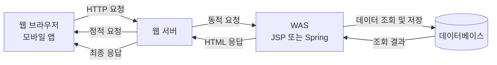
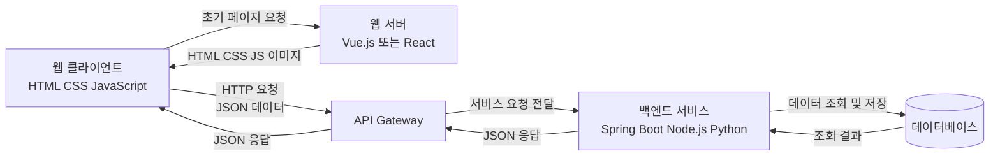

# 웹 애플리케이션

웹 애플리케이션은 클라이언트와 서버가 HTTP와 같은 통신 규칙을 사용해 데이터를 주고받으며 동작하는 프로그램입니다. 일반적으로 웹 브라우저나 모바일 앱을 통해 이용합니다.

| 구분 | 설명 | 예시 |
|---|---|---|
| 클라이언트 | 서버에 요청을 보내고 응답을 받아 사용자에게 보여주는 프로그램 | 웹 브라우저, 모바일 앱 |
| 프론트엔드 | 사용자가 직접 보고 조작하는 화면 영역 | HTML, CSS, JavaScript, Angular, React, Vue.js |
| 서버 | 클라이언트의 요청을 처리하고 결과를 응답하는 프로그램 | Java, Node.js, Python으로 구현한 애플리케이션 |
| 백엔드 | 인증, 비즈니스 로직, 데이터 처리를 담당하는 서버 영역 | Spring Boot, Express, Django |

## 웹 애플리케이션의 주요 개념

| 개념 | 정의 | 쉬운 예시 |
|---|---|---|
| 웹 애플리케이션 | 네트워크를 통해 사용자가 기능을 이용하는 프로그램 | 쇼핑몰, 게시판, 은행 사이트 |
| 웹 클라이언트 | 서버에 요청을 보내는 사용자 측 프로그램 | 웹 브라우저, 모바일 앱 |
| 웹 서버 | 정적 리소스를 제공하거나 요청을 다른 서버로 전달하는 서버 | HTML, CSS, JavaScript, 이미지 제공 |
| 정적 리소스 | 미리 만들어져 있어 요청이 와도 내용이 크게 바뀌지 않는 파일 | HTML, CSS, JavaScript, 이미지 |
| WAS | 프로그램 로직을 실행하고 동적인 응답을 만드는 서버 | JSP, Spring, Node.js 애플리케이션 실행 |
| 데이터베이스(DB) | 애플리케이션이 사용하는 데이터를 저장하고 관리하는 시스템 | 회원, 상품, 주문 정보 저장 |
| SQL | 데이터베이스의 데이터를 조회하거나 변경하기 위한 언어 | 회원 조회, 상품 등록, 주문 수정 |
| HTTP 요청(Request) | 클라이언트가 서버에 보내는 메시지 | 로그인, 상품 조회 요청 |
| HTTP 응답(Response) | 서버가 요청을 처리한 뒤 클라이언트에 보내는 메시지 | HTML, JSON, 상태 코드 반환 |
| Content-Type | 메시지 본문에 담긴 데이터의 형식을 알려주는 HTTP 헤더 | `text/html`, `application/json` |
| API | 서로 다른 프로그램이 정해진 방식으로 기능과 데이터를 사용할 수 있게 만든 접점 | 사용자 목록을 반환하는 서버 기능 |
| API Gateway | 여러 백엔드 서비스로 요청을 전달하는 공통 진입점 | Kong, Nginx, Spring Cloud Gateway |
| 모놀리식 아키텍처 | 여러 기능이 하나의 애플리케이션으로 구성된 구조 | 회원, 주문, 결제가 하나의 애플리케이션에 포함 |
| 마이크로서비스 아키텍처 | 애플리케이션을 여러 개의 작은 서비스로 나눈 구조 | 회원 서비스, 주문 서비스, 결제 서비스 분리 |

> REST API는 API를 설계하는 방식이고, 마이크로서비스는 애플리케이션을 나누는 구조입니다. 따라서 모놀리식 애플리케이션도 REST API를 제공할 수 있습니다.

## 모놀리식 웹 애플리케이션 구조

모놀리식 구조에서는 여러 기능이 하나의 애플리케이션 안에 함께 구성됩니다. 서버가 HTML을 만들어 응답하는 서버 사이드 렌더링 방식이 자주 사용됩니다.



### 동작 흐름

| 순서 | 과정 |
|---:|---|
| 1 | 사용자가 웹 브라우저에서 웹 페이지를 요청합니다. |
| 2 | 웹 서버가 HTML, CSS, 이미지 같은 정적 리소스를 제공하거나 요청을 WAS로 전달합니다. |
| 3 | WAS가 필요한 경우 데이터베이스에서 데이터를 조회하거나 저장합니다. |
| 4 | WAS가 HTML 형태의 결과를 만들어 웹 서버에 전달합니다. |
| 5 | 웹 서버가 최종 HTML 응답을 브라우저에 전달합니다. |

## REST API 기반 애플리케이션 구조

REST API 기반 애플리케이션에서는 클라이언트가 서버에 JSON과 같은 표현 형식으로 데이터를 요청하고 응답받습니다. 클라이언트는 받은 데이터를 이용해 화면을 구성할 수 있습니다.



### 동작 흐름

| 순서 | 과정 |
|---:|---|
| 1 | 웹 클라이언트가 웹 서버에서 화면에 필요한 정적 파일을 받습니다. |
| 2 | 사용자가 버튼을 누르면 클라이언트가 API Gateway 또는 백엔드 API에 HTTP 요청을 보냅니다. |
| 3 | API Gateway가 요청을 적절한 백엔드 서비스로 전달합니다. |
| 4 | 백엔드 서비스가 데이터베이스에서 데이터를 조회하거나 저장합니다. |
| 5 | 백엔드 서비스가 JSON 형식으로 처리 결과를 반환합니다. |
| 6 | 웹 클라이언트가 JSON 데이터를 이용해 화면을 변경합니다. |

# REST란?

REST는 **Representational State Transfer**의 줄임말입니다. 웹의 자원을 URI로 식별하고, HTTP 메서드로 자원에 수행할 작업을 표현하며, JSON이나 XML 같은 표현 형식으로 데이터를 주고받는 설계 방식입니다.

REST 자체는 특정 프로그래밍 언어나 프레임워크가 아닙니다. Spring Boot, Node.js, Django 등 어떤 기술로도 REST API를 만들 수 있습니다.

## REST의 핵심 요소

| 요소 | 질문 | 설명 | 예시 |
|---|---|---|---|
| Resource | 무엇을 다룰 것인가? | 서버가 제공하고 클라이언트가 조작하는 자원 | 사용자, 상품, 주문 |
| URI | 자원을 어디에서 식별하는가? | 자원을 고유하게 나타내는 주소 | `/users/10` |
| HTTP Method | 무엇을 할 것인가? | 조회, 생성, 수정, 삭제 등의 행위를 표현 | `GET`, `POST`, `PUT`, `DELETE` |
| Representation | 어떤 형식으로 주고받는가? | 자원을 표현한 데이터 형식 | JSON, XML, HTML, 이미지 |

## Resource: 자원

리소스(Resource)는 서버가 제공하고 클라이언트가 조작할 수 있는 대상입니다. 데이터 그 자체라기보다 데이터가 의미하는 개념을 자원으로 봅니다.

REST에서는 자원을 보통 명사로 표현합니다.

```text
User
Product
Article
Order
Review
Image
SensorData
```

예를 들어 사용자를 조회할 때 자원은 `User`이고, 주문을 생성할 때 자원은 `Order`입니다.

## URI: 자원의 식별자

URI(Uniform Resource Identifier)는 자원을 식별하는 주소입니다. URI는 어떤 자원을 다루는지를 표현하고, HTTP 메서드는 그 자원에 어떤 작업을 할지를 표현합니다.

```http
GET /users/10              # 10번 사용자 조회
PUT /users/10              # 10번 사용자 전체 수정
PATCH /users/10            # 10번 사용자 일부 수정
DELETE /users/10           # 10번 사용자 삭제
GET /users/10/orders       # 10번 사용자의 주문 목록 조회
```

URI는 동사보다 명사 중심으로 작성합니다.

```text
좋은 예: /users/10
나쁜 예: /createUser, /updateUser
```

`create`, `update`와 같은 행위는 URI에 넣기보다 HTTP 메서드로 표현하는 것이 REST 방식에 더 적합합니다.

### URI와 URL의 차이

- URI: 자원을 식별하는 문자열이라는 넓은 개념입니다.
- URL: 자원에 접근하는 방법과 위치까지 포함한 URI입니다.

실무에서는 두 용어가 비슷한 의미로 사용되기도 하지만, REST API의 엔드포인트를 설명할 때는 URI라는 표현을 자주 사용합니다.

## HTTP Method: 자원의 행위

자원을 조회, 생성, 수정, 삭제하는 CRUD 작업은 URI가 아니라 HTTP 메서드로 표현합니다.

| 행위 | HTTP Method | URI 예시 | 의미 |
|---|---|---|---|
| 생성(Create) | `POST` | `/users` | 새로운 사용자를 생성합니다. |
| 조회(Read) | `GET` | `/users/1` | 1번 사용자 정보를 조회합니다. |
| 수정(Update) | `PUT` 또는 `PATCH` | `/users/1` | `PUT`은 전체 수정, `PATCH`는 일부 수정을 의미합니다. |
| 삭제(Delete) | `DELETE` | `/users/1` | 1번 사용자를 삭제합니다. |

## Representation: 자원의 표현

클라이언트는 서버에 있는 `User` 객체 자체를 받는 것이 아니라, 그 자원을 표현한 데이터를 받습니다. 가장 많이 사용하는 표현 형식은 JSON입니다.

```json
{
  "id": 10,
  "name": "홍길동"
}
```

대표적인 표현 형식은 다음과 같습니다.

| 형식 | 용도 |
|---|---|
| JSON | REST API에서 가장 일반적으로 사용하는 데이터 형식 |
| XML | 태그 기반의 구조화된 데이터 형식 |
| YAML | 설정 파일이나 사람이 읽기 쉬운 데이터 표현 |
| HTML | 웹 브라우저 화면을 표현하는 문서 형식 |
| Text | 단순한 문자열 데이터 |
| Image | JPG, PNG와 같은 이미지 파일 |
| Binary file | 일반 파일이나 실행 파일 등 이진 데이터 |
| PDF | 문서 파일 |

# 모놀리식 구조와 REST API 기반 마이크로서비스 비교

| 구분 | 모놀리식 구조 | REST API 기반 마이크로서비스 |
|---|---|---|
| 구조 | 기능이 하나의 애플리케이션에 함께 구성 | 기능을 여러 서비스로 분리 |
| 화면 응답 | 서버가 HTML을 만들어 응답 | 클라이언트가 화면을 만들고 JSON을 받음 |
| 주요 통신 | 웹 서버와 WAS 중심 | 클라이언트, API Gateway, 여러 서비스 간 API 통신 |
| 데이터 형식 | HTML, `text/html` | JSON, `application/json` |
| 장점 | 구조가 단순하고 처음 배우기 쉬움 | 서비스별 개발, 배포, 확장이 쉬움 |
| 단점 | 규모가 커지면 수정과 배포가 어려워질 수 있음 | 구조가 복잡하고 관리할 대상이 많음 |

# REST 설계 원칙

REST의 제약 조건을 지키면 클라이언트와 서버의 역할을 분리하고, 확장 가능한 웹 서비스를 설계하는 데 도움이 됩니다.

## 1. 클라이언트와 서버의 분리

클라이언트는 사용자 화면과 요청을 담당하고, 서버는 데이터와 비즈니스 로직을 담당합니다. 서로의 내부 구현을 몰라도 정해진 API를 통해 통신할 수 있어야 합니다.

## 2. 무상태성(Stateless)

무상태성이란 서버가 클라이언트의 이전 요청 상태를 저장하지 않는 특성입니다. 각 요청은 처리에 필요한 정보를 스스로 포함해야 하므로, 모든 요청은 서로 독립적입니다.

### 필요한 정보의 예

- 인증 정보
- 권한 정보
- 요청 처리에 필요한 데이터

이 정보는 HTTP 헤더, JWT, HTTP-Only Cookie 등의 방식으로 전달할 수 있습니다.

### 상태 저장 방식과 REST 방식 비교

```text
상태 저장 방식
로그인 요청 → 서버가 세션 생성 → 이후 요청마다 서버가 세션 확인

무상태 REST 방식
GET /profile
Host: api.example.com
Authorization: Bearer eyJhbGciOi...

서버는 이전 로그인 상태를 기억하지 않고, 현재 요청에 포함된 인증 정보를 확인
```

### 효과

- 사용자별 세션을 특정 서버에 유지할 필요가 없어 서버 확장이 쉬워집니다.
- 여러 서버 중 어느 서버가 요청을 받아도 처리할 수 있습니다.
- 서버 내부 상태 관리가 줄어들어 시스템이 단순해집니다.

## 3. 캐시 가능성(Cacheable)

캐시는 한 번 받은 응답을 일정 시간 저장해 두었다가 다시 사용하는 기능입니다. REST에서는 응답이 캐시 가능한지, 얼마나 오래 사용할 수 있는지를 명확하게 표시합니다.

```http
HTTP/1.1 200 OK
Content-Type: application/json
Cache-Control: max-age=600
```

위 응답은 600초, 즉 10분 동안 재사용할 수 있다는 의미입니다. 브라우저, CDN, 프록시는 이 헤더를 기준으로 캐싱 여부를 판단합니다.

### 효과

- 같은 데이터를 다시 요청하는 네트워크 비용 감소
- 응답 속도 향상
- 서버 부하 감소

`ETag`를 사용하면 데이터가 변경되었는지 확인한 뒤 변경되지 않은 경우 기존 캐시를 재사용할 수도 있습니다.

## 4. 일관된 인터페이스(Uniform Interface)

일관된 인터페이스는 모든 API가 예측 가능한 공통 규칙을 따르는 것을 의미합니다.

### 자원의 식별

자원은 명사 중심의 URI로 표현합니다.

```http
GET /users/10
GET /orders/2025/items
```

```text
잘못된 예: /getUserInfo, /doOrderCreate
```

### 표준 메서드 사용

```http
GET /products       # 모든 상품 조회
GET /products/1     # 특정 상품 조회
POST /products      # 새로운 상품 생성
PUT /products/1     # 상품 정보 전체 수정
PATCH /products/1   # 상품 정보 일부 수정
DELETE /products/1  # 상품 삭제
```

### 표준 표현 형식 사용

서버는 JSON, XML, YAML 등의 표준 형식으로 자원을 전달합니다.

```json
{
  "id": 10,
  "name": "홍길동"
}
```

### 자기 서술적 메시지(Self-descriptive Message)

요청과 응답만 보더라도 메시지의 의미를 이해할 수 있어야 합니다. HTTP 메서드, URI, 상태 코드, `Content-Type` 등을 함께 사용하면 메시지를 더 명확하게 해석할 수 있습니다.

```http
POST /users HTTP/1.1
Content-Type: application/json

{
  "name": "홍길동"
}
```

```http
HTTP/1.1 201 Created
Location: /users/10
Content-Type: application/json

{
  "id": 10,
  "name": "홍길동"
}
```

## 5. 계층 구조(Layered System)

클라이언트는 요청이 어떤 서버를 거쳐 최종 처리되는지 알 필요가 없습니다. 로드 밸런서, API Gateway, 인증 서버, 프록시 등 여러 중간 계층을 둘 수 있습니다.

```text
클라이언트 → API Gateway → 인증 서버 → 백엔드 서비스 → 데이터베이스
```

### 효과

- 인증 서버를 분리해 보안을 강화할 수 있습니다.
- 로드 밸런싱과 캐싱을 적용할 수 있습니다.
- API Gateway를 통해 여러 백엔드 서비스를 통합할 수 있습니다.

## 6. Code on Demand(선택 사항)

Code on Demand는 서버가 클라이언트에 실행 가능한 코드를 내려주고, 클라이언트가 이를 실행해 기능을 확장하는 방식입니다. REST의 다른 원칙과 달리 선택 사항입니다.

### 예시

- 브라우저에 새로운 JavaScript 파일을 내려줍니다.
- 클라이언트 업데이트 없이 새로운 입력 검증 기능을 추가합니다.
- 특정 페이지에서만 실행되는 동작을 내려줍니다.

# HTTP 메서드별 REST API 예시

| 메서드 | 의미 | 예시 |
|---|---|---|
| `GET` | 조회 | `GET /users` |
| `POST` | 생성 | `POST /users` |
| `PUT` | 전체 수정 | `PUT /users/1` |
| `PATCH` | 일부 수정 | `PATCH /users/1` |
| `DELETE` | 삭제 | `DELETE /users/1` |
