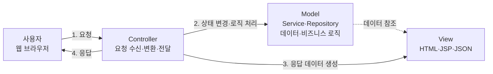
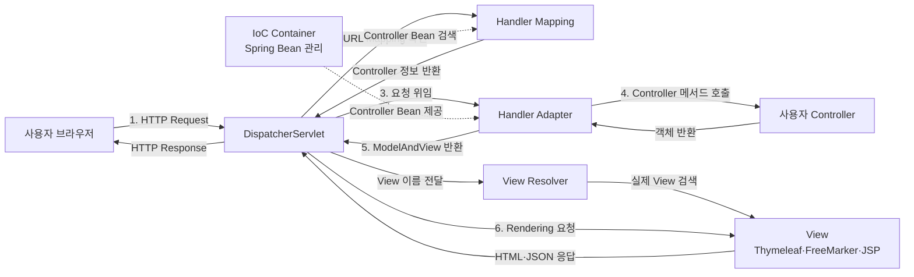
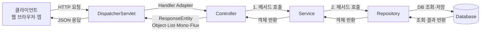
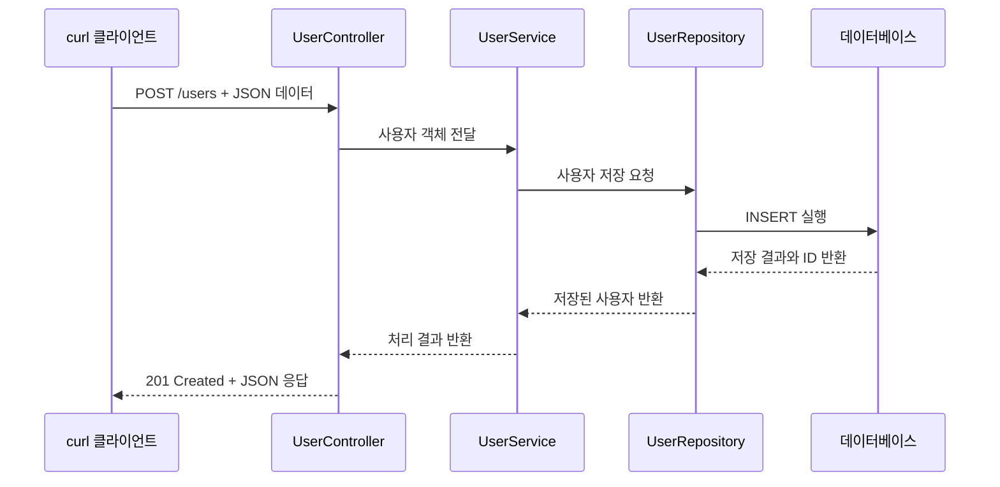

# 컴포넌트 스캔 
- 

# MVC 모델 

- MVC 패턴: 1970 년대 전통적인 UI 아키텍처 패턴이며, 역할 분리 원칙을 따르는 구조
- Spring은 이 일반적인 MVC 개념을 웹 애플리케이션 개발에 맞게 프레임워크로 구현

| 용어 | 정의 | 쉽게 설명하면 |
|---|---|---|
| MVC | Model, View, Controller로 역할을 나누는 설계 패턴 | 요청 처리, 데이터, 화면을 분리하는 구조 |
| Model | 데이터와 비즈니스 로직을 담당 | 데이터를 조회·저장하고 업무 처리 |
| View | 사용자에게 보여줄 화면을 담당 | HTML, JSP, JSON 등으로 결과 출력 |
| Controller | 요청을 받고 처리 흐름을 제어 | 사용자 요청을 받아 적절한 작업 연결 |
| URL Mapping | URL과 Controller를 연결하는 설정 | `/users` 요청을 어떤 메서드가 처리할지 결정 |
| Parameter | 요청에 포함된 값 | 사용자 ID, 검색어, 입력값 |
| Service | 실제 업무 규칙을 처리하는 영역 | 회원 가입, 주문 계산 등 |
| Repository | 데이터 저장소와 통신하는 영역 | DB에서 데이터 조회·저장 |
| Spring MVC | Spring에서 MVC 구조를 구현한 웹 프레임워크 | HTTP 요청을 Controller에 연결 |
| Tomcat | Spring MVC 애플리케이션을 실행하는 웹 서버 | 요청을 받아 애플리케이션으로 전달 |
| DispatcherServlet | 모든 요청을 가장 먼저 받는 Spring MVC 핵심 서블릿 | 요청 처리의 중앙 안내자 |
| Handler Mapping | 요청 URL에 맞는 Controller를 찾음 | `/users`를 처리할 Controller 검색 |
| Handler Adapter | 찾은 Controller의 메서드를 실행 | Controller 메서드 호출 담당 |
| Controller Method | 실제 사용자 업무를 처리하는 메서드 | 회원 조회, 게시글 등록 등 |
| ModelAndView | Model 데이터와 View 정보를 함께 담는 객체 | 전달할 데이터와 화면 이름 묶음 |
| View Resolver | View 이름을 실제 화면 파일로 변환 | `home` → `home.html` |
| Rendering | Model 데이터를 View에 반영해 화면 생성 | HTML 화면 완성 |
| IoC Container | 객체와 Bean을 생성·관리하는 Spring 컨테이너 | 필요한 객체를 대신 관리 |
| Bean | Spring IoC Container가 관리하는 객체 | Controller, Service, Repository 객체 |

# 1. 기본 MVC 구조

기본 흐름
사용자가 웹 브라우저에서 요청을 보냅니다.
Controller가 URL과 파라미터를 확인합니다.
Model이 비즈니스 로직을 처리하고 데이터를 조회합니다.
View가 결과를 화면이나 JSON으로 만들어 응답합니다.

# 2. Spring MVC 처리 흐름

!!! 다이어그램 잘못 그림 !!!  다시 수정해야한다, 

| 구분 | 역할 |
|---|---|
| DispatcherServlet | 모든 HTTP 요청을 가장 먼저 받음 |
| Handler Mapping | 요청에 맞는 Controller를 찾음 |
| Handler Adapter | Controller 메서드를 실행함 |
| Controller | 사용자의 실제 업무 처리를 요청함 |
| ModelAndView | 데이터와 화면 정보를 전달함 |
| View Resolver | View 이름을 실제 화면 파일로 찾음 |
| View | 데이터를 화면으로 렌더링함 |
| DispatcherServlet | 완성된 결과를 사용자에게 응답함 |

# REST API Spring boot MVC 

> 핵심은 Controller가 직접 DB를 처리하지 않고, Service와 Repository에 역할을 나누어 맡기는 것

| 순서 | 처리 내용 |
|---|---|
| 1 | 클라이언트가 HTTP 요청을 보냄 |
| 2 | DispatcherServlet과 Handler Adapter가 요청에 맞는 Controller 메서드를 호출 |
| 3 | Controller가 Service에 업무 처리를 요청 |
| 4 | Service가 Repository에 데이터 조회 또는 저장을 요청 |
| 5 | Repository가 데이터베이스와 통신 |
| 6 | 조회 결과가 Repository → Service → Controller 순서로 반환 |
| 7 | Controller가 `ResponseEntity`로 응답을 구성 |
| 8 | Spring Boot가 객체를 JSON으로 변환해 클라이언트에 응답 |

@RestController
public class UserController {

    private final UserService userService;

    @GetMapping("/users/1")
    public ResponseEntity<User> findUser() {
        User user = userService.findUser(1);
        return ResponseEntity.ok(user);
    }
}

Controller
    ↓
Service
    ↓
Repository
    ↓
Database

- Controller: 요청과 응답 담당
- Service: 업무 규칙 담당
- Repository: 데이터베이스 담당
- ResponseEntity: 최종 응답 상태와 데이터 담당

# Controller // HTTP 매개변수 

Controller의 역할 
- 요청 접수 및 라우팅 Request Mapping
- HTTP 요청 진입점 

요청 데이터 검증 및 변환 (Data Validation & Binding)
- Java 객체 변환 및 변환된 데이터 유효성 검증 

비즈니스 로직 오케스트레이션(Orchestration)
- Service 계층 호출 및 데이터 처리 위임

응답 구조화 및 반환 (Response) 
- JSON 데이터 변환 및 HTTP 상태코드 주입 

# @RequestBody

- HTTP 요청의 본문Body에 담긴 JSON, XML 등 데이터를 자바 객체로 자동 변환 Mapping 

curl -X POST http://localhost:8080/users \
-H "Content-Type: application/json" \
-d '{
  "name": "홍길동",
  "email": "hong@example.com",
  "age": 30
}'

| 부분 | 의미 |
|---|---|
| `-X POST` | 새로운 데이터를 생성하겠다는 요청 |
| `http://localhost:8080/users` | 로컬 서버의 `/users` 주소로 요청 |
| `Content-Type: application/json` | 보낼 데이터가 JSON 형식임을 알림 |
| `-d` | 서버로 전송할 데이터 |
| `name` | 사용자 이름 |
| `email` | 사용자 이메일 |
| `age` | 사용자 나이 |

## 예시 

@PostMapping("/users")
public ResponseEntity<User> createUser(@RequestBody User user) {
    User savedUser = userService.createUser(user);
    return ResponseEntity.status(HttpStatus.CREATED)
                         .body(savedUser);
}

@RequestBody가 JSON을 Java 객체로 변환

{
  "name": "홍길동",
  "email": "hong@example.com",
  "age": 30
}

Json에서 자바 객체로 변환한다. 

User {
    name = "홍길동",
    email = "hong@example.com",
    age = 30
}

# Service & Repository 

## API Service 구성 

## Repository의 역할

## Repository의 구현 

## User Entity 만들기 

## Service의 역할 

## Service 구현 

## 의존관계 자동 주입 DI

# Spring MVC Framework 

## 샘플로 Spring 구조 이해하기

# Lombok 