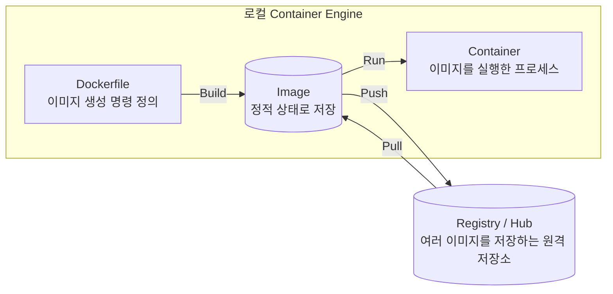

## 가상화(Virtualization)

가상화는 물리 하드웨어를 추상화해 소프트웨어로 구현하는 기술이다. 한 대의 컴퓨터를 여러 대의 독립된 컴퓨터처럼 사용할 수 있게 한다.

애플리케이션 관점의 실행 방식은 그대로 유지하면서, 실제로 사용하는 물리 자원을 논리적으로 분리한다.

(인텔 맥북을 써봤다면, 그 당시 VMWARE로 윈도우를 맥 OS에서 돌리는 것을 기억해볼 수 있을 듯 하다.)

## 하이퍼바이저(Hypervisor)

하이퍼바이저는 물리 서버 위에서 여러 가상 머신(VM, Virtual Machine)을 생성, 실행, 관리하는 소프트웨어 계층이다. 한 컴퓨터의 자원을 나누어 여러 독립된 컴퓨터처럼 운영할 수 있게 한다.

- CPU, 메모리, 디스크, NIC 등 물리 하드웨어 관리
- VM 생성, 삭제, 스냅샷, 마이그레이션 관리
- 각 VM에 적절한 자원 할당
- VM 간 자원 충돌 방지
- VM이 요청하는 하드웨어 명령 중재 및 스케줄링

### Type 1: Native/Bare-metal Hypervisor

물리 하드웨어에서 직접 실행되는 방식이다.

- VM 전용 서버 구성에 활용
- 호스트 OS 오버헤드가 적어 높은 성능과 안정성 제공
- 클라우드, IDC, 데이터 센터에서 주로 사용
- 예: VMware ESXi, Microsoft Hyper-V, KVM, Xen

```text
물리 서버
└── Type 1 Hypervisor
    ├── 웹 서버 VM (24시간 가동)
    ├── DB 서버 VM (24시간 가동)
    └── 캐시 서버 VM (24시간 가동)
```

### Type 2: Hosted Hypervisor

기존 운영체제 위에서 애플리케이션처럼 실행되는 방식이다.

- 기존 장비에 가상화 환경을 구성할 때 활용
- 호스트 OS 오버헤드 존재
- 데스크톱 테스트,개발 환경에 적합
- 예: VMware Workstation, Oracle VirtualBox, Parallels Desktop

```text
개발자 맥북
└── macOS (주 작업 환경)
    ├── Chrome, Slack, VS Code 사용
    └── VirtualBox 실행
        └── Ubuntu VM (테스트용, 필요할 때만 실행)
```

## VM 구조의 한계

VM은 물리 서버 자원의 동적 할당을 지원하지만, 애플리케이션 설치와 운영 방식은 전통적인 물리 서버 환경과 유사하다.

- 큰 이미지 크기
  - 게스트 OS와 가상 하드웨어 설정 등을 포함하므로 수 GB에서 수십 GB에 이를 수 있다.
- 느린 시작 시간
  - 게스트 OS와 미들웨어, 애플리케이션을 단계적으로 실행해야 한다.
- VM 간 환경 불일치
  - 애플리케이션 실행에 필요한 패키지와 라이브러리를 VM마다 별도로 구성하므로 환경 차이가 발생할 수 있다.

## 작은 실행 단위: 컨테이너

컨테이너는 호스트의 커널을 공유하고 애플리케이션과 실행에 필요한 파일,라이브러리를 이미지로 묶는다.

- 작은 이미지: 게스트 OS 전체가 아닌 애플리케이션 실행 파일과 라이브러리만 포함
- 빠른 시작: 별도의 OS 부팅 없이 프로세스 수준으로 실행
- 높은 이식성: 애플리케이션과 의존성을 이미지에 함께 포함해 실행 환경을 일관되게 유지
- 높은 집적도: VM보다 적은 오버헤드로 더 많은 실행 단위를 배치 가능

> Linux 컨테이너는 Linux 커널을 공유한다. macOS나 Windows에서 Linux 컨테이너를 실행할 때는 내부적으로 Linux VM을 사용한다.

## VM과 컨테이너 비교

| 비교 항목 | 기존 VM의 한계 | 컨테이너 도입 후 변화 |
| --- | --- | --- |
| 이식성<br>Portability | 환경마다 OS 패키지와 라이브러리 버전이 달라 오류가 발생할 수 있음 | 앱과 의존성 라이브러리를 하나의 이미지로 묶어 로컬과 클라우드에서 일관되게 실행 |
| 이미지 크기 | 게스트 OS 전체를 포함해 수 GB~수십 GB에 달함 | OS 커널을 제외하고 앱 구동에 필요한 파일만 담아 일반적으로 더 작음 |
| 기동 속도 | OS 부팅과 가상 하드웨어 초기화 필요 | 프로세스 실행 수준으로 빠르게 기동 |
| 자원 효율,집적도 | VM마다 OS 구동에 필요한 CPU,메모리 오버헤드 발생 | 호스트 커널을 공유하고 필요한 자원만 소비 |

### 세부 비교

|  | 가상 서버 | 컨테이너 |
| --- | --- | --- |
| 가상화 | 서버 가상화, VM 간 격리 | 호스트 자원 공유<br>네임 스페이스를 통해 앱 간 격리 |
| 이미지화 | OS와 가상 디바이스 등도 포함되어<br>사이즈가 큼 | 필요한 앱과 bin/lib만 포함되어<br>사이즈가 매우 작음 |
| 플랫폼 간 이식성 | 일반적으로 동일한 하이퍼바이저 환경 중심 | 물리,가상,클라우드 환경 간 이동이 쉬움 |
| 이기종 OS 사용 | 가능 | 호스트 커널과 호환되는 OS 계열 필요 |
| 부팅 시간 | 수십 초~수 분 | 수 밀리초~수 초 |
| 개발 환경 구축 | 수작업으로 앱 설치 및 삭제 필요<br>일반적으로 오래 걸림 | 이미지 재사용으로 환경 구축 자동화<br>일반적으로 더 빠름 |
| 집적도 | 상대적으로 낮음 | 상대적으로 높음 |
| 앱 확장성 | Low (수작업 요소 많음) | High (완전 자동화 가능) |
| OS 비용 | VM별 발생 가능 | 주로 호스트 기준 |
| 베어메탈 대비 성능 | 가상화 오버헤드 존재 | 상대적으로 오버헤드가 작음 |
| 자원 할당 | CPU, Memory, GPU, 네트워크, Storage 등 | CPU, Memory, GPU, 네트워크, Storage 등 |

## 컨테이너 관리 도구

CI/CD 파이프라인에서는 데이터베이스, 백엔드, Python 애플리케이션 등이 어느 환경에서나 동일하게 실행되어야 한다. 이를 위해 다음 도구를 사용한다.

- 컨테이너 플랫폼
- 컨테이너 이미지 빌드 도구
- 컨테이너 런타임

Docker를 사용할 때는 환경과 조직 규모에 따른 라이선스 정책을 확인해야 한다. Kubernetes는 Docker Engine 자체가 아니라 `containerd`, `CRI-O` 같은 CRI 호환 런타임으로 컨테이너를 실행한다.

## 컨테이너 이미지 라이프사이클



```text
Dockerfile --Build--> Image --Run--> Container
                         |
                         |-- Push --> Registry / Hub
                         |<-- Pull -- Registry / Hub
```

- `Build`: Dockerfile을 바탕으로 Image 생성
- `Run`: Image를 실행하여 Container 생성
- `Push`: 로컬 Image를 Registry / Hub에 업로드
- `Pull`: Registry / Hub의 Image를 로컬로 다운로드
- `Image`: 변경되지 않는 정적 파일 묶음
- `Container`: Image가 실행되어 애플리케이션 프로세스로 동작하는 상태

### Docker 이미지 참조(Image Reference) 구조

실제 저장소 정보 대신 다음과 같은 예시를 사용한다.

```text
registry.example.com/team/webserver:1.0
```

```text
registry.example.com / team/webserver : 1.0
└── Registry Domain   └── Repository    └── TAG
```

| 구분 | 예시 | 의미 |
| --- | --- | --- |
| Image Name 또는 Image Reference | `registry.example.com/team/webserver:1.0` | 이미지를 구분하는 전체 이름 |
| Registry Domain | `registry.example.com` | 이미지 저장소 서비스의 주소 |
| Repository Name | `team/webserver` | Registry 안에서 특정 이미지 계열을 관리하는 저장소 이름 |
| TAG | `1.0` | 이미지의 버전 또는 구분값 |

#### Registry

여러 이미지를 저장, 제공하는 전체 서비스 또는 서버

#### Repository

Registry 안에서 특정 이미지 계열을 관리하는 개별 저장소 단위

## 컨테이너 이미지 빌드

Dockerfile은 컨테이너 이미지에 무엇을 포함할지 선언적으로 정의하는 파일이다. Dockerfile의 전용 문법(DSL)으로 기반 이미지, 패키지 설치, 파일 복사, 실행 명령 등을 작성한다.

```dockerfile
# Python 3.10 Alpine 이미지를 기반 이미지로 사용
FROM python:3.10-alpine

# bash, curl, 컴파일 도구, Linux 헤더, jq 패키지를 이미지에 설치
RUN apk add --no-cache bash curl gcc musl-dev linux-headers jq

# FastAPI 서버 실행과 시스템 모니터링에 필요한 Python 패키지를 설치
RUN pip install --no-cache-dir fastapi uvicorn psutil python-multipart prometheus-client

# 현재 디렉터리의 fastserver.py 파일을 이미지 내부로 복사
COPY fastserver.py /app/fastserver.py

WORKDIR /app

# 컨테이너가 시작될 때 fastserver.py를 Python 3로 실행
CMD ["python3", "fastserver.py"]
```
