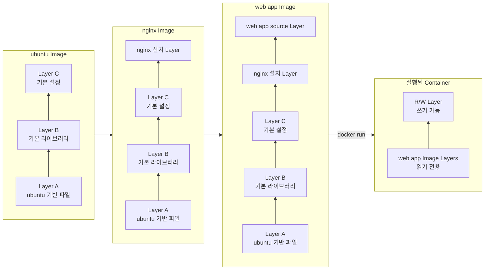
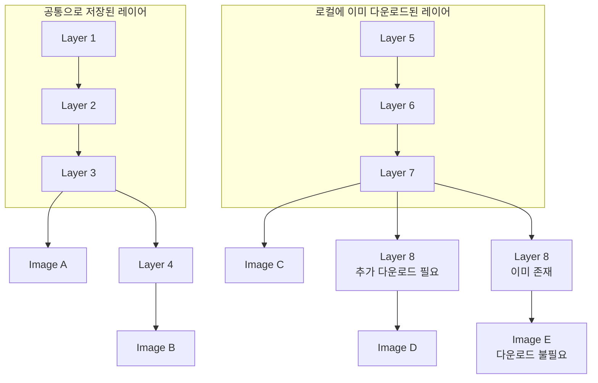
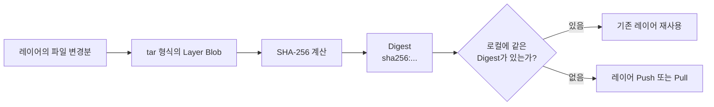
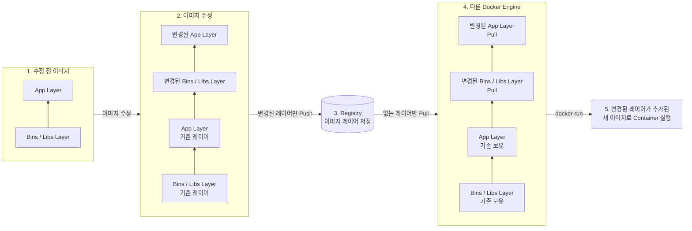

## 컨테이너 이미지 레이어 구조

컨테이너 이미지는 여러 개의 읽기 전용 레이어로 구성된다.

컨테이너를 실행하면 이미지 레이어 위에 데이터를 쓰고 수정할 수 있는 R/W 레이어가 추가된다.



```dockerfile
# Layer 1: Ubuntu 기반 이미지 사용
FROM ubuntu:22.04

# Layer 2: nginx 설치
RUN apt-get update && \
    apt-get install -y --no-install-recommends nginx

# Layer 3: 웹 애플리케이션 소스 복사
COPY ./src /var/www/html

# 컨테이너 실행 시 nginx 시작
CMD ["nginx", "-g", "daemon off;"]
```

### 이미지 레이어 공유

동일한 레이어는 이미지끼리 공유하기 때문에 중복 다운로드와 업로드가 필요하지 않다.



- 이미지 A를 삭제해도 다른 이미지에서 사용하는 Layer 1, 2, 3은 삭제되지 않는다.
- 이미지 C를 이미 다운로드했다면 공통 Layer 5, 6, 7을 다시 다운로드하지 않는다.
- 이미지 D에 새로운 Layer 8이 있다면 Layer 8만 추가로 다운로드한다.
- 이미지 E의 모든 레이어가 로컬에 있다면 추가 다운로드가 필요하지 않다.

### Docker가 동일한 레이어를 판별하는 방법

Docker는 레이어의 내용을 SHA-256 방식으로 계산한 `Digest`를 이용해 동일한 레이어인지 판별한다.



쉽게 말하면 레이어는 포장된 택배 상자이고, Digest는 상자 내용으로 만든 고유한 디지털 지문이다.

```text
Layer  = 파일 변경분을 담은 택배 상자
Digest = 상자 내용으로 만든 고유 송장 번호
```

Digest가 레이어를 더 작은 단위로 분리하는 것은 아니다. Dockerfile 명령으로 만들어진 파일 시스템 변경분이 하나의 레이어가 되고, 그 레이어 Blob에 Digest가 부여된다.

```text
Dockerfile 명령 실행
→ 파일 시스템 변경분 생성
→ 하나의 Layer로 묶음
→ SHA-256 Digest 계산
→ 저장,공유,중복 확인
```

따라서 레이어는 Docker가 저장,전송,캐시하는 기본 단위이지만 반드시 크기가 작지는 않다. 하나의 `RUN` 명령에서 많은 파일을 설치하면 하나의 레이어가 수백 MB가 될 수도 있다.

Registry의 Image Manifest에는 이미지가 사용하는 레이어의 Digest가 순서대로 기록된다. Docker는 Image를 Pull할 때 Manifest의 Digest와 로컬에 저장된 레이어를 비교한다.

```text
Registry의 Layer Digest
        ↓
로컬에 같은 Digest가 있는가?
        ├─ 있음 → Already exists, 다운로드 생략
        └─ 없음 → 해당 레이어 다운로드
```

이 구조를 통해 다음 작업이 가능하다.

- 동일한 레이어의 중복 저장 방지
- 이미 존재하는 레이어의 다운로드 생략
- 변경된 레이어만 Push 또는 Pull
- 다운로드한 레이어의 손상 여부 확인

이미지의 RootFS 레이어 식별값은 다음 명령으로 확인할 수 있다.

```bash
docker image inspect nginx \
  --format '{{json .RootFS.Layers}}'
```

> `docker image inspect`의 `RootFS.Layers`에는 압축을 해제한 레이어 내용의 식별값인 `diff_id`가 표시된다. Registry Manifest에서 Push와 Pull에 사용하는 압축된 Layer Blob의 Digest와는 값이 다를 수 있지만, 둘 다 콘텐츠를 기반으로 계산한 식별값이다.

같은 Dockerfile 명령을 사용했다고 해서 항상 같은 레이어가 만들어지는 것은 아니다.

```dockerfile
RUN apt-get update
```

명령이 같아도 실행 시점에 내려받은 패키지나 생성된 파일이 달라지면 레이어 내용과 Digest도 달라진다. 반대로 이미지 이름이 다르더라도 실제 Layer Blob의 Digest가 같다면 해당 레이어를 공유할 수 있다.

레이어의 동일성 판별과 빌드 캐시 판별도 구분해야 한다.

| 구분 | 주로 확인하는 정보 |
| --- | --- |
| 레이어 저장,Push,Pull | Layer Blob의 Digest |
| Dockerfile 빌드 캐시 | Dockerfile 명령, 부모 상태, 입력 파일과 빌드 설정 |

즉, Digest는 레이어를 잘게 나누는 도구가 아니라 **이미 만들어진 레이어가 같은 내용인지 확인하는 디지털 지문**이다.

## 컨테이너 이미지 Push/Pull

기존 이미지에서 변경된 레이어만 Registry에 Push하고, 다른 환경에서도 필요한 레이어만 Pull한다.



```text
기존 이미지 → 이미지 수정 → 변경된 레이어만 Push → Registry
                                                    ↓
컨테이너 실행 ← 새 이미지 구성 ← 없는 레이어만 Pull ← 다른 Docker Engine
```

- 변경되지 않은 기존 레이어는 다시 업로드하거나 다운로드하지 않는다.
- 수정된 App, Bins/Libs 레이어만 Registry로 Push한다.
- 다른 Docker Engine은 로컬에 없는 레이어만 Pull한다.
- 기존 레이어와 새 레이어를 결합한 이미지로 컨테이너를 실행한다.

### 이미지 생성과 Push

공개 이미지를 그대로 사용할 수도 있지만, 필요한 실행 환경이 없다면 Dockerfile로 직접 이미지를 만든 뒤 Registry에 Push한다.

## 멀티 스테이지 빌드

멀티 스테이지 빌드는 빌드 환경과 실행 환경을 분리한다.

1. Node.js, npm, Vite로 Vue 소스 코드를 빌드해 `dist` 디렉터리를 만든다.
2. 실행 단계의 Nginx 이미지에는 `dist` 디렉터리만 복사한다.

```text
Vue 소스 코드
  ↓ Node.js, npm, Vite로 빌드
dist 디렉터리 생성
  ↓ dist만 복사
Nginx가 정적 파일 제공
```

장점은 다음과 같다.

- 최종 이미지 크기 감소
- 배포와 다운로드 속도 향상
- 소스 코드와 빌드 도구가 최종 이미지에서 제외되어 공격 표면 감소
- 빌드 환경과 실행 환경의 명확한 분리

### Vue 애플리케이션 예시

```dockerfile
# Stage 1: Vue 프로젝트 빌드
FROM node:22-alpine AS builder

WORKDIR /app

# 의존성 파일을 먼저 복사하여 Docker 빌드 캐시 활용
COPY package*.json ./
RUN npm ci

# 소스 코드를 복사하고 배포용 파일 생성
COPY . .
RUN npm run build

# Stage 2: Nginx를 이용한 실제 서비스
FROM nginx:stable-alpine

WORKDIR /usr/share/nginx/html

# Nginx 기본 페이지 제거
RUN rm -rf ./*

# builder 단계에서 생성한 dist만 복사
COPY --from=builder /app/dist .

EXPOSE 80

# Nginx를 포그라운드로 실행
CMD ["nginx", "-g", "daemon off;"]
```

## Dockerfile의 `RUN` 명령

`RUN`은 이미지를 빌드하는 과정에서 명령을 실행할 때 사용한다.

```dockerfile
RUN apt-get update && \
    apt-get install -y --no-install-recommends nginx && \
    rm -rf /var/lib/apt/lists/*
RUN mkdir -p /app && chmod 755 /app
```

주요 용도는 다음과 같다.

- 프로그램과 패키지 설치
- 파일과 디렉터리 생성
- 파일 권한 변경
- 애플리케이션 빌드

`RUN`으로 파일 시스템에 적용된 변경 사항은 이미지 레이어에 저장된다. 서로 관련된 명령은 하나의 `RUN`으로 묶으면 불필요한 중간 파일을 같은 레이어에서 제거할 수 있다.

## 빌드 캐시

Docker는 이전 빌드 결과를 캐시한다. Dockerfile 명령과 관련 파일이 바뀌지 않았다면 기존 결과를 재사용해 빌드 시간을 줄인다.

```bash
# 일반 빌드: 사용할 수 있는 캐시 재사용
docker build -t my-app .

# 캐시 없이 모든 단계를 다시 실행
docker build --no-cache -t my-app .
```

> `--no-cache`는 이전 빌드 결과를 재사용하지 않고 Dockerfile의 모든 단계를 새로 실행하는 옵션이다.

### 명령 순서와 캐시 무효화

Dockerfile은 위에서 아래로 처리된다. 특정 단계의 입력이 바뀌어 캐시를 사용할 수 없으면 그 단계와 이후 단계도 다시 실행된다.

```dockerfile
FROM ubuntu:22.04

RUN apt-get update && \
    apt-get install -y --no-install-recommends python3 && \
    rm -rf /var/lib/apt/lists/*

WORKDIR /app
COPY webserver.py .

CMD ["python3", "webserver.py"]
```

예를 들어 `webserver.py`만 변경되면 앞의 패키지 설치 단계는 캐시를 재사용하고, `COPY webserver.py .` 이후 단계만 다시 처리할 수 있다. 이를 활용하려면 자주 바뀌지 않는 명령을 앞쪽에, 자주 바뀌는 소스 코드 복사를 뒤쪽에 배치한다.

> 여기서 앞뒤 관계는 Dockerfile 명령과 이미지 레이어의 순서를 설명하는 표현이다. 공식적인 "부모,자식 컨테이너" 종류가 따로 있는 것은 아니다.

## CMD 명령어 최적화 

컨테이너 프로세스의 실행 방법

1. 컨테이너 즉시 종료되지 않고,멈춰 강제 종료되는 문제 
2. 트래픽을 받고 처리중 Graceful shutdown 되지 않고 KILL 되는 현상
3. 이로인한 트래픽 유실 발생 및 배포 속도 저하 

CMD 한줄 잘못 사용하는 경우 발생 

### CMD 최적화 방법

| 표준 명칭 | 사용 방법 | 특징 | 권고 |
|---|---|---|---|
| Exec Form | `CMD ["python3", "webserver.py"]` | 쉘을 거치지 않고 앱이 직접 PID 1로 실행됩니다. 신호 처리와 종료가 명확합니다. | 강력 권고 |
| Shell Form | `CMD ["/bin/sh", "-c", "python3 webserver.py"]` 또는 `CMD python3 webserver.py` | `/bin/sh`가 PID 1이 되고, 실제 앱은 자식 프로세스로 실행됩니다. 종료 신호 전달 등이 불명확해질 수 있습니다. | 비권고 |
| Shell with Exec | `CMD ["/bin/sh", "-c", "exec python3 webserver.py"]` | 쉘에서 환경변수 처리,명령 조합 등을 한 뒤 `exec`가 쉘을 앱으로 교체합니다. 결과적으로 앱이 PID 1이 됩니다. | 조건부 권고 |

### SIGTERM 신호 수신 코드 넣기

webserver.py에 SIGTERM 처리 handler를 등록
