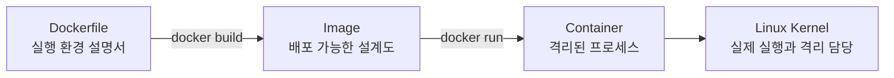
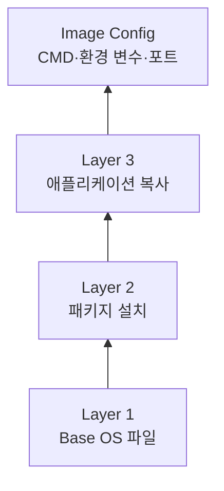
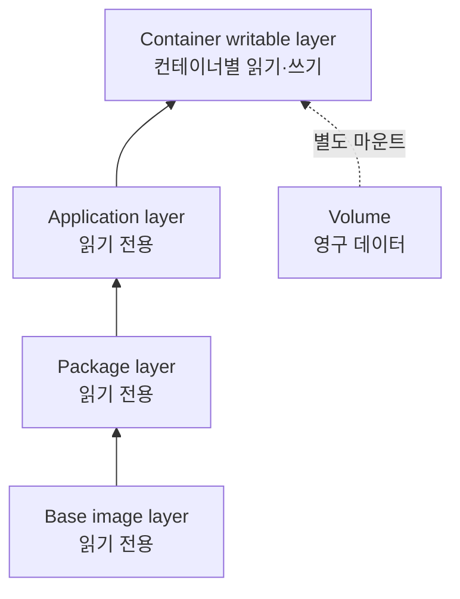
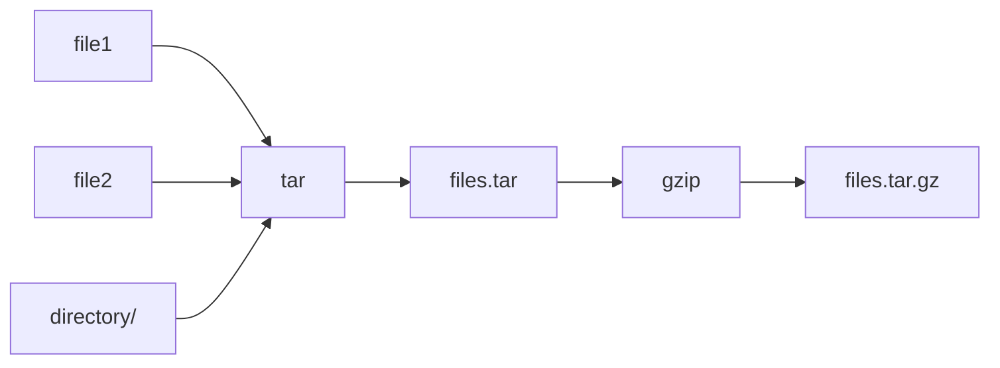
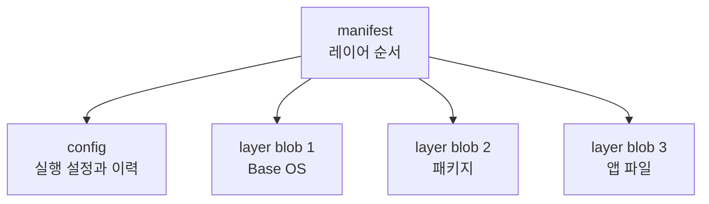

Docker를 이해할 때는 다음 흐름을 먼저 잡으면 쉽다.



- **Dockerfile**은 이미지를 만드는 방법을 적은 문서입니다.
- **이미지(Image)**는 애플리케이션 실행에 필요한 파일과 설정을 묶은 읽기 전용 패키지입니다.
- **컨테이너(Container)**는 이미지를 바탕으로 실행된 격리된 프로세스 또는 프로세스 그룹입니다.
- **Linux Kernel**은 Namespace, cgroups 등의 기능으로 컨테이너를 실제로 격리하고 제한합니다.

> 쉬운 비유: `Dockerfile`은 요리법, `Image`는 밀키트, `Container`는 밀키트로 실제 조리한 한 접시입니다. 같은 이미지로 여러 컨테이너를 만들 수 있습니다.

---

## 1. Docker 이미지와 레이어

### 먼저 알아둘 단어

| 단어 | 뜻 | 쉬운 비유 |
|---|---|---|
| Image | 애플리케이션 실행 파일, 라이브러리, 설정을 묶은 읽기 전용 패키지 | 프로그램을 찍어내는 설계도 |
| Layer | 이전 상태에서 추가·수정·삭제된 파일의 묶음 | 투명 필름 한 장 |
| rootfs | 컨테이너가 `/`로 보는 루트 파일 시스템 | 컨테이너 전용 서랍장 |
| Metadata | 실행 명령, 환경 변수, 포트 등 이미지의 설정 정보 | 제품 사용 설명서 |
| Digest | 콘텐츠를 해시한 고유 식별값 | 내용이 바뀌면 함께 바뀌는 디지털 지문 |

### 1.1 이미지는 무엇인가?

Docker 이미지는 애플리케이션을 실행하는 데 필요한 다음 요소를 묶은 배포 단위.

- 여러 개의 파일 시스템 레이어
- 실행 명령(`CMD`, `ENTRYPOINT`)
- 환경 변수, 작업 디렉터리, 사용자 등의 설정
- 레이어의 순서와 Digest를 가리키는 Manifest

레이어는 일반적으로 파일 시스템의 변경분을 tar 형식으로 직렬화해 저장한다. 이미지 전체가 단일 거대한 파일인 것이 아니라, 여러 변경분과 메타데이터가 조합된 구조.

> 주의: 레이어에는 주로 **파일 시스템 변경분**이 들어가고, `CMD`, `LABEL`, `EXPOSE` 같은 실행 설정은 이미지 설정 메타데이터에 기록된다.

### 1.2 레이어는 어떻게 쌓이는가?



다음 Dockerfile을 예로 들어 보겠습니다.

```dockerfile
FROM python:3.12-slim
WORKDIR /app
COPY requirements.txt .
RUN pip install --no-cache-dir -r requirements.txt
COPY . .
CMD ["python", "webserver.py"]
```

- `FROM`: 부모 이미지의 기존 레이어를 가져옵니다.
- `COPY`, `RUN`, `ADD`: 보통 파일 시스템 변경분을 새 레이어에 기록합니다.
- `CMD`, `ENTRYPOINT`, `ENV`, `EXPOSE`: 주로 실행 설정 메타데이터를 기록합니다.
- `WORKDIR` 등 일부 명령은 빌더와 상황에 따라 파일 시스템 변경과 이미지 이력의 표현이 달라질 수 있습니다.

따라서 **Dockerfile 명령어 하나가 항상 실제 파일 시스템 레이어 하나와 정확히 대응하는 것은 아닙니다.** `docker image history`에는 파일 변경이 없는 `0B` 단계도 표시될 수 있습니다.

### 1.3 레이어의 특징

- 이미지 레이어는 기본적으로 읽기 전용입니다.
- 부모에서 자식 순서로 쌓이며, 위 레이어의 파일이 아래 레이어의 같은 경로를 가릴 수 있습니다.
- 파일 삭제도 아래 레이어를 실제로 지우는 대신 `whiteout` 같은 삭제 표시로 표현할 수 있습니다.
- 동일한 Digest의 레이어는 여러 이미지와 컨테이너가 공유할 수 있습니다.

레이어 공유 덕분에 다음 효과가 생깁니다.

- 같은 베이스 이미지를 중복 저장하지 않아 디스크를 절약합니다.
- 이미 보유한 레이어는 다시 받지 않아 `pull`이 빨라집니다.
- 동일한 이미지를 사용하면 서버가 달라도 비슷한 실행 환경을 재현할 수 있습니다.

### 1.4 컨테이너를 실행하면 무엇이 달라지는가?

이미지를 실행하면 읽기 전용 이미지 레이어 위에 컨테이너 전용 쓰기 레이어가 추가됩니다.



컨테이너 안에서 파일을 수정해도 원본 이미지가 바뀌지는 않습니다. 변경 내용은 해당 컨테이너의 쓰기 레이어에 저장됩니다.

컨테이너를 삭제하면 쓰기 레이어도 함께 사라집니다. 데이터베이스 파일처럼 유지해야 할 데이터는 **Volume**이나 **Bind Mount**에 저장해야 합니다.

---

## 2. tar와 이미지 내부 구조

### 먼저 알아둘 단어

| 단어 | 뜻 | 쉬운 비유 |
|---|---|---|
| Archive | 여러 파일과 디렉터리를 하나로 묶은 파일 | 이삿짐 상자 |
| tar | 아카이브를 만들고 푸는 형식이자 명령어 | 물건을 한 상자에 포장하는 도구 |
| gzip | 데이터 크기를 줄이는 압축 방식 | 상자 속 진공 압축팩 |
| Manifest | 이미지 구성과 레이어 순서를 기록한 문서 | 상자 안 물품 목록 |
| Blob | Digest로 이름 붙여 저장한 실제 데이터 덩어리 | 번호표가 붙은 포장물 |

> 쉬운 비유: tar는 여러 서류를 한 파일철에 모으는 작업이고, gzip은 그 파일철을 눌러 부피까지 줄이는 작업입니다.

### 2.1 tar 기본 사용법

`.tar`는 여러 파일을 하나로 **묶은 것**입니다. tar 자체와 압축은 별개이며, gzip을 함께 사용하면 보통 `.tar.gz` 또는 `.tgz`가 됩니다.

```bash
# 여러 파일과 디렉터리를 files.tar로 묶기
tar -cvf files.tar file1.txt file2.txt directory/

# .tar 내부 목록 확인
tar -tvf files.tar

# .tar 풀기
tar -xvf files.tar

# gzip으로 압축된 .tar.gz 만들기
tar -czvf files.tar.gz file1.txt file2.txt directory/

# .tar.gz 풀기
tar -xzvf files.tar.gz
```

주요 옵션은 다음과 같습니다.

| 옵션 | 뜻 |
|---|---|
| `c` | 새 아카이브 생성(Create) |
| `x` | 아카이브 해제(Extract) |
| `t` | 내부 목록 조회(List) |
| `v` | 처리 과정을 자세히 출력(Verbose) |
| `f` | 뒤에 오는 값을 아카이브 파일명으로 사용(File) |
| `z` | gzip 압축 또는 해제 |



### 2.2 Docker 이미지가 tar와 닮은 이유

컨테이너 이미지도 실행 파일들을 레이어별 묶음으로 저장합니다. 각 레이어가 파일 시스템 변경분을 담고, Manifest가 레이어의 순서를 연결합니다.



다만 `docker save` 결과의 정확한 디렉터리 형태와 Blob 압축 여부는 Docker 버전과 이미지 저장 방식에 따라 달라질 수 있습니다. 구조를 추측하기보다 `file`, `jq`, `tar`로 실제 형식을 확인하는 것이 안전합니다.

### 2.3 예제 이미지 만들기

```dockerfile
ARG UBUNTU_VERSION=22.04
FROM ubuntu:${UBUNTU_VERSION}

# FROM 앞에서 선언한 ARG를 빌드 단계 안에서 다시 사용하려면 재선언합니다.
ARG UBUNTU_VERSION

RUN apt-get update \
    && apt-get install -y --no-install-recommends curl lsb-release nginx \
    && rm -rf /var/lib/apt/lists/*

RUN echo "현재 빌드에 사용된 Ubuntu 버전: ${UBUNTU_VERSION}"

LABEL maintainer="sample@example.com"
LABEL description="Linux version example"

EXPOSE 8080/tcp
EXPOSE 80/tcp

WORKDIR /var/www/html
COPY index.html .

CMD ["nginx", "-g", "daemon off;"]
```

```bash
# 마지막의 점(.)은 현재 디렉터리를 빌드 컨텍스트로 전달한다는 뜻입니다.
docker build --tag indepth-container:1.0 .

# Dockerfile 단계와 이미지 이력 확인
docker image history indepth-container:1.0
```

### 2.4 이미지를 저장하고 분해하기

```bash
mkdir -p indepth-container
cd indepth-container

docker save --output indepth-container.tar indepth-container:1.0

# 먼저 목록만 확인
tar -tvf indepth-container.tar

# 현재 디렉터리에 해제
tar -xvf indepth-container.tar
find . -maxdepth 3 -type f | sort
```

`manifest.json`이 있다면 다음처럼 확인합니다.

```bash
jq . manifest.json
```

개념적인 내용은 다음과 같습니다. Digest 값은 빌드할 때마다 달라질 수 있습니다.

```json
[
  {
    "Config": "blobs/sha256/<config-digest>",
    "RepoTags": ["indepth-container:1.0"],
    "Layers": [
      "blobs/sha256/<base-layer-digest>",
      "blobs/sha256/<package-layer-digest>",
      "blobs/sha256/<app-layer-digest>"
    ]
  }
]
```

Blob의 실제 유형과 파일 목록은 다음처럼 확인합니다.

```bash
cd blobs/sha256
file *

# tar 형식 Blob
tar -tvf <layer-digest>

# gzip으로 압축된 tar Blob
tar -tzvf <layer-digest>
```

> Manifest의 `Layers` 순서는 이미지의 파일 시스템을 구성하는 순서입니다. `CMD`, `LABEL`, `EXPOSE`처럼 파일을 바꾸지 않는 명령은 별도의 파일 시스템 레이어가 없을 수 있으므로, Dockerfile의 모든 줄과 `Layers` 배열을 일대일로 맞추면 안 됩니다.

### 2.5 MariaDB 이미지로 확인하기

```bash
docker pull mariadb:10.11
mkdir -p indepth-mariadb
cd indepth-mariadb

docker save --output mariadb.tar mariadb:10.11
tar -xvf mariadb.tar
jq . manifest.json
```

특정 레이어의 내용은 다음과 같이 확인할 수 있습니다.

```bash
file blobs/sha256/<layer-digest>
tar -tvf blobs/sha256/<layer-digest>
```

예를 들어 엔트리포인트가 추가된 레이어라면 `usr/local/bin/docker-entrypoint.sh` 같은 파일이 나타날 수 있습니다. 정확한 Digest와 레이어 수는 이미지 버전에 따라 달라집니다.

---
