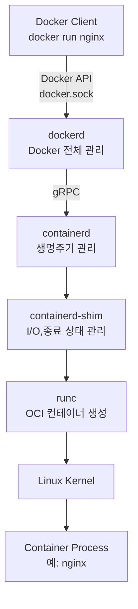
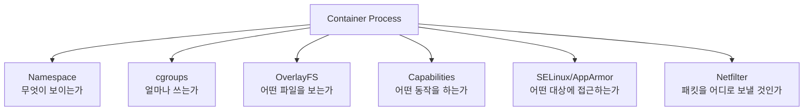
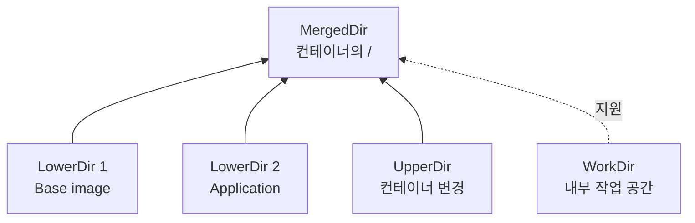

## 1. Docker 명령에서 컨테이너 프로세스까지

> Docker 명령 한 번이 실제 Linux 프로세스가 되기까지

### 먼저 알아둘 단어

| 단어 | 뜻 | 쉬운 비유 |
|---|---|---|
| Docker Client | 사용자의 `docker` 명령을 API 요청으로 바꾸는 도구 | 주문을 받는 직원 |
| `dockerd` | 이미지,컨테이너,네트워크,볼륨을 관리하는 데몬 | 전체 매장을 관리하는 점장 |
| `containerd` | 이미지와 컨테이너 생명주기를 관리하는 고수준 런타임 | 작업을 배정하는 현장 관리자 |
| `containerd-shim` | 실행 중인 컨테이너의 I/O와 종료 상태를 지키는 중간 프로세스 | 작업자 곁에 남는 담당자 |
| `runc` | OCI 설정대로 컨테이너를 생성하는 저수준 런타임 | 실제 작업 공간을 만드는 기술자 |
| OCI | 이미지와 런타임의 공통 규격 | 제조업의 표준 규격서 |
| Unix Domain Socket | 같은 호스트의 프로세스가 파일 경로를 통해 통신하는 방식 | 건물 내부 전용 인터폰 |

> 쉬운 비유: 사용자가 주문하면 Client가 `dockerd`에 전달하고, `dockerd`는 `containerd`에 작업을 맡긴다. 마지막에는 `runc`가 커널 기능을 사용해 실제 컨테이너 환경을 만든다.

### 1.1 전체 실행 흐름



실행 순서는 다음과 같습니다.

1. 사용자가 `docker run nginx`를 입력.
2. Docker Client가 Docker API로 `dockerd`에 요청.
3. `dockerd`가 네트워크와 볼륨 등 Docker 실행 환경을 준비하고 `containerd`에 요청.
4. `containerd`가 이미지 Snapshot과 컨테이너 상태를 준비하고 Shim을 실행.
5. Shim이 `runc`를 호출.
6. `runc`가 OCI 설정에 따라 Namespace, cgroup, rootfs, Capability를 적용합니다.
7. 컨테이너의 초기 프로세스를 실행한 뒤 `runc`는 종료.
8. Shim은 남아서 표준 입출력과 종료 상태를 관리.

### 1.2 구성 요소별 역할과 사용하는 이유

| 구성 요소 | 핵심 역할 | 왜 사용하는가? |
|---|---|---|
| Docker Client | 사용자의 명령을 Docker API 요청으로 전달 | 사람이 사용하기 쉬운 명령어와 실제 관리 작업을 분리하기 위해 사용. Client는 로컬뿐 아니라 원격 Docker Engine에도 요청을 보낼 수 있다. |
| `dockerd` | API, 이미지 빌드, 컨테이너, 네트워크, 볼륨 관리 | 컨테이너 하나만 실행하는 것이 아니라 Docker 리소스 전체의 상태와 정책을 한곳에서 조정하기 위해 사용. |
| `containerd` | 이미지, Snapshot, 컨테이너 생명주기 관리 | 이미지 준비와 실행 상태 관리처럼 컨테이너 공통 기능을 Docker의 사용자 기능과 분리하기 위해 사용. |
| `containerd-shim` | 실행 중인 프로세스의 I/O와 종료 상태 관리 | 컨테이너마다 작은 관리 프로세스를 남겨 표준 입출력과 종료 코드를 수집하고, 컨테이너 프로세스를 장기 실행 런타임과 분리하기 위해 사용. |
| `runc` | OCI Runtime Specification에 따라 컨테이너 생성 | Namespace, cgroup, rootfs 같은 Linux 설정을 OCI 표준에 맞춰 실제 프로세스에 적용하기 위해 사용합니다. 생성이 끝나면 종료되는 짧은 실행 도구. |
| `libcontainer` | `runc`가 Linux 컨테이너 기능을 다룰 때 사용하는 내부 라이브러리 | Namespace와 cgroup 같은 저수준 커널 기능을 일관된 코드로 다루기 위해 사용. |
| Linux Kernel | 프로세스 실행, 격리, 자원 제한, 권한 통제를 실제 수행 | 컨테이너는 별도 운영체제가 아니므로 실제 격리와 자원 제어는 호스트 커널의 기능을 사용. |

`dockerd`는 모든 커널 설정을 혼자 직접 수행하는 프로세스가 아니다. 여러 실행 계층을 조정하고, 최종적으로 `runc`와 Linux Kernel이 격리된 프로세스를 만든다.

#### 왜 여러 계층으로 나누는가?

한 프로세스가 API, 이미지, 네트워크, 프로세스 생성, 입출력까지 모두 담당하면 구성 요소를 교체하거나 장애 원인을 나누어 확인하기 어렵다. Docker는 역할을 계층별로 분리해 각 구성 요소가 맡은 일에 집중하도록 한다. 또한 `containerd`와 `runc`가 OCI 같은 표준 인터페이스를 사용하므로 상위 도구가 달라도 공통 런타임 기술을 재사용할 수 있다.

### 1.3 Unix Domain Socket

로컬 Docker Client는 보통 다음 소켓으로 `dockerd`와 통신.

```text
/var/run/docker.sock
```

TCP가 `127.0.0.1:8080`처럼 IP와 포트를 주소로 사용하는 반면, Unix Domain Socket은 `/var/run/docker.sock` 같은 파일 시스템 경로를 주소로 사용합니다.

- 같은 호스트 안에서만 직접 사용할 수 있다.
- 파일 소유권과 권한으로 접근을 제어.
- Docker 소켓 접근 권한은 사실상 Docker를 제어할 강한 권한이므로 함부로 공개하면 안 된다.

Unix Domain Socket을 사용하는 이유는 같은 컴퓨터 안의 Client와 데몬이 통신할 때 별도의 네트워크 포트를 열 필요가 없고, 파일 권한으로 접근 주체를 관리할 수 있기 때문입니다. 다만 `docker` 그룹 사용자나 소켓을 마운트한 컨테이너는 호스트를 강하게 제어할 수 있으므로 단순한 일반 파일처럼 취급하면 안 된다.

### 1.4 컨테이너는 실행 단위인가?

정확히 말하면 **실제로 CPU에서 실행되는 단위는 Linux 프로세스와 스레드**.

컨테이너는 런타임이 다음 요소를 하나의 논리적 단위로 묶어 관리하는 추상화.

- Namespace로 격리된 프로세스 또는 프로세스 그룹
- cgroup으로 제한된 자원
- 이미지와 쓰기 레이어로 구성된 rootfs
- 네트워크 인터페이스, 권한, 보안 정책

즉, 컨테이너 안의 애플리케이션도 호스트 커널이 실행하는 일반 Linux 프로세스. 다만 다른 환경이 보이고, 사용할 수 있는 자원과 권한이 제한됨.

---

## 2. 컨테이너 격리와 자원 관리

### 먼저 알아둘 단어

| 단어 | 뜻 | 쉬운 비유 |
|---|---|---|
| Namespace | 프로세스마다 보이는 시스템 범위를 분리 | 같은 건물 안의 칸막이 방 |
| cgroups | 프로세스 그룹의 CPU,메모리 등 사용량 제한 | 방마다 정해 둔 전기 사용 한도 |
| OverlayFS | 여러 디렉터리 레이어를 하나처럼 보여주는 파일 시스템 | 여러 투명 필름을 겹친 완성 화면 |
| Copy-on-Write | 원본 대신 복사본을 만들어 수정하는 방식 | 공용 원본은 두고 개인 복사본에 필기 |
| Capability | root 권한을 세부 기능으로 나눈 권한 | 마스터키 대신 필요한 방의 열쇠만 지급 |
| SELinux/AppArmor | 프로세스가 접근할 대상을 정책으로 제한 | 출입증으로 접근 가능한 구역 제한 |

> 쉬운 비유: 컨테이너는 별도의 건물이 아니라 한 건물 안의 독립 사무실. Namespace는 벽, cgroups는 전기,수도 한도, rootfs는 사무실 서류함, 보안 정책은 출입 카드.



### 2.1 Namespace: 보이는 환경 격리

Namespace는 같은 커널을 사용하는 프로세스들이 서로 다른 시스템 환경을 보는 것처럼 만든다.

| Namespace | 격리하는 대상 |
|---|---|
| PID | 프로세스 ID와 프로세스 트리 |
| NET | 네트워크 인터페이스, IP, 포트, 라우팅 테이블 |
| MNT | 마운트 지점과 파일 시스템 트리 |
| IPC | 공유 메모리, 메시지 큐, 세마포어 |
| USER | UID와 GID 매핑 |
| UTS | 호스트 이름과 도메인 이름 |

예를 들어 컨테이너의 초기 프로세스는 컨테이너 안에서 PID 1로 보일 수 있지만, 호스트에서는 다른 PID를 가진 일반 프로세스로 보인다.

#### 왜 Namespace를 사용하는가?

Namespace가 없으면 모든 컨테이너가 호스트의 프로세스 목록, 네트워크 인터페이스, 마운트 지점 등을 그대로 공유하게 된다. 그러면 서로 다른 애플리케이션이 같은 포트나 호스트 이름을 독립적으로 사용할 수 없고, 다른 컨테이너의 시스템 정보까지 쉽게 볼 수 있다. Namespace는 각 컨테이너에 자신만의 시스템 환경이 있는 것처럼 보이게 해 충돌을 줄이고 격리된 실행 환경을 만든다.

다만 Namespace는 보이는 범위를 나누는 기능이며 완전한 보안 경계 하나로 충분하지 않다. cgroups, Capability, SELinux/AppArmor 같은 제어를 함께 사용해야 한다.

### 2.2 cgroups: 자원 사용량 제한

`cgroups(Control Groups)`는 프로세스와 스레드를 그룹화해 자원을 제한하고 측정.

| 자원 | 제어 예시 |
|---|---|
| CPU | 사용 시간, 가중치, 할당량 제한 |
| Memory | 메모리와 Swap 사용량 제한 |
| Block I/O | 디스크 읽기,쓰기 대역폭 또는 IOPS 제한 |
| PIDs | 생성 가능한 프로세스 수 제한 |
| CPU set | 사용할 CPU 코어와 메모리 노드 지정 |

```bash
docker run -d \
  --name resource-demo \
  --cpus="2.0" \
  --memory="512m" \
  nginx
```

이 컨테이너는 최대 CPU 2개에 해당하는 처리량과 메모리 `512MiB` 한도를 갖는다.

메모리 한도를 넘으면 개념적으로 다음 흐름이 발생.


종료 코드 `137`은 일반적으로 `128 + 9(SIGKILL)`입니다. OOM 때문에 자주 나타나지만, 누군가 `SIGKILL`을 보낸 경우도 있으므로 코드만으로 OOM을 확정해서는 안 된다. Docker 상태, 커널 로그, Kubernetes의 `OOMKilled` 표시를 함께 확인해야 한다.

CPU는 보통 한도를 넘었다고 프로세스를 죽이지 않고 실행 시간을 줄이는 `throttling` 방식으로 제한.

#### 왜 cgroups를 사용하는가?

Namespace는 다른 환경처럼 보이게 할 뿐 CPU나 메모리 사용량까지 제한하지는 않는다. cgroups가 없으면 오류가 난 컨테이너 하나가 메모리나 CPU를 대부분 사용해 같은 호스트의 다른 컨테이너까지 느려지거나 중단될 수 있다. cgroups는 이런 **자원 독점 문제**를 막고, 서비스별 용량 계획과 사용량 측정을 가능하게 한다.

### 2.3 OverlayFS와 rootfs

OverlayFS는 여러 디렉터리를 합쳐 하나의 파일 시스템처럼 보여준다.

| 요소 | 역할 |
|---|---|
| LowerDir | 읽기 전용 이미지 레이어 |
| UpperDir | 컨테이너별 변경 사항을 저장하는 쓰기 레이어 |
| WorkDir | OverlayFS가 병합 작업에 사용하는 내부 공간 |
| MergedDir | 컨테이너가 최종적으로 보는 통합된 rootfs |



실제 containerd 저장 경로와 디렉터리 이름은 Snapshotter, 버전, 설정에 따라 달라진다. 개념적으로는 이미지 Snapshot 위에 컨테이너의 쓰기 Snapshot을 만들고, 이를 병합한 rootfs를 컨테이너의 Mount Namespace에 연결.

#### 왜 OverlayFS를 사용하는가?

같은 이미지로 컨테이너를 10개 실행할 때마다 전체 파일을 10번 복사하면 저장 공간과 생성 시간이 크게 늘어난다. OverlayFS를 사용하면 컨테이너들이 읽기 전용 이미지 레이어를 공유하고 각 컨테이너의 변경 사항만 별도의 UpperDir에 저장할 수 있다. 이 구조 덕분에 이미지 레이어를 재사용하고 컨테이너를 빠르게 만들 수 있다.

### 2.4 Copy-on-Write

컨테이너가 아래 레이어의 파일을 수정하면 원본을 바로 바꾸지 않는다.

1. LowerDir의 파일을 UpperDir로 복사한다.
2. UpperDir의 복사본을 수정한다.
3. MergedDir에서는 위쪽의 수정본이 먼저 보인다.
4. 원본 이미지 레이어는 그대로 유지.

```text
수정 전
LowerDir: /app/config.yml = version 1
UpperDir: 없음
MergedDir: version 1

수정 후
LowerDir: /app/config.yml = version 1  # 원본 유지
UpperDir: /app/config.yml = version 2  # 변경 저장
MergedDir: version 2                   # 위 레이어 우선
```

큰 파일의 일부만 바꾸더라도 처음 수정할 때 파일 전체를 UpperDir로 복사해야 할 수 있다. 쓰기가 많거나 영속성이 필요한 데이터베이스 파일은 Volume 사용이 적합.

#### 왜 Copy-on-Write를 사용하는가?

Copy-on-Write는 실제로 수정하기 전까지 파일을 복제하지 않으므로 여러 컨테이너가 이미지 원본을 효율적으로 공유하게 한다. 변경 내용은 컨테이너별 쓰기 레이어에만 남기 때문에 원본 이미지는 변하지 않고, 컨테이너를 삭제하면 임시 변경 사항도 쉽게 정리할 수 있다. 반면 첫 수정 때 복사 비용이 발생하므로 쓰기가 많거나 반드시 보존해야 하는 데이터에는 Volume이 더 적합.

#### 여기서 오버헤드란 무엇인가?

**오버헤드(overhead)**는 개발 문서에서 자주 사용하는 표현으로, **실제 핵심 작업 외에 추가로 들어가는 비용**을 뜻한다.

예를 들어 데이터베이스의 본래 목적이 데이터를 저장하는 것이라면 다음 작업이 핵심.

```text
DB 데이터 저장
→ 실제 필요한 작업
```

그런데 Docker의 writable layer에서 파일을 처음 수정할 때는 Copy-on-Write 때문에 다음과 같은 중간 과정이 추가될 수 있다.

```text
파일 위치 확인
→ LowerDir의 파일을 UpperDir로 copy-up
→ OverlayFS 레이어 처리
→ 파일 수정
```

데이터 수정이라는 본래 작업 외에 파일을 복사하고 레이어를 처리하는 비용이 더 들어갑니다. 이를 **추가적인 I/O 오버헤드가 발생한다**고 표현.

오버헤드는 실행 시간만 뜻하지 않는다.

```text
CPU를 더 사용함       → CPU 오버헤드
메모리를 더 사용함    → 메모리 오버헤드
추가 통신이 발생함    → 네트워크 오버헤드
디스크 작업이 늘어남  → I/O 오버헤드
관리 과정이 늘어남    → 관리 오버헤드
```

따라서 단순히 "성능이 나빠진다"고 말하기보다 "중간 처리 과정 때문에 추가적인 I/O 오버헤드가 발생한다"고 하면 원인과 비용의 종류를 더 정확하게 전달할 수 있다.

> 한마디로 외우면 **오버헤드 = 본업을 하기 위해 덤으로 치르는 비용**.

### 2.5 Capabilities와 SELinux/AppArmor

전통적인 Linux 권한은 크게 `UID 0(root)`과 일반 사용자로 나뉩니다. root 전체 권한을 주면 프로세스가 탈취됐을 때 피해가 커질 수 있다.

- **Capabilities**는 root 권한을 `CAP_NET_BIND_SERVICE`, `CAP_NET_ADMIN`, `CAP_KILL` 같은 세부 기능으로 나눈다.
- **SELinux/AppArmor**는 프로세스가 어떤 파일, 포트, 프로세스 등에 접근할 수 있는지 정책으로 제한.

```text
Capabilities     = 어떤 행동을 할 수 있는가?
SELinux/AppArmor = 어떤 대상에 접근할 수 있는가?
```

#### 왜 두 기능을 함께 사용하는가?

애플리케이션에 root 전체 권한을 주지 않고 필요한 동작만 허용하기 위해 Capabilities를 사용한다. 예를 들어 네트워크 설정 권한이 필요하지 않은 웹 서버에서는 `CAP_NET_ADMIN`을 제거해 침해 사고의 피해 범위를 줄일 수 있다.

Capabilities만으로는 "특정 파일에는 접근하면 안 된다" 같은 대상별 정책을 충분히 표현하기 어렵다. SELinux/AppArmor를 함께 사용하면 허용된 권한을 가진 프로세스라도 정책 밖의 파일이나 프로세스에는 접근하지 못하게 제한할 수 있다. 하나의 방어가 뚫렸을 때 다른 방어가 피해를 줄이는 **다층 방어**를 구성하는 것이다.

Kubernetes에서는 다음처럼 모든 Capability를 제거한 뒤 필요한 것만 추가할 수 있다.

```yaml
apiVersion: v1
kind: Pod
metadata:
  name: capability-demo
spec:
  containers:
    - name: nginx
      image: nginx:latest
      securityContext:
        runAsUser: 1000
        runAsNonRoot: true
        capabilities:
          drop:
            - ALL
          add:
            - NET_BIND_SERVICE
```

- `runAsUser: 1000`: 일반 사용자 UID로 실행.
- `runAsNonRoot: true`: root 실행을 금지.
- `drop: [ALL]`: 기본 Capability를 모두 제거.
- `add: [NET_BIND_SERVICE]`: 낮은 번호의 포트 바인딩과 관련된 권한만 추가.

> 실제 `nginx:latest`를 UID 1000으로 실행하면 PID, 캐시, 설정 파일의 권한 때문에 추가 설정이 필요할 수 있다. 또한 낮은 포트의 비특권 사용자 바인딩 동작은 노드 커널 설정에 따라 달라질 수 있다.

SELinux 설정의 개념적인 예시는 다음과 같다.

```yaml
spec:
  securityContext:
    seLinuxOptions:
      type: container_t
      level: "s0:c123,c456"
```

이 설정은 노드에서 SELinux가 활성화되고 컨테이너 런타임과 정책이 이를 지원할 때 적용된다. 배포판과 클러스터 정책에 따라 허용되는 값이 다르므로 운영 환경의 정책을 먼저 확인해야 한다.

---
