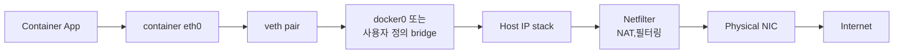
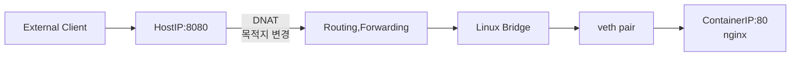
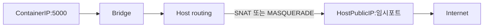
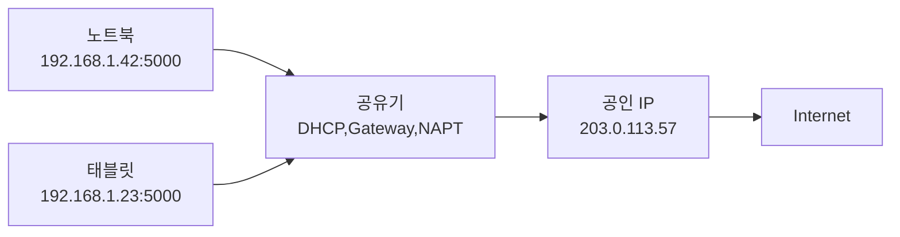
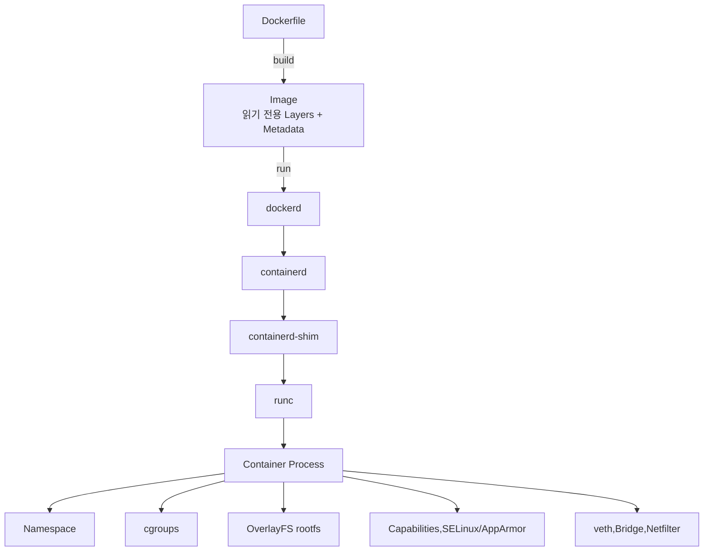

## 1. Docker 네트워크

### 먼저 알아둘 단어

| 단어 | 뜻 | 쉬운 비유 |
|---|---|---|
| Network Namespace | 컨테이너만의 네트워크 장치, IP, 라우팅 공간 | 세대별로 분리된 집안 배선 |
| veth pair | 두 끝이 서로 연결된 가상 네트워크 인터페이스 쌍 | 벽 양쪽을 잇는 랜 케이블 |
| Linux Bridge | 여러 인터페이스를 연결해 프레임을 전달하는 가상 스위치 | 멀티탭 또는 네트워크 스위치 |
| NAT | 패킷의 IP 주소를 변환 | 우편물의 주소를 바꿔 적기 |
| NAPT | IP와 포트를 함께 변환 | 대표 전화번호와 내선번호 사용 |
| Port Publishing | 호스트 포트를 컨테이너 포트에 연결 | 건물 대표번호를 특정 내선에 연결 |
| Netfilter | 커널에서 패킷을 검사,변환,차단하는 체계 | 도로의 검문소와 방향 안내판 |

> 쉬운 비유: Bridge 네트워크는 가상 공유기에 여러 컨테이너를 연결한 모습입니다. 컨테이너는 내부 주소를 쓰고, 외부로 나갈 때 호스트가 주소를 바꿉니다.

### 1.1 Bridge 네트워크 구조



Bridge 네트워크의 특징은 다음과 같습니다.

- 컨테이너마다 별도의 Network Namespace와 내부 IP를 사용합니다.
- 컨테이너의 `eth0`와 호스트의 Bridge를 veth pair로 연결합니다.
- 같은 Bridge에 있는 컨테이너끼리는 내부 네트워크로 통신합니다.
- 외부로 나갈 때는 보통 SNAT/MASQUERADE가 적용됩니다.
- 외부에서 들어오려면 일반적으로 포트를 게시합니다.

### 1.2 기본 Bridge, 사용자 정의 Bridge, Host 비교

| 유형 | 네트워크 격리 | 이름 기반 DNS | 일반적인 용도 |
|---|---:|---:|---|
| 기본 `bridge` | O | 제한적 | 간단한 단일 컨테이너 테스트 |
| 사용자 정의 Bridge | O | O | 같은 애플리케이션의 컨테이너 그룹 |
| `host` | X | 해당 없음 | 네트워크 격리보다 낮은 오버헤드가 중요한 경우 |

사용자 정의 Bridge를 만드는 예.

```bash
docker network create my-bridge

docker run -d --name web --network my-bridge nginx
docker run -d --name api --network my-bridge my-api
```

같은 사용자 정의 Bridge에 연결된 컨테이너는 Docker의 내장 DNS를 통해 `web`, `api` 같은 컨테이너 이름으로 서로를 찾을 수 있습니다.

Host 네트워크는 다음처럼 사용합니다.

```bash
docker run --network host nginx
```

이 모드에서는 컨테이너가 호스트의 Network Namespace를 공유하므로 별도의 컨테이너 IP, veth, Bridge를 사용하지 않습니다. 호스트의 다른 프로세스와 포트가 충돌할 수 있으며, 일반적인 `-p` 포트 게시의 의미도 없어집니다. 동작과 지원 범위는 운영체제 및 Docker 환경에 따라 차이가 있습니다.

### 1.3 외부에서 컨테이너로: Port Publishing과 DNAT

```bash
docker run -d -p 8080:80 nginx
```

`-p 8080:80`은 **호스트의 8080 포트로 들어온 요청을 컨테이너의 80 포트로 전달**한다는 뜻입니다.



패킷 수준의 개념적인 흐름은 다음과 같습니다.

1. 패킷이 호스트의 물리 NIC로 들어옵니다.
2. Netfilter 규칙이 목적지를 `HostIP:8080`에서 `ContainerIP:80`으로 바꿉니다(DNAT).
3. 커널 라우팅 테이블이 컨테이너 네트워크로 전달할 경로를 고릅니다.
4. Bridge가 FDB를 보고 대상 MAC 주소가 연결된 veth 포트를 찾습니다.
5. veth를 통해 컨테이너의 `eth0`와 Nginx에 도착합니다.

- **Neighbor/ARP Table**: 같은 L2 네트워크에서 IP 주소와 MAC 주소의 관계를 저장합니다.
- **FDB(Forwarding Database)**: Bridge가 MAC 주소와 Bridge 포트(veth)를 연결해 기억합니다.

Docker가 사용하는 실제 방화벽 백엔드는 환경에 따라 `iptables` 또는 `nftables` 기반일 수 있지만, 핵심은 Linux Kernel의 Netfilter 경로에서 주소 변환과 필터링이 이뤄진다는 점입니다.

### 1.4 외부로 나가기: SNAT와 MASQUERADE

컨테이너가 인터넷에 요청을 보내는 흐름입니다.



- **SNAT**는 패킷의 출발지 주소를 바꿉니다.
- **MASQUERADE**는 호스트 인터페이스의 현재 주소를 사용하도록 만든 SNAT 방식입니다.
- 응답이 돌아오면 연결 추적 정보에 따라 원래 컨테이너의 IP와 포트로 복원됩니다.

### 1.5 DHCP, 사설 IP, NAT, NAPT 구분

Docker 네트워크를 이해하려면 가정용 공유기를 떠올리면 쉽습니다.



| 개념 | 역할 | 한 줄 암기 |
|---|---|---|
| DHCP | IP, 서브넷 마스크, Gateway, DNS 정보를 자동 할당 | IP 나눠주기 |
| 사설 IP | 내부 네트워크에서 사용하는 주소 | 내부용 주소 |
| 공인 IP | 인터넷에서 라우팅 가능한 주소 | 외부용 주소 |
| Gateway | 다른 네트워크로 패킷을 내보내는 출구 | 외부로 나가는 문 |
| DNS | 도메인 이름을 IP 주소로 변환 | 이름을 주소로 변환 |
| NAT | IP 주소를 변환 | 주소 바꾸기 |
| NAPT | IP와 포트를 함께 변환 | 대표번호와 내선번호 |
| DNAT | 목적지 주소,포트를 변환 | 들어오는 우편의 수신지 변경 |
| SNAT | 출발지 주소,포트를 변환 | 나가는 우편의 발신지 변경 |

NAPT의 예는 다음과 같습니다.

```text
192.168.1.42:5000  → 203.0.113.57:2001
192.168.1.23:5000  → 203.0.113.57:2002
```

두 기기가 하나의 공인 IP를 공유해도 외부 포트가 다르므로, 공유기는 돌아온 응답을 올바른 내부 기기에 전달할 수 있습니다. 실무에서 단순히 NAT라고 부르는 기능이 실제로는 포트까지 변환하는 NAPT인 경우가 많습니다.

---

## 2. Kubernetes CNI와 Calico

### 먼저 알아둘 단어

| 단어 | 뜻 | 쉬운 비유 |
|---|---|---|
| CNI | 컨테이너 네트워크를 설정하기 위한 표준 인터페이스 | 콘센트의 공통 규격 |
| Calico | CNI 구현과 NetworkPolicy 기능을 제공하는 네트워크 솔루션 | 규격에 맞춰 실제 배선을 설치하는 업체 |
| Pod CIDR | Pod에 할당할 IP 주소 범위 | 한 동에 배정된 주소 구역 |
| BGP | 네트워크 도달 경로를 서로 알리는 라우팅 프로토콜 | 목적지로 가는 길을 공유하는 안내 체계 |
| NetworkPolicy | Pod 간 허용할 통신을 선언하는 정책 | 건물의 출입 허용 명단 |
| CoreDNS | Kubernetes 내부 이름을 IP로 해석하는 DNS | 사내 전화번호부 |

> 쉬운 비유: CNI는 Kubernetes와 네트워크 플러그인 사이의 계약서이고, Calico는 그 계약에 맞춰 Pod의 랜선과 경로, 보안 규칙을 실제로 구성합니다.

### 2.1 Pod가 생성될 때


Calico는 CNI를 통해 Pod 인터페이스와 경로를 구성하며, NetworkPolicy를 실제 네트워크 규칙으로 적용할 수 있습니다.

### 2.2 같은 노드와 다른 노드의 통신


- **같은 노드**: 보통 veth와 노드의 라우팅 경로를 통해 다른 Pod로 전달됩니다.
- **다른 노드**: 환경 설정에 따라 직접 라우팅, IP-in-IP, VXLAN 등의 방식으로 전달됩니다.
- **BGP**: 어떤 Pod CIDR이 어느 노드 또는 라우터 뒤에 있는지 경로를 교환하는 데 사용할 수 있습니다.
- **NetworkPolicy**: 출발지와 목적지 Pod, Namespace, 포트를 기준으로 통신을 허용하거나 차단합니다.

Calico가 항상 `tunl0`를 사용하는 것은 아닙니다. IP-in-IP 모드에서는 `tunl0`가 보일 수 있지만, VXLAN이나 비캡슐화 라우팅 모드에서는 구조가 달라집니다.

### 2.3 Docker Bridge와 Calico 비교

| 항목 | Docker 사용자 정의 Bridge | Kubernetes + Calico |
|---|---|---|
| 주요 대상 | Docker 컨테이너 | Kubernetes Pod |
| 기본 범위 | 단일 Docker 호스트 중심 | 여러 Kubernetes 노드 |
| 네트워크 설정 주체 | Docker Engine | Kubernetes가 CNI를 호출 |
| 이름 해석 | Docker 내장 DNS | CoreDNS |
| 통신 정책 | Docker 네트워크 단위 격리 중심 | Kubernetes NetworkPolicy 지원 |

Docker도 Swarm Overlay처럼 멀티 호스트 네트워크 기능이 있지만, 여기서의 비교는 일반적인 단일 호스트 Bridge 네트워크를 기준으로 합니다.

### 2.4 CIDR 읽는 법

`192.168.0.0/24`에서 `/24`는 앞의 24비트가 네트워크 영역이라는 뜻입니다.

```text
192.168.0.0/24
└─ 전체 주소 수: 2^(32-24) = 256개
└─ 주소 범위: 192.168.0.0 ~ 192.168.0.255
```

일반적인 IPv4 서브넷에서는 네트워크 주소와 브로드캐스트 주소를 제외해 호스트에 254개를 할당할 수 있습니다. 다만 클라우드나 CNI는 일부 주소를 추가 예약할 수 있으므로 실제 사용 가능 수는 구현에 따라 달라질 수 있습니다.

```text
Prefix 숫자가 커질수록 → 주소 범위가 작아짐
Prefix 숫자가 작아질수록 → 주소 범위가 커짐
```

---

## 3. 전체 요약

### 구성 요소 한눈에 보기

| 영역 | 핵심 질문 | 담당 기술 |
|---|---|---|
| 이미지 | 실행 환경을 어떻게 배포하는가? | Image, Layer, Manifest, Config |
| 파일 시스템 | 원본을 유지하며 어떻게 수정하는가? | OverlayFS, Copy-on-Write, Volume |
| 실행 | 명령이 어떻게 프로세스가 되는가? | Docker Client, `dockerd`, `containerd`, Shim, `runc` |
| 격리 | 프로세스에 무엇이 보이는가? | Namespace |
| 자원 | 얼마나 사용할 수 있는가? | cgroups |
| 권한 | 어떤 시스템 동작을 할 수 있는가? | Capabilities |
| 접근 통제 | 어떤 대상에 접근할 수 있는가? | SELinux, AppArmor |
| 네트워크 | 패킷을 어디로 전달하는가? | Bridge, veth, Netfilter, NAT |
| Kubernetes 네트워크 | 여러 노드의 Pod를 어떻게 연결하는가? | CNI, Calico, Routing, NetworkPolicy |

### 최종 연결 다이어그램



### 초압축 암기

```text
Image       = 실행 환경을 담은 읽기 전용 설계도
Layer       = 이미지의 파일 변경분
Container   = 격리되고 제한된 Linux 프로세스 그룹
dockerd     = Docker 전체 관리
containerd  = 이미지와 컨테이너 생명주기 관리
runc        = OCI 설정대로 실제 컨테이너 생성
Namespace   = 무엇이 보이는가
cgroups     = 얼마나 사용할 수 있는가
OverlayFS   = 어떤 파일 시스템을 보는가
Capability  = 어떤 시스템 동작을 할 수 있는가
SELinux     = 어떤 대상에 접근할 수 있는가
Bridge      = 같은 호스트의 컨테이너 네트워크 연결
NAT         = 패킷의 주소 변환
CNI         = Kubernetes 네트워크 설정 표준
Calico      = Pod 네트워크와 NetworkPolicy 구현
```
