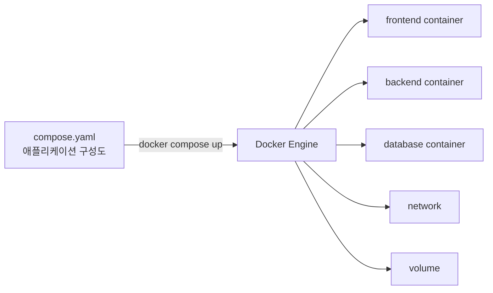
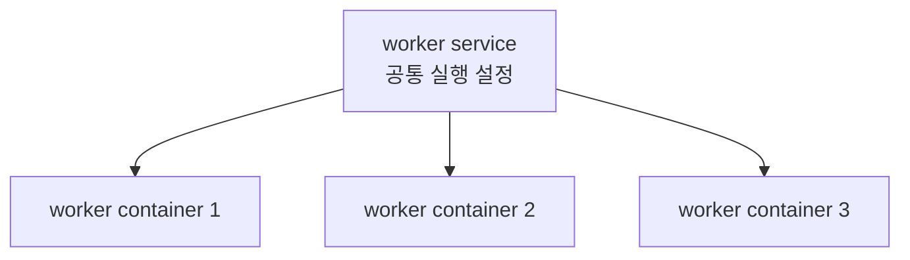
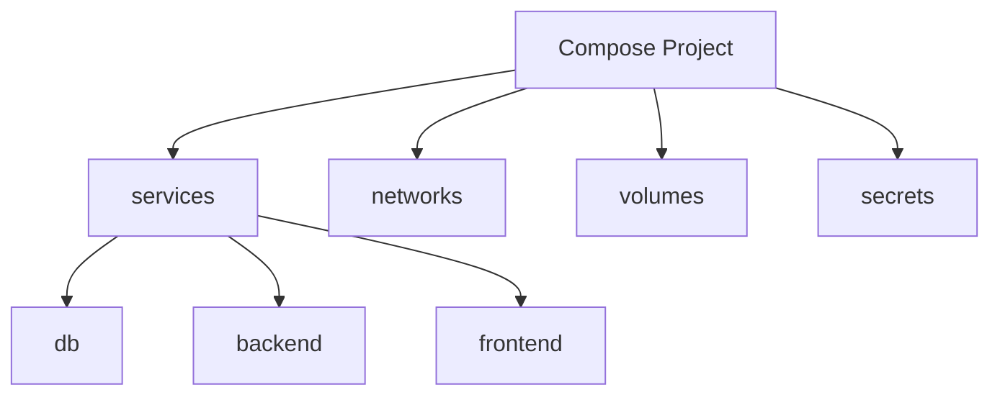
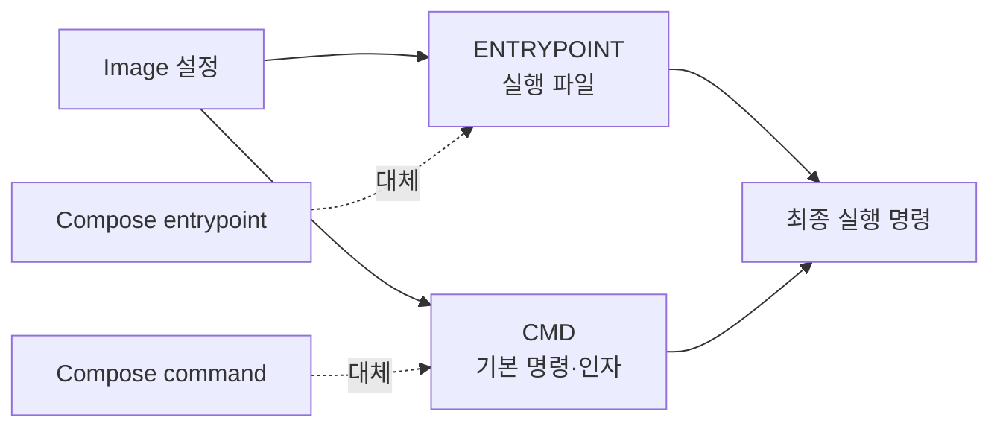

Docker Compose는 여러 컨테이너로 구성된 애플리케이션을 하나의 YAML 파일로 정의하고, 한 번의 명령으로 함께 실행·중지·관리하는 도구입니다.



> 쉬운 비유: `docker run`이 가전제품을 하나씩 직접 설치하는 일이라면, Docker Compose는 집 전체의 가전제품·배선·수도 연결을 설계도 한 장으로 한꺼번에 설치하는 작업입니다.

Compose는 여러 컨테이너를 편리하게 조율하지만, Kubernetes처럼 여러 노드에 컨테이너를 스케줄링하고 장애 시 자동으로 재배치하는 완전한 클러스터 오케스트레이터는 아닙니다. 로컬 개발, 교육, 통합 테스트, 단일 Docker 호스트 애플리케이션에 특히 적합합니다.

---

## 1. Docker Compose 핵심 개념

### 먼저 알아둘 단어

| 단어 | 뜻 | 쉬운 비유 |
|---|---|---|
| Compose file | 서비스·네트워크·볼륨 구성을 선언한 YAML 파일 | 건물 설계도 |
| Service | 동일한 설정으로 실행할 컨테이너의 논리적 정의 | 식당의 주방·홀·창고 역할 |
| Project | 하나의 Compose 애플리케이션에 속한 리소스 묶음 | 건물 단지 이름 |
| Network | 서비스끼리 통신하는 가상 네트워크 | 건물 내부 통로 |
| Volume | 컨테이너가 사라져도 데이터를 보존하는 저장소 | 별도 창고 |
| Declarative | 원하는 최종 상태를 파일에 선언하는 방식 | 작업 순서 대신 완성 도면 전달 |

### 1.1 Compose가 필요한 이유

Compose 없이 세 개의 컨테이너를 실행하려면 네트워크와 볼륨을 만들고, 각 컨테이너에 환경 변수와 포트를 반복해서 지정해야 합니다.

```text
docker network create ...
docker volume create ...
docker run ... database
docker run ... backend
docker run ... frontend
```

Compose에서는 이 구성을 `compose.yaml`에 저장한 뒤 다음 명령으로 실행합니다.

```bash
docker compose up -d
```

Compose가 관리하는 대표 항목은 다음과 같습니다.

- 컨테이너 이미지 또는 빌드 방법
- 환경 변수와 Secret
- 서비스 간 네트워크
- 호스트에 공개할 포트
- Volume과 Bind Mount
- 시작 의존 관계와 Healthcheck
- 재시작 정책

### 1.2 서비스와 컨테이너의 관계

서비스는 **컨테이너 그 자체가 아니라 컨테이너 실행 설정**입니다. 기본적으로 서비스당 컨테이너 하나가 만들어지지만, 필요하면 같은 서비스의 컨테이너 수를 늘릴 수 있습니다.

```bash
docker compose up -d --scale worker=3
```



고정된 호스트 포트를 사용하는 서비스를 여러 개로 확장하면 포트 충돌이 발생할 수 있습니다. 여러 복제본 앞에는 별도의 프록시나 로드 밸런서가 필요할 수 있습니다.

---

## 2. compose.yaml 구조

### 먼저 알아둘 단어

| 단어 | 뜻 | 쉬운 비유 |
|---|---|---|
| `services` | 실행할 서비스 정의 | 입주 업체 목록 |
| `image` | 컨테이너를 만들 이미지 | 완제품 주문 |
| `build` | 이미지를 직접 만드는 방법 | 현장에서 제품 제작 |
| `ports` | 호스트 포트와 컨테이너 포트 연결 | 대표번호를 내선에 연결 |
| `environment` | 컨테이너 프로세스에 전달할 환경 변수 | 작업자에게 전달하는 업무 메모 |
| `volumes` | 데이터 또는 파일 마운트 | 외부 창고 연결 |
| `networks` | 서비스가 참여할 네트워크 | 출입 가능한 통로 지정 |
| `depends_on` | 서비스 생성·시작 의존 관계 | 선행 작업 확인표 |

> 쉬운 비유: 최상위 `services`, `networks`, `volumes`는 각각 입주자, 도로, 창고를 정의하는 설계도 영역입니다.

### 2.1 최소 예제

```yaml
services:
  db:
    image: postgres:15
    environment:
      POSTGRES_PASSWORD: postgres
    volumes:
      - db-data:/var/lib/postgresql/data

  backend:
    image: my-backend:1.0
    environment:
      DB_HOST: db
      DB_PORT: "5432"
    depends_on:
      - db

  frontend:
    image: my-frontend:1.0
    ports:
      - "8080:80"

volumes:
  db-data:
```

들여쓰기가 구조를 결정하므로 Tab 대신 공백을 사용해야 합니다. 최신 Compose Specification에서는 최상위 `version` 필드가 필요하지 않습니다.

### 2.2 전체 구조



Compose는 별도로 지정하지 않으면 현재 디렉터리 이름을 프로젝트 이름으로 사용합니다. 생성되는 리소스에는 일반적으로 프로젝트 이름이 접두사로 붙습니다.

```text
myapp_default
myapp-db-1
myapp_db-data
```

실제 이름은 Compose 버전, 설정한 `container_name`, 리소스 종류에 따라 달라질 수 있습니다. 서비스 검색에는 컨테이너 이름보다 **서비스 이름**을 사용하는 것이 좋습니다.

---

## 3. 이미지 빌드와 실행 명령

### 먼저 알아둘 단어

| 단어 | 뜻 | 쉬운 비유 |
|---|---|---|
| Build Context | 이미지 빌더에 전달할 파일 범위 | 공장에 보내는 재료 상자 |
| Dockerfile | 이미지를 만드는 절차 | 제품 조립 설명서 |
| Build Argument | 이미지 빌드 중에만 사용하는 값 | 제조 공정용 임시 지시사항 |
| `ENTRYPOINT` | 컨테이너의 기본 실행 프로그램 | 반드시 실행할 본체 |
| `CMD` | 기본 명령 또는 기본 인자 | 본체에 전달하는 기본 옵션 |
| `command` | Compose에서 이미지의 `CMD`를 대체하는 값 | 기본 옵션 교체 |
| `entrypoint` | Compose에서 이미지의 `ENTRYPOINT`를 대체하는 값 | 실행 본체 교체 |

> 쉬운 비유: `ENTRYPOINT`가 커피 머신이라면 `CMD`는 기본 메뉴인 아메리카노입니다. `command`는 메뉴를 라테로 바꾸고, `entrypoint`는 커피 머신 자체를 다른 기계로 교체합니다.

### 3.1 기존 이미지 사용과 직접 빌드

Registry의 이미지를 그대로 사용할 때는 `image`를 지정합니다.

```yaml
services:
  web:
    image: nginx:alpine
```

로컬 Dockerfile로 이미지를 만들 때는 `build`를 지정합니다.

```yaml
services:
  app:
    build:
      context: ./app
      dockerfile: Dockerfile.prod
      args:
        APP_ENV: production
    image: myapp:1.0
    ports:
      - "8080:8080"
```

```text
project/
├── compose.yaml
└── app/
    ├── Dockerfile.prod
    └── app.jar
```

```dockerfile
FROM eclipse-temurin:17-jre

ARG APP_ENV
ENV APP_ENV=${APP_ENV}

COPY app.jar /app/app.jar
ENTRYPOINT ["java", "-jar", "/app/app.jar"]
```

- `context: ./app`: 빌더에 전달할 디렉터리입니다.
- `dockerfile`: Context를 기준으로 사용할 Dockerfile 경로입니다.
- `args`: Dockerfile의 `ARG`에 전달할 빌드 시점 값입니다.
- `image`: 빌드 결과에 붙일 이미지 이름과 태그입니다.

Build Argument는 비밀값 전달 수단이 아닙니다. 이미지 이력이나 빌드 캐시에 남을 수 있으므로 비밀번호와 토큰을 넣지 않아야 합니다.

### 3.2 `command`와 `entrypoint`

이미지에 다음 설정이 있다고 가정합니다.

```dockerfile
ENTRYPOINT ["docker-entrypoint.sh"]
CMD ["nginx", "-g", "daemon off;"]
```

`command`만 지정하면 이미지의 `CMD`를 대체하고 `ENTRYPOINT`는 유지합니다.

```yaml
services:
  web:
    image: nginx:alpine
    command: ["nginx", "-g", "daemon off;"]
```

`entrypoint`를 지정하면 이미지의 `ENTRYPOINT`를 대체합니다. Compose에서는 이미지의 기본 `CMD`도 무시되므로 필요한 인자를 `command`로 명시해야 합니다.

```yaml
services:
  web:
    image: nginx:alpine
    entrypoint: ["/custom-entrypoint.sh"]
    command: ["nginx", "-g", "daemon off;"]
```



배열 형태는 Shell의 문자열 해석 차이를 줄여 주므로 실행 파일과 인자가 명확할 때 유용합니다.

---
