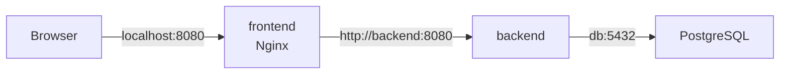

## 1. Compose 네트워크와 서비스 통신

### 먼저 알아둘 단어

| 단어 | 뜻 | 쉬운 비유 |
|---|---|---|
| Default Network | Compose가 자동 생성하는 프로젝트 전용 네트워크 | 자동으로 만들어지는 사내망 |
| Service Discovery | 서비스 이름을 컨테이너 IP로 찾는 기능 | 이름으로 찾는 사내 전화번호부 |
| `ports` | 호스트 포트를 컨테이너 포트에 게시 | 외부 대표번호 공개 |
| `expose` | 컨테이너가 사용하는 포트를 문서화 | 내부 안내판 |
| Internal Network | 외부 연결을 제한한 Docker 네트워크 | 외부 출입구가 없는 내부 통로 |
| Reverse Proxy | 요청을 받아 적절한 내부 서비스로 전달 | 안내 데스크 |

> 쉬운 비유: Compose 네트워크 안에서 `backend`와 `db`는 사람 이름과 같습니다. IP라는 좌석 번호가 바뀌어도 이름으로 상대를 찾을 수 있습니다.

### 1.1 서비스 이름으로 통신하기



같은 Compose 네트워크에 연결된 서비스는 서비스 이름으로 통신합니다.

```text
Frontend → http://backend:8080
Backend  → postgresql://db:5432/app
```

컨테이너 안의 `localhost`는 **호스트나 다른 컨테이너가 아니라 그 컨테이너 자신**을 가리킵니다. 다른 서비스에는 `backend`, `db` 같은 서비스 이름으로 접근해야 합니다.

컨테이너 IP로도 통신할 수 있지만 재생성 시 IP가 바뀔 수 있으므로 서비스 이름을 사용하는 것이 안전합니다. 연결이 이미 열려 있던 상태에서 컨테이너가 교체되면 애플리케이션은 DNS 재조회와 재연결을 수행할 수 있어야 합니다.

### 1.2 `ports`와 `expose`

```yaml
services:
  frontend:
    image: nginx:alpine
    ports:
      - "8080:80"
```

`8080:80`은 호스트의 모든 인터페이스에서 8080 포트를 열어 컨테이너의 80 포트로 전달할 수 있습니다.

```text
외부 또는 호스트 → HostIP:8080 → frontend:80
```

로컬 호스트에서만 접근하게 하려면 바인딩 주소를 제한합니다.

```yaml
ports:
  - "127.0.0.1:8080:80"
```

`expose`는 호스트에 포트를 공개하지 않습니다.

```yaml
services:
  backend:
    image: my-backend:1.0
    expose:
      - "8080"
```

`expose`는 내부 사용 포트를 문서화하는 성격이 강합니다. 같은 네트워크의 컨테이너 간 접근을 방화벽처럼 허용하거나 차단하지는 않습니다. 애플리케이션이 `0.0.0.0:8080`에서 듣고 있고 네트워크가 연결되어 있다면 `expose`가 없어도 다른 컨테이너가 접근할 수 있습니다.

### 1.3 Public·Private 네트워크 분리

```yaml
services:
  frontend:
    image: nginx:alpine
    ports:
      - "8080:80"
    networks:
      - public

  backend:
    image: my-backend:1.0
    networks:
      - public
      - private

  db:
    image: postgres:15
    networks:
      - private

networks:
  public:
  private:
    internal: true
```


- 외부에는 `frontend`만 포트가 게시됩니다.
- `frontend`와 `backend`는 `public` 네트워크에서 통신합니다.
- `backend`와 `db`는 `private` 네트워크에서 통신합니다.
- `frontend`와 `db`는 공통 네트워크가 없어 직접 통신할 수 없습니다.
- `internal: true`는 해당 네트워크에 외부 연결성을 제공하지 않도록 구성합니다.

이미 만들어진 Docker 네트워크를 사용하려면 외부 네트워크로 선언합니다.

```yaml
networks:
  shared-network:
    external: true
```

외부 네트워크는 Compose가 생성하거나 `down`으로 삭제하지 않습니다.

### 1.4 Nginx Reverse Proxy 예제

```nginx
server {
    listen 80;

    location / {
        root /usr/share/nginx/html;
        index index.html;
    }

    location /api/ {
        proxy_pass http://backend:8080/;
        proxy_set_header Host $host;
        proxy_set_header X-Real-IP $remote_addr;
        proxy_set_header X-Forwarded-For $proxy_add_x_forwarded_for;
        proxy_set_header X-Forwarded-Proto $scheme;
    }
}
```

```yaml
services:
  frontend:
    image: nginx:alpine
    ports:
      - "8080:80"
    volumes:
      - ./nginx.conf:/etc/nginx/conf.d/default.conf:ro
      - ./frontend/dist:/usr/share/nginx/html:ro

  backend:
    image: my-backend:1.0
    expose:
      - "8080"
```

- `$host`: 클라이언트가 요청한 Host 정보를 백엔드에 전달합니다.
- `$remote_addr`: Nginx에 직접 연결한 클라이언트 주소입니다.
- `$proxy_add_x_forwarded_for`: 기존 전달 경로를 보존하며 클라이언트 IP를 추가합니다.
- `:ro`: 컨테이너에서 마운트한 호스트 파일을 읽기 전용으로 사용합니다.

위 `location /api/`와 `proxy_pass http://backend:8080/`는 둘 다 끝에 `/`가 있으므로 `/api/users` 요청이 백엔드의 `/users`로 전달됩니다. `/api` 경로를 유지해야 한다면 `proxy_pass`의 URI 구성 차이를 확인해야 합니다.

---

## 2. Volume과 데이터 영속성

### 먼저 알아둘 단어

| 단어 | 뜻 | 쉬운 비유 |
|---|---|---|
| Writable Layer | 컨테이너가 실행 중 변경한 파일을 저장하는 임시 계층 | 철거 시 사라지는 임시 보관함 |
| Named Volume | Docker가 관리하고 이름으로 참조하는 저장 공간 | 관리사무소가 관리하는 창고 |
| Bind Mount | 호스트의 특정 경로를 컨테이너에 직접 연결 | 내 방의 서랍을 작업장에 연결 |
| Anonymous Volume | 명시적 이름 없이 만들어진 Volume | 번호만 붙은 임시 창고 |

> 쉬운 비유: 컨테이너는 교체 가능한 사무실이고 Volume은 별도 문서 보관실입니다. 사무실을 철거해도 보관실을 없애지 않으면 문서는 남습니다.

### 2.1 Named Volume

```yaml
services:
  db:
    image: postgres:15
    volumes:
      - db-data:/var/lib/postgresql/data

volumes:
  db-data:
```

Named Volume은 Docker가 실제 저장 위치를 관리합니다. `docker compose down`만 실행하면 기본적으로 남고, 다음 `up`에서 다시 연결됩니다.

### 2.2 Bind Mount

```yaml
services:
  backend:
    build: ./backend
    volumes:
      - ./backend/src:/app/src
      - ./backend/config.yml:/app/config.yml:ro
```

Bind Mount는 소스 코드와 설정 파일을 즉시 반영하는 개발 환경에 편리합니다. 반면 호스트 경로, 권한, 운영체제 차이에 영향을 받기 쉽습니다.

| 구분 | Named Volume | Bind Mount |
|---|---|---|
| 경로 관리 | Docker | 사용자 |
| 호스트 경로 의존성 | 낮음 | 높음 |
| 개발 코드 동기화 | 보통 | 편리함 |
| DB 영속 데이터 | 일반적으로 적합 | 권한·성능 검토 필요 |
| 설정 파일 한 개 연결 | 가능 | 편리함 |

Volume은 백업이 아닙니다. 중요한 데이터는 별도의 백업과 복구 절차가 필요합니다.

---
