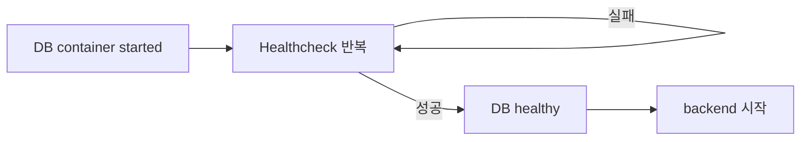
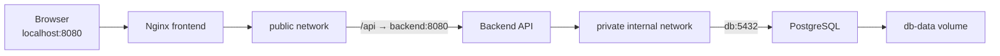

## 1. 의존 관계, Healthcheck, 재시작 정책

### 먼저 알아둘 단어

| 단어 | 뜻 | 쉬운 비유 |
|---|---|---|
| Startup Order | 어떤 서비스를 먼저 시작할지 정한 순서 | 가게 문을 여는 순서 |
| Readiness | 실제 요청을 처리할 준비가 된 상태 | 직원이 출근한 것이 아니라 업무 준비까지 끝난 상태 |
| Healthcheck | 컨테이너 내부 서비스의 상태를 주기적으로 검사 | 정기 건강검진 |
| Restart Policy | 프로세스 종료 후 컨테이너 재시작 규칙 | 고장 시 자동 전원 복구 설정 |
| PID 1 | 컨테이너의 생명주기를 대표하는 메인 프로세스 | 가게의 영업 책임자 |

> 쉬운 비유: DB 컨테이너가 시작됐다는 것은 식당 직원이 출근했다는 뜻이고, `healthy`는 재료 준비까지 마쳐 주문을 받을 수 있다는 뜻.

### 1.1 `depends_on`의 한계

짧은 문법은 컨테이너의 시작 순서만 조정.

```yaml
services:
  backend:
    depends_on:
      - db
```

DB 프로세스가 실제 연결을 받을 준비가 끝날 때까지 기다린다는 뜻은 아니다. 준비 상태까지 기다리려면 DB에 Healthcheck를 만들고 `service_healthy` 조건을 사용.

### 1.2 Healthcheck와 `service_healthy`

```yaml
services:
  db:
    image: postgres:15
    environment:
      POSTGRES_USER: app
      POSTGRES_DB: app
      POSTGRES_PASSWORD: local-only
    healthcheck:
      test: ["CMD-SHELL", "pg_isready -U $$POSTGRES_USER -d $$POSTGRES_DB"]
      interval: 5s
      timeout: 5s
      retries: 5
      start_period: 10s

  backend:
    image: my-backend:1.0
    depends_on:
      db:
        condition: service_healthy
```

`$$`는 Compose가 `$POSTGRES_USER`를 호스트에서 미리 치환하지 않고, 컨테이너 안의 Shell에 `$` 문자를 전달하도록 합니다.



Healthcheck 항목의 의미는 다음과 같습니다.

| 항목 | 의미 |
|---|---|
| `test` | 실행할 검사 명령 |
| `interval` | 검사 주기 |
| `timeout` | 한 번의 검사 제한 시간 |
| `retries` | 연속 실패 후 `unhealthy`가 되는 기준 |
| `start_period` | 초기 기동 실패를 본격 집계하기 전 유예 시간 |

Healthcheck는 상태를 `starting`, `healthy`, `unhealthy`로 표시할 뿐, 일반 Docker Compose에서 `unhealthy` 컨테이너를 자동으로 교체하거나 재시작하지는 않습니다. `depends_on`도 최초 시작 시 기다리는 용도이며, 실행 중 DB가 나중에 `unhealthy`가 됐다고 Backend를 자동으로 재시작하지 않습니다.

애플리케이션도 DB 연결 실패에 대비해 재시도와 지수 백오프를 구현하는 것이 좋습니다.

### 1.3 재시작 정책

```yaml
services:
  backend:
    image: my-backend:1.0
    restart: unless-stopped
```

| 값 | 동작 | 적합한 예 |
|---|---|---|
| `no` | 자동으로 재시작하지 않음. 기본값 | 일회성 작업 |
| `on-failure` | 프로세스가 0이 아닌 종료 코드로 끝나면 재시작 | 실패 시 재시도할 배치 작업 |
| `always` | 프로세스 종료 또는 Docker 데몬 재시작 후 다시 실행 | 상시 서비스 |
| `unless-stopped` | 사용자가 명시적으로 중지하지 않은 한 다시 실행 | 수동 중지 상태를 유지할 상시 서비스 |

재시작 판단의 기준은 컨테이너의 메인 프로세스(PID 1)가 종료됐는지 여부입니다. 단순히 Healthcheck가 실패한 것만으로는 프로세스가 종료되지 않으므로 재시작 정책이 작동하지 않는다.

사용자가 직접 중지한 컨테이너에는 재시작 정책이 즉시 적용되지 않습니다. `always`와 `unless-stopped`는 Docker 데몬이 다시 시작될 때 수동 중지 상태를 처리하는 방식에서 차이가 있으므로, 의도적으로 꺼 둔 상태를 유지하려면 `unless-stopped`가 이해하기 쉽다.

---

## 2. 실전 전체 예제

### 디렉터리 구조

```text
project/
├── compose.yaml
├── .env
├── nginx.conf
├── frontend/
│   └── dist/
└── backend/
    ├── Dockerfile
    └── ...
```

### Compose 파일

```yaml
services:
  db:
    image: postgres:15
    environment:
      POSTGRES_USER: app
      POSTGRES_DB: app
      POSTGRES_PASSWORD: "${DB_PASSWORD:?DB_PASSWORD를 설정하세요}"
    volumes:
      - db-data:/var/lib/postgresql/data
    healthcheck:
      test: ["CMD-SHELL", "pg_isready -U $$POSTGRES_USER -d $$POSTGRES_DB"]
      interval: 5s
      timeout: 5s
      retries: 5
      start_period: 10s
    restart: unless-stopped
    networks:
      - private

  backend:
    build:
      context: ./backend
      dockerfile: Dockerfile
    environment:
      APP_ENV: development
      DB_HOST: db
      DB_PORT: "5432"
      DB_NAME: app
      DB_USER: app
      DB_PASSWORD: "${DB_PASSWORD}"
    expose:
      - "8080"
    depends_on:
      db:
        condition: service_healthy
    restart: unless-stopped
    networks:
      - public
      - private

  frontend:
    image: nginx:alpine
    ports:
      - "${FRONTEND_PORT:-8080}:80"
    volumes:
      - ./nginx.conf:/etc/nginx/conf.d/default.conf:ro
      - ./frontend/dist:/usr/share/nginx/html:ro
    depends_on:
      - backend
    restart: unless-stopped
    networks:
      - public

volumes:
  db-data:

networks:
  public:
  private:
    internal: true
```

> 이 예제는 구조 학습용. 운영 환경에서는 DB 비밀번호를 환경 변수 대신 Secret Manager 또는 파일 기반 Secret으로 전달하고, TLS,백업,모니터링,로그 수집 정책도 별도로 구성해야 한다.

### 실행과 점검

```bash
# 최종 설정과 변수 치환 결과 검증
docker compose config

# 빌드 후 실행
docker compose up -d --build

# 서비스 상태와 Health 확인
docker compose ps

# 전체 로그 추적
docker compose logs -f --tail=100

# 접속
curl http://localhost:8080

# 종료하되 DB Volume은 보존
docker compose down
```



---

## 3. 전체 요약

### 핵심 구분표

| 궁금한 점 | 사용하는 항목 |
|---|---|
| 어떤 컨테이너를 실행하는가? | `services` |
| Registry 이미지를 사용하는가? | `image` |
| Dockerfile로 직접 만드는가? | `build` |
| 외부에서 어떻게 접근하는가? | `ports` |
| 서비스끼리 어떻게 찾는가? | Network + 서비스 이름 |
| 컨테이너에 설정값을 어떻게 주는가? | `environment`, `env_file` |
| Compose 파일의 변수를 어떻게 채우는가? | `.env`, `--env-file`, Shell 환경 변수 |
| 데이터를 어떻게 보존하는가? | Named Volume, Bind Mount |
| DB 준비를 어떻게 기다리는가? | `healthcheck` + `depends_on.condition` |
| 프로세스 종료 후 어떻게 복구하는가? | `restart` |
| 설정 변경을 어떻게 반영하는가? | `docker compose up -d`로 재생성 |

### 초압축 암기

```text
Compose file = 여러 컨테이너 애플리케이션의 선언형 설계도
Service      = 컨테이너 실행 설정
Project      = Compose가 관리하는 리소스 묶음
image        = 기존 이미지 사용
build        = Dockerfile로 이미지 생성
ports        = Host 포트를 Container에 공개
expose       = 내부 사용 포트 문서화, Host에는 미공개
environment  = 컨테이너 환경 변수
.env         = Compose 변수 보간의 기본 입력
Volume       = 컨테이너와 분리된 영속 저장소
depends_on   = 시작 의존 관계
healthcheck  = 서비스 상태 검사
restart      = 메인 프로세스 종료 후 재시작 규칙
up           = 생성,실행,필요 시 재생성
stop         = 컨테이너를 남기고 중지
down         = 컨테이너와 Compose 네트워크 제거
```
