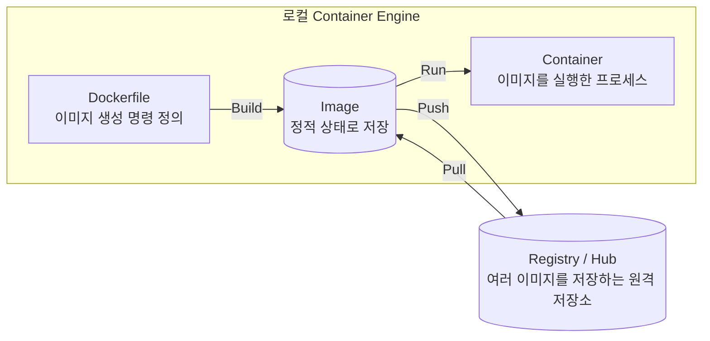
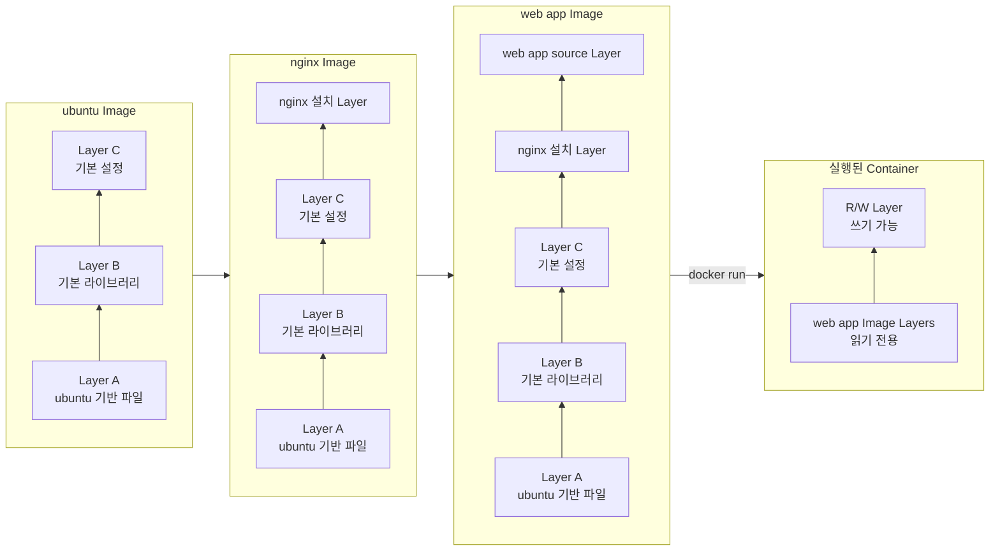
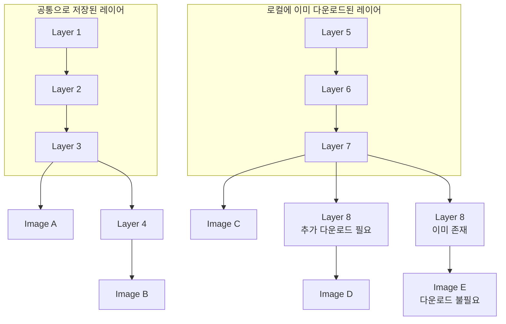
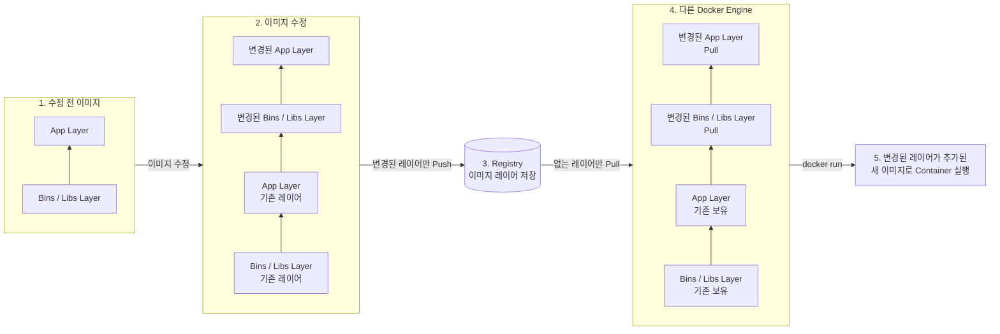
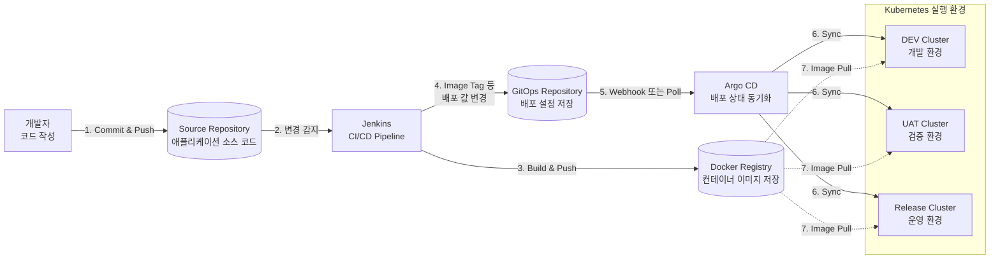

# Cloud기반 Container

## 컨테이너 관리 도구 

CI / CD 파이프라인 빌드를 위한 도구 

내가 만든 DB

내가 만든 백엔드

내가 만든 파이썬 

이 잘 돌아가야 한다. 

이를 위해 

- 컨테이너 플랫폼
- 컨테이너 빌드 도구
- 컨테이너 런타임 도구

--- 

도커? 

도커 -> 비용을 내야한다. 

향후에 쿠버네티스 

-> 도커 X  -> 런타임용 도구를 쓴다. 

sudo pkill -9 -f -i docker

- sudo : 관리자 권한
- pkill : 조건에 맞는 프로세스 
- -9 : 즉시 강제 종료 
- -f : 프로세스 전체 실행 명령 검색 
- -i : 대소문자 구분 없이 Docker 검색 

> lsof -ti :8080 | xargs kill -9

lsof -ti :8080 : 8080 포트를 사용하는 프로세스 ID

| : 출력된 PID를 다음 명령어로 전달

xargs kill -9: 전달받은 프로세스를 즉시 강제 종료

# 가상화 Virualization

- 물리적인 하드웨어를 추상화하여 소프트웨어로 구현하는 기술
- 가상화 기술을 활용하면 한 컴퓨터를 독립된 여러 대의 컴퓨터 처럼 사용할 수 있도록 지원

어플리케이셔 관점에서는 바뀌는 게 없고, 물리적으로 사용하는 것만 바뀜

# 가상화를 위한 Hypervisor 

물리 서버 위에서 여러 개의 가상 머신VM, Virtual Machine을 생성, 실행, 관리하는 소프트웨어 계층
즉, 하나의 컴퓨터 자원을 나눠서 여러 개의 독립된 컴퓨터처럼 운영할 수 있게 해주는 가상화 엔진

- 물리 하드웨어 CPU, Memory, Disk, NIC 등 를 관리
- VM을 생성 / 삭제 / Snapshot / Migration 관리
- 각 VM에게 적절한 자원 할당
- VM 간 자원 충돌을 방지
- VM이 요청하는 하드웨어 명령을 중재 및 스케줄

Type 1
Native / Bare metal Hypervisor

경량 전용 OS, 전용 하드웨어, 원격관리 도구 지원

- VM 전용 서버 구성 시 활용
- OS 오버헤드 없고, 높은 성능과 안정성 제공
- 클라우드 IDC, 데이터 센터용

VMware ESXi

- Microsoft Hyper V
- KVM 리눅스 커널 포함 형태
- Xen

Type 2
Hosted Hypervisor

기존 장비에 가상화 환경 구성시 활용

- 기존 운영체제에서 동작
- OS 오버헤드 존재
- 데스크탑 테스트/개발용

```text
AWS EC2 서버
└── ESXi Hypervisor
    ├── 웹서버 VM (24시간 가동)
    ├── DB 서버 VM (24시간 가동)
    └── 캐시 서버 VM (24시간 가동
```

VMware Workstation

- Oracle VirtualBox
- Parallels Desktop

```text
개발자 맥북
└── macOS (주 작업 환경)
    ├── Chrome, Slack, VSCode 사용
    └── VirtualBox 실행
        └── Ubuntu VM (테스트용, 필요할 때만)
```

VM 구조의 문제점 V

irtualization Machine은 물리 서버를 서비스화하여 동적 할당을 지원

But, 애플리케이션의 설치 및 운영은 기존 전통적인 물리 서버 환경과 동일한 구조

# VM 구조의 고질적 문제 

- 거대한 이미지 크기 
    - VM 이미지는 OS, 가상 하드웨어 등 포함
    - 사이즈 : 수 GB 수십 GB
- 느린 시작 시간
    - 부팅 시 Hypervisor OS M/W Appl 까지 단계적 실행
- VM 간 환경 불일치
    - VM은 OS 까지만, Appl 실행을 위한 환경 구성은 별로 필요 이로인한 환경 불일치 문제 발생

Virtualization Machine은 물리 서버를 서비스화하여 동적 할당을 지원
But, 애플리케이션의 설치 및 운영은 기존 전통적인 물리 서버 환경과 동일한 구조

# 작은 실행 단위 컨테이너화 단위 

- Linux Kernel 환경으로 OS 환경 통합
- 애플리케이션과 실행 환경을 통합한 이미지로 생성 관리 배포 단위에서 OS 이미지 제거

Host OS는 Dont Care

Host OS는 Linux Kernel

작은 이미지 크기 Appl. 실행을 위한 파일/라이브러리만
이미지화
사이즈: 수십 MB 수백 MB

빠른 시작 시간 컨테이너는 Kernel 공유하므로
별도 부팅 시간 없음
실행 시간: 프로세스 실행 밀리초, 초

동일 실행 환경(높은 이동성)
Appl. 중심 의존관계 파일/라이브러리를
컨테이너 이미지로 포함
동일 Linux Kernel에서 동일 실행

# VM 대비 높은 개발 집적도

컨테이너 특징

| 비교 항목 | 기존 VM의 한계 | 컨테이너 도입 후 변화 |
| --- | --- | --- |
| 이식성<br>Portability | 환경마다 OS 패키지·라이브러리 버전이 달라<br>내 PC에선 되는데 서버에선 에러 발생 | 앱, 의존성 라이브러리를 단일 패키지로 묶어<br>로컬·클라우드 어디서든 100 동일 실행 |
| 이미지 크기 | Guest OS 전체를 포함해 이미지 크기가<br>수 GB 수십 GB에 달함 | OS 커널을 제외, 앱 구동에 필요한 파일만 담아<br>수십 MB 수백 MB 수준 |
| 기동 속도 | OS 부팅 및 가상 하드웨어 초기화로<br>기동에 수십 초 수 분 소요 | 프로세스 실행 수준으로 수 밀리초 수 초 |
| 자원 효율<br>집적도 | 각 VM마다 OS 구동을 위한 고정 CPU/메모리<br>오버헤드가 발생해 자원 낭비 큼 | 호스트 커널을 공유, 필요한 리소스만 소비 |

[참고] VM 과의 차이점 1. 컨테이너의 이해

|  | 가상 서버 | 컨테이너 |
| --- | --- | --- |
| 가상화 | 서버 가상화, VM 간 격리 | 호스트 자원 공유<br>네임 스페이스를 통해 앱 간 격리 |
| 이미지화 | OS와 가상 디바이스 등도 포함되어<br>사이즈가 큼 | 필요한 앱과 bin/lib만 포함되어<br>사이즈가 매우 작음 |
| 플랫폼간 이식성 | 동일 하이퍼바이저 간 only | 이기종 물리, 가상, 클라우드 간 |
| 이기종 OS 사용 | 가능 | 불가능 (Host OS와 동일한 OS 계열이어야 됨) |
| 부팅시간 | 수십초~수분 1 | 수 밀리초~수초 |
| 개발 환경 구축 | 수작업으로 앱 설치 및 삭제 필요<br>보통 하루 이상 소요 | 환경 구축의 수작업 요소 제거<br>수 분~수 십분 소요 |
| 직접도 | 물리 서버당 4~6 VM | 물리 서버당 20~30 컨테이너 |
| 앱 확장성 | Low (수작업 요소 많음) | High (완전 자동화 가능) |
| OS Cost | VM 당 | Host 당 |
| 베어메탈 대비 성능 | 50~80% | 98% |
| 자원 할당 | CPU, Memory, GPU, 네트워크, Storage 등 | CPU, Memory, GPU, 네트워크, Storage 등 |


# 컨테이너 이미지 라이프사이클



```text
Dockerfile --Build--> Image --Run--> Container
                         |
                         |-- Push --> Registry / Hub
                         |<-- Pull -- Registry / Hub
```

- `Build`: Dockerfile을 바탕으로 Image 생성
- `Run`: Image를 실행하여 Container 생성
- `Push`: 로컬 Image를 Registry / Hub에 업로드
- `Pull`: Registry / Hub의 Image를 로컬로 다운로드
- `Image`: 변경되지 않는 정적 파일 묶음
- `Container`: Image가 실행되어 애플리케이션 프로세스로 동작하는 상태

## Docker Image Reference 구조

실제 저장소 정보 대신 다음과 같은 예시를 사용한다.

```text
registry.example.com/team/webserver:1.0
```

```text
registry.example.com / team/webserver : 1.0
└── Registry Domain   └── Repository    └── TAG
```

| 구분 | 예시 | 의미 |
| --- | --- | --- |
| Image Name 또는 Image Reference | `registry.example.com/team/webserver:1.0` | 이미지를 구분하는 전체 이름 |
| Registry Domain | `registry.example.com` | 이미지 저장소 서비스의 주소 |
| Repository Name | `team/webserver` | Registry 안에서 특정 이미지 계열을 관리하는 저장소 이름 |
| TAG | `1.0` | 이미지의 버전 또는 구분값 |

### Registry

여러 이미지를 저장·제공하는 전체 서비스 또는 서버

### Repository

Registry 안에서 특정 이미지 계열을 관리하는 개별 저장소 단위

# 컨테이너 빌드 방법 

- Docker는 image를 만들기 위해 Dockerfile에 DSLDomain Specific Language로 이미지 생성 레이어 기술
- Dockerfile은 무엇을 이미지화해야하는지를 선언적으로 정의

```dockerfile
# Python 3.10 Alpine 이미지를 기반 이미지로 사용
FROM python:3.10 alpine

# bash, curl, 컴파일 도구, Linux 헤더, jq 패키지를 이미지에 설치
RUN apk add no cache bash curl gcc musl dev linux headers jq

# FastAPI 서버 실행과 시스템 모니터링에 필요한 Python 패키지를 설치
RUN pip install fastapi uvicorn psutil python multipart prometheus client

# 현재 디렉터리의 fastserver.py 파일을 이미지 내부로 복사
COPY fastserver.py fastserver.py

# 컨테이너가 시작될 때 fastserver.py를 Python 3로 실행
CMD python3, fastserver.py
```

# 실습 : 데이터베이스 만들기

### Docker 네트워크 확인 및 생성

```bash
# skala 네트워크가 존재하는지 확인하고, 없으면 bridge 방식으로 생성
# > /dev/null 2>&1: 정상 출력과 오류 출력을 화면에 표시하지 않음
# ||: 앞의 네트워크 확인 명령이 실패했을 때만 다음 명령을 실행
docker network inspect skala > /dev/null 2>&1 || \
docker network create --driver bridge skala
```

### MariaDB 컨테이너 실행

```bash
# MariaDB 컨테이너를 백그라운드에서 실행
# --name: 컨테이너 이름을 mariadb로 지정
# MYSQL_ROOT_PASSWORD: MariaDB root 사용자의 비밀번호 설정
# MYSQL_DATABASE: 컨테이너가 처음 실행될 때 skala 데이터베이스 생성
# MYSQL_USER: 일반 사용자 이름 설정
# MYSQL_PASSWORD: 일반 사용자의 비밀번호 설정
# --network: 컨테이너를 skala 네트워크에 연결
# -p: 호스트의 3306 포트를 컨테이너의 3306 포트와 연결
# mariadb:latest: Docker Hub의 최신 MariaDB 이미지를 사용
docker run -d \
  --name mariadb \
  -e MYSQL_ROOT_PASSWORD=password \
  -e MYSQL_DATABASE=skala \
  -e MYSQL_USER=user \
  -e MYSQL_PASSWORD=password \
  --network skala \
  -p 3306:3306 \
  mariadb:latest
```

### 실행 중인 컨테이너 확인

```bash
# 현재 실행 중인 컨테이너 목록 확인
docker ps
```

```text
CONTAINER ID   IMAGE                                COMMAND      CREATED          STATUS
be913f24c917   docker.io/library/mariadb:latest     mariadbd     53 minutes ago
```

### MariaDB 컨테이너 중지

```bash
# 컨테이너 ID가 be913f24c917인 컨테이너 중지
docker stop be913f24c917
```

### 사용하지 않는 Docker 이미지 정리

```bash
# 실행 중인 컨테이너에서 사용하지 않는 Docker 이미지를 모두 정리
docker image prune -a
```

```text
WARNING! This will remove all non running containers.
Are you sure you want to continue? [y/N] y
a14a76483ae1832de7700772028dd72025940b47f955f2e6ee4076a1f5e42f6f
be913f24c917e8b382faea3bf1bbdef14c8df860d87a9863782700d993f661b6
```

# 도커 볼륨 

도커 볼륨(Docker Volume)은 컨테이너의 데이터를 컨테이너 밖에 따로 보관하는 저장 공간.

컨테이너를 하나의 임시 작업실이라고 보면, 볼륨은 작업실이 철거돼도 남아 있는 외부 창고.

컨테이너 삭제
    ↓
컨테이너 내부 데이터 삭제

컨테이너 삭제
    ↓
볼륨에 저장한 데이터는 유지

MariaDB 컨테이너를 볼륨 없이 삭제하면 데이터베이스 데이터도 함께 사라진다. 

볼륨을 연결하면 새 컨테이너를 만들어도 기존 데이터를 다시 사용할 수 있다. 

# mariadb-data라는 볼륨 생성
docker volume create mariadb-data

# MariaDB 데이터 저장 경로에 볼륨 연결
docker run -d \
  --name mariadb \
  -e MYSQL_ROOT_PASSWORD=password \
  -e MYSQL_DATABASE=skala \
  -p 3306:3306 \
  -v mariadb-data:/var/lib/mysql \
  mariadb:latest

-v mariadb-data:/var/lib/mysql

| 구분 | 의미 |
| --- | --- |
| `mariadb-data` | Docker가 관리하는 볼륨 이름 |
| `/var/lib/mysql` | 컨테이너에서 MariaDB 데이터가 저장되는 경로 |
| `:` | 왼쪽 저장 공간과 오른쪽 경로를 연결 |

MariaDB가 데이터를 저장
        ↓
컨테이너의 /var/lib/mysql 경로 사용
        ↓
실제로는 mariadb-data 볼륨에 저장
        ↓
MariaDB 컨테이너를 삭제해도 볼륨은 유지
        ↓
새 컨테이너에 같은 볼륨을 연결하면 데이터 재사용

# 볼륨 목록 확인
docker volume ls

# 볼륨 상세 정보 확인
docker volume inspect mariadb-data

# 사용하지 않는 볼륨 정리
docker volume prune


----- 

# 컨테이너 기본 활용 

Docker + 명령

- Docker <명령 형식> 
- 항상 root 권한으로 실행 

Image Registory

Docker Hub를 사용하지 않고 Private Registry 를 사용

컨테이너 기본 활용 

Container Images 저장을 위한 Repository 구조


```text
registry.example.com/team/webserver:1.0
```

```text
registry.example.com / team/webserver : 1.0
└── Registry Domain   └── Repository    └── TAG
```

Registry
여러 이미지를 저장·제공하는 전체 서비스/서버

Repository
Registry 안에서 특정 이미지 계열을 관리하는 개별 저장소 단위

# [참고] docker hub의 image 이름은?

docker hub에 저장되는 image 이름
nginx à docker.io/library/nginx:latest
그러면 왜? nginx:latest만 하면 가져올까?
registry이름과 project 이름이 없는 경우: default에서 검색 docker는 내장
podman 과 buildah 등은 ?
:/etc/containers cat registries.conf
unqualified search registries docker.io,quay.io,registry.fedoraproject.org

# 컨테이너 이미지 레이어 구조

컨테이너 이미지는 여러 개의 읽기 전용 레이어로 구성된다.

컨테이너를 실행하면 이미지 레이어 위에 데이터를 쓰고 수정할 수 있는 R/W 레이어가 추가된다.



```dockerfile
# Layer 1: Ubuntu 기반 이미지 사용
FROM ubuntu:22.04

# Layer 2: nginx 설치
RUN apt-get update && \
    apt-get install -y --no-install-recommends nginx

# Layer 3: 웹 애플리케이션 소스 복사
COPY ./src /var/www/html

# 컨테이너 실행 시 nginx 시작
CMD ["nginx", "-g", "daemon off;"]
```

## 이미지 레이어 공유

동일한 레이어는 이미지끼리 공유하기 때문에 중복 다운로드와 업로드가 필요하지 않다.



- 이미지 A를 삭제해도 다른 이미지에서 사용하는 Layer 1, 2, 3은 삭제되지 않는다.
- 이미지 C를 이미 다운로드했다면 공통 Layer 5, 6, 7을 다시 다운로드하지 않는다.
- 이미지 D에 새로운 Layer 8이 있다면 Layer 8만 추가로 다운로드한다.
- 이미지 E의 모든 레이어가 로컬에 있다면 추가 다운로드가 필요하지 않다.

# 컨테이너 이미지 Push/Pull 

기존 이미지에서 변경된 레이어만 Registry에 Push하고, 다른 환경에서도 필요한 레이어만 Pull한다.



```text
기존 이미지 → 이미지 수정 → 변경된 레이어만 Push → Registry
                                                    ↓
컨테이너 실행 ← 새 이미지 구성 ← 없는 레이어만 Pull ← 다른 Docker Engine
```

- 변경되지 않은 기존 레이어는 다시 업로드하거나 다운로드하지 않는다.
- 수정된 App, Bins/Libs 레이어만 Registry로 Push한다.
- 다른 Docker Engine은 로컬에 없는 레이어만 Pull한다.
- 기존 레이어와 새 레이어를 결합한 이미지로 컨테이너를 실행한다.

# 이미지 생성과 푸시
- 누군가 만들어 놓은 이미지를 활용하는 것도 매우 좋은 일!
- 그러나 경우에 따라 우리가 필요한 이미지가 없는 경우도 존재
- 우리가 필요한 도커를 만들고 레지스트리에 등록하는 방법에 대해 학습

# [참고] Continuous Integration & Continuous Deployment (CI/CD)

애플리케이션을 컨테이너 이미지로 Build, Push한 후 실행 환경에 배포하는 흐름이다.



```text
개발자 → Source Repository → Jenkins → Docker Registry
                              │
                              └→ GitOps Repository ↔ Argo CD
                                                       ├→ DEV Cluster
                                                       ├→ UAT Cluster
                                                       └→ Release Cluster
```

| 단계 | 동작 | 결과 |
| --- | --- | --- |
| 1 | 개발자가 코드를 Commit하고 Source Repository에 Push | 소스 코드 변경 |
| 2 | Jenkins가 변경을 감지하여 CI/CD Pipeline 실행 | Build와 테스트 시작 |
| 3 | 컨테이너 이미지를 Build하고 Docker Registry에 Push | 배포할 이미지 저장 |
| 4 | GitOps Repository의 Image Tag 등 배포 설정 갱신 | 원하는 배포 상태 기록 |
| 5 | Argo CD가 Webhook 또는 Poll 방식으로 변경 감지 | 실제 상태와 원하는 상태 비교 |
| 6 | Argo CD가 각 Kubernetes Cluster에 설정 동기화 | DEV, UAT, Release 환경에 배포 |
| 7 | Kubernetes가 Registry에서 컨테이너 이미지를 Pull | 새 버전 컨테이너 실행 |

## CI와 CD의 역할

| 구분 | 의미 | 담당 작업 |
| --- | --- | --- |
| CI | Continuous Integration, 지속적 통합 | 코드 통합, Build, 테스트, 이미지 생성과 Push |
| CD | Continuous Deployment, 지속적 배포 | 배포 설정 변경 감지, 실행 환경 동기화, 컨테이너 배포 |

- Jenkins는 애플리케이션을 Build하고 컨테이너 이미지를 Registry에 Push한다.
- GitOps Repository에는 Kubernetes가 어떤 이미지 버전을 실행해야 하는지 기록한다.
- Argo CD는 GitOps Repository의 원하는 상태와 Kubernetes의 실제 상태를 비교하고 동기화한다.
- DEV, UAT, Release Cluster는 목적이 다른 실행 환경이며 동일한 방식으로 배포할 수 있다.

# Multi Stage 방법

1단계: Node.js로 빌드
소스 코드 + npm + 라이브러리 → dist 폴더 생성

실제로 실행에 필요한 파일만 가져온다. 

2단계: Nginx로 실행
dist 폴더만 복사 → 웹 서비스

- 최종 이미지 용량이 작아짐 
- 배포와 다운로드가 빨리짐
- 소스 코드와 빌드 도구가 제외됨 -> 보안에 유리함 
- 빌드 환경과 실행 환경 명확히 분리 

FROM node:20 AS builder
# 빌드 도구와 소스 코드 사용

FROM nginx:alpine
# 완성된 파일만 포함

COPY --from=builder /app/dist /usr/share/nginx/html

# 예시 

Dockerfile은 Vue 소스 코드를 Node.js로 빌드한 뒤, 완성된 dist 폴더만 Nginx 이미지에 담는 멀티 스테이지 빌드

Vue 소스 코드
   ↓ Node.js, npm, Vite로 빌드
dist 폴더 생성
   ↓ dist만 복사
Nginx가 정적 파일을 사용자에게 제공

## Stage 1: Vue 프로젝트 빌드
FROM node:22-alpine AS builder

WORKDIR /app

## 의존성 파일을 먼저 복사하여 Docker 캐시 활용
COPY package*.json ./
RUN npm ci

## 소스 코드를 복사하고 배포용 파일 생성
COPY . .
RUN npm run build


## Stage 2: Nginx를 이용한 실제 서비스
FROM nginx:stable-alpine

WORKDIR /usr/share/nginx/html

## Nginx 기본 페이지 제거
RUN rm -rf ./*

## builder 단계에서 생성된 dist만 복사
COPY --from=builder /app/dist .

EXPOSE 80

## Nginx를 포그라운드로 실행
CMD ["nginx", "-g", "daemon off;"]


# 도커 Run 명령어

RUN <command>

> RUN은 Docker 이미지를 만드는 과정에서 명령어를 실행할 때 사용

RUN apt-get update
RUN apt-get install -y nginx
RUN mkdir /app
RUN chmod 755 /app

주로 다음 작업에 사용합니다.
- 프로그램과 패키지 설치
- 파일과 디렉터리 생성
- 파일 권한 변경
- 빌드 작업 실행


RUN으로 변경된 내용은 이미지에 저장

# 레이어란?

Docker는 RUN 명령을 실행한 결과를 레이어라는 작업 기록 단위로 저장합니다.
RUN apt-get update           # 레이어 1
RUN apt-get install -y nginx # 레이어 2
RUN mkdir /app               # 레이어 3

쉽게 말하면 레이어는 이미지가 만들어지는 과정에서 남기는 중간 저장 기록입니다.
RUN을 너무 많이 나누면 레이어가 불필요하게 많아질 수 있으므로, 서로 관련된 명령은 하나로 묶기도 합니다.

(run 한 개당 레이어가 하나씩 생김 -> 너무 많이 나누면 안되고, 도커 컨테이너에는 최대 레이어 갯수가 있음)


# 캐시란?
Docker는 이전에 실행한 빌드 결과를 기억해 두었다가 같은 명령이 나오면 다시 실행하지 않고 재사용합니다.

도커 노캐싱(no-cache)은 이전에 저장된 빌드 결과를 재사용하지 않고, 모든 명령을 처음부터 다시 실행해서 이미지를 만드는 것

일반 빌드: 
docker build -t my-app .

이전 레이어 캐시 확인
→ 사용할 수 있으면 재사용
→ 빌드가 빠름

노캐시 빌드 
docker build --no-cache -t my-app .

캐시를 사용하지 않음
→ 모든 RUN 명령을 다시 실행
→ 빌드가 느리지만 최신 상태로 새로 생성

예를 들어 
RUN apt-get update
RUN apt-get install -y nginx

한 줄로 정리하면 
> 도커 노캐싱은 이전 조립 결과를 가져다가 쓰지 않고, Dockerfile의 작업을 새로 수행하는 방식 

# Docker -> parent-child 컨테이너 공식적인 컨테이너 종류는 안님 

- 두 컨테이너 사이의 관계를 쉽게 설명하기 위해 사용하는 표현

예를 들어 다음 Dockerfile을 

FROM ubuntu:22.04

RUN apt-get update
RUN apt-get install -y python3

WORKDIR /app
COPY webserver.py .

CMD ["python3", "webserver.py"]

Docker는 각 명령의 결과를 순서대로 레이어에 저장 

FROM Ubuntu 
RUN apt-get update 
RUN apt-get install -y python3 

WORKDIR /app 
COPY webserver.py

CMD["python3", "webserver.py"]

Docker는 각 명령의 결과를 순서대로 레이어에 저장

처음에는 모든 작업을 실행 

FROM Ubuntu                 → 1번 레이어
RUN apt-get update          → 2번 레이어
RUN apt-get install Python  → 3번 레이어
WORKDIR /app                → 4번 레이어
COPY webserver.py .         → 5번 레이어

처음 빌드할 때는 모든 작업을 실행

RUN apt-get update           5초
RUN apt-get install python3  10초
COPY webserver.py            실행

같은 Dockerfile로 빌드하면 이전 결과를 재사용 