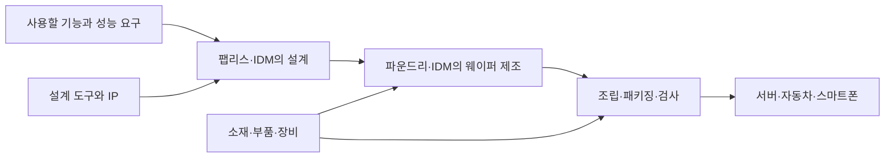

## 먼저 전체 흐름부터

**반도체 산업은 작은 전기적 기능을 설계하고, 실제 물질로 만들고, 사용할 수 있는 제품으로 연결하는 산업이다.** 기업 이름부터 외우기보다 각 단계의 결과물이 다음 단계에 어떻게 넘어가는지 보면 이해하기 쉽다.



이 글에서 잡을 로직은 간단하다. **필요한 기능이 생긴다 → 회로를 설계한다 → 공정으로 구현한다 → 검사하고 연결한다 → 실제 제품에서 사용한다.** 앞 단계에서 의도한 성능을 뒤 단계에서도 유지해야 한다.

## 1. 정보가 어떻게 물건이 될까?

**컴퓨터 안의 0과 1은 추상적인 숫자이면서, 회로에서는 구분 가능한 전기적 상태로 표현된다.** 글자는 정해진 문자 인코딩으로 숫자에 대응시키고, 사진은 위치별 밝기와 색을 수치로 표현할 수 있다. 그렇게 표현한 데이터를 저장하고 계산할 물리적인 장치가 필요하다.

전등 스위치를 생각해보자. 스위치가 켜졌는지 꺼졌는지로 두 상태를 구분할 수 있다. 반도체에서는 트랜지스터와 회로를 이용해 신호를 제어한다. 다만 모든 회로에서 특정 트랜지스터의 ON이 곧바로 논리값 1인 것은 아니다. 예를 들어 입력을 뒤집는 회로에서는 입력이 높을 때 출력이 낮아진다.

수많은 소자를 연결하면 덧셈을 하거나, 값을 비교하거나, 데이터를 저장하는 회로가 된다. 이 소자들과 연결을 칩 안에 구현한 것이 **집적회로, IC**다. 작은 스위치 하나가 바로 CPU인 것은 아니고, 스위치들이 목적에 맞게 연결되어야 CPU가 된다. 소자 동작은 [2편](/ax/semiconductor/part-2/)에서 살펴본다.

## 2. 웨이퍼, 다이, 패키지를 구분하자

**웨이퍼는 여러 칩을 함께 만드는 원판이고, 다이는 그 위에 만들어진 개별 칩이며, 패키지는 다이를 보호하고 밖과 연결하는 구조다.** 세 가지를 구분하면 제조 과정이 훨씬 덜 복잡해진다.

쿠키 반죽을 한 판에 여러 개 찍어 굽는 장면을 떠올려보자. 한 번에 여러 개를 처리한다는 점은 웨이퍼 제조와 닮았다. 다만 반도체는 단순히 모양만 찍는 것이 아니라, 재료를 쌓고 일부를 제거하는 작업을 여러 번 반복한다.

| 구분 | 무엇인가 | 다음 단계에서 필요한 일 |
|---|---|---|
| 웨이퍼 | 여러 다이가 만들어지는 얇은 기판 | 각 위치에 회로를 형성하고 검사한다 |
| 다이 | 웨이퍼에서 분리되는 개별 반도체 칩 | 전원과 신호를 연결하고 보호한다 |
| 패키지 | 다이와 외부를 연결하는 조립 구조 | 보드에 연결해 시스템으로 동작시킨다 |

웨이퍼가 완성됐다고 바로 노트북에 꽂을 수 있는 것은 아니다. 칩의 작은 접점과 보드의 연결부를 이어주고, 열을 빼내고, 주변 환경으로부터 보호하는 단계가 더 필요하다. [ASML의 제조 개요](https://www.asml.com/en/technology/all-about-microchips/how-microchips-are-made)에서도 웨이퍼 위에 여러 층의 패턴을 형성하는 구조를 확인할 수 있다.

## 3. 누가 설계하고 누가 만드나?

**팹리스, 파운드리, IDM은 기업의 역할을 나누는 말이다. 메모리와 시스템 반도체처럼 제품을 나누는 말과는 기준이 다르다.**

건물을 지을 때 설계와 시공을 나눠 생각하면 쉽다. 설계하는 쪽은 필요한 기능을 도면으로 구체화하고, 만드는 쪽은 그 도면을 실제 구조로 구현한다. 반도체에서는 공정의 제약을 반영해 회로를 설계해야 하므로 두 단계가 계속 협력한다.

| 역할 | 주된 결과물 | 다음 주체와 맞춰야 할 것 |
|---|---|---|
| 팹리스 | 칩 설계 | 제조 공정의 설계 규칙, 성능·전력·면적 조건 |
| 파운드리 | 설계를 구현한 웨이퍼 | 공정 품질, 생산 일정, 검사 결과 |
| IDM | 설계와 제조를 결합한 제품 | 개발부터 양산까지의 연결 |
| OSAT | 조립·검사를 마친 반도체 | 패키지 구조, 연결 품질, 최종 검사 |
| EDA·IP 공급자 | 설계 도구, 재사용 가능한 설계 블록 | 도구·IP와 공정의 호환성 |

이는 역할을 이해하기 위한 지도다. 실제 기업은 여러 사업을 동시에 하거나 일부 업무를 외부에 맡길 수 있다. 따라서 기업 하나를 영구적으로 한 칸에만 넣기보다는 **특정 제품에서 어떤 역할을 수행하는가**를 보는 편이 정확하다.

### 재생으로 따라가는 칩의 여정

**재생을 누르고, 각 주체가 다음 주체에게 무엇을 넘기는지 따라가보자.** 처음 움직이는 보라색 점은 설계 데이터다. 제조 단계에서는 별도로 준비한 웨이퍼 위에 회로가 생기고, 이후에는 노란 다이와 그 다이를 담은 패키지가 이동한다. 설계 파일 자체가 실리콘으로 변하는 것은 아니다.

::semiconductor-explorer{scene="industry-chain"}
::

일시정지한 뒤 **위에서 보기**로 전체 경로를, **옆에서 보기**로 다이와 패키지의 차이를 살펴보면 된다. 소재·부품·장비의 공급, 반복 공정과 여러 검사는 아래에서 따로 설명한다. 실제 기업 간 운송 순서와 소요 시간을 재현한 모형은 아니며, [ASML의 기업 역할·제조 개요](https://www.asml.com/en/technology/all-about-microchips/how-microchips-are-made)를 바탕으로 결과물의 연결을 표현했다.

## 4. 소재·부품·장비는 공정을 가능하게 한다

**좋은 설계만으로 좋은 칩이 만들어지지는 않는다. 의도한 위치에, 의도한 재료를, 일정한 품질로 구현해야 한다.**

벽을 칠한다고 생각해보자. 페인트의 성질, 붓의 상태, 표면의 먼지, 작업 환경이 모두 결과에 영향을 준다. 반도체에서는 이를 훨씬 작은 구조와 까다로운 조건에서 관리한다.

- **소재:** 웨이퍼, 감광액, 가스, 전구체, 연마액 등 공정에 사용하는 물질.
- **부품:** 장비 안에서 진공·온도·이송 등을 유지하는 구성 요소.
- **장비:** 증착, 노광, 식각, 검사처럼 실제 작업을 수행하는 시스템.

예를 들어 노광은 원하는 위치를 빛으로 기록하고, 식각은 열린 위치의 재료를 제거한다. 두 작업은 서로 다르지만 앞 단계의 결과가 다음 단계의 조건이 된다. 자세한 변화는 [3편 공정 실험실](/ax/semiconductor/part-3/)에서 확인할 수 있다.

## 5. 작아지면 무조건 싸고 좋아질까?

**미세화는 같은 면적에 더 많은 기능을 넣을 기회를 주지만, 성능과 비용이 자동으로 좋아지는 것은 아니다.** 소자 구조, 배선, 누설전류, 열, 공정 난이도와 수율을 함께 봐야 한다.

노트 한 장에 글씨를 더 작게 쓰면 많은 내용을 담을 수 있다. 하지만 너무 작아지면 읽거나 정확하게 쓰기가 어려워진다. 칩도 더 많은 소자를 배치하는 이점과 더 정밀하게 만들어야 하는 부담이 함께 생긴다.

무어의 법칙은 집적도 증가에 관한 역사적인 관찰이다. 자연법칙이나 일정한 성능 향상을 보장하는 약속으로 보면 안 된다. 또한 최신 공정 이름의 숫자를 모든 소자의 실제 길이로 그대로 읽어서는 안 된다. 구조와 세대에 따라 비교 기준을 확인해야 한다.

아래는 **수율의 의미를 보기 위한 가상 계산**이다.

```text
검사한 다이 100개, 그중 합격 90개
→ 이 검사 단계의 수율은 90 / 100 = 90%

검사한 다이 100개, 그중 합격 70개
→ 같은 개수를 만들었어도 사용할 수 있는 제품은 더 적다.
```

실제 원가는 다이 면적, 공정 단계, 장비, 패키지, 테스트 등에도 영향을 받는다. 따라서 위 계산만으로 제품 가격이나 이익을 추정할 수는 없다.

## 6. AX에서는 어디를 먼저 봐야 할까?

**AX의 시작점은 모델 선택보다, 누가 어떤 결정을 늦게 또는 어렵게 하고 있는지 찾는 것이다.** 다음은 산업 구조를 업무 문제로 연결한 학습용 예시다. 특정 기업의 실제 도입 성과를 뜻하지 않는다.

| 현장 문제 | 필요한 데이터 | 개선하려는 결정 | 확인할 지표 |
|---|---|---|---|
| 자재 도착이 불확실하다 | 발주·납기·재고·생산 계획 | 어떤 자재를 먼저 확보할까 | 납기 오차, 결품으로 멈춘 시간 |
| 설비 이상을 늦게 발견한다 | 센서 시계열, 정비 이력 | 언제 점검할까 | 미탐, 오탐, 비계획 정지 시간 |
| 불량 원인을 찾는 데 오래 걸린다 | 검사 결과, 공정·장비 이력 | 어떤 공정과 장비부터 조사할까 | 조사 시간, 재발률 |

여기서 중요한 연결 고리는 제품과 공정의 **이력**이다. 검사에서 불량을 찾았어도 그 다이가 어떤 장비에서 어떤 조건으로 처리됐는지 모르면 원인을 좁히기 어렵다. AI의 출력이 실제 의사결정으로 이어지는 경로까지 설계해야 한다.

## 이해 확인

1. 웨이퍼, 다이, 패키지는 각각 무엇을 가리키는가?
2. 팹리스와 메모리 반도체는 왜 같은 기준으로 나눈 분류가 아닌가?
3. 검사 정확도가 높아져도 생산 현장의 문제가 해결되지 않을 수 있는 이유는 무엇인가?

## 참고자료와 다음 글

- [ASML: 마이크로칩 제조와 기업 역할](https://www.asml.com/en/technology/all-about-microchips/how-microchips-are-made)
- [Intel: 트랜지스터의 역할과 구조](https://www.intel.com/content/www/us/en/newsroom/tech101/the-transistor-explained.html)
- [ASML: 계측 데이터와 공정 제어](https://www.asml.com/technology/lithography-principles/measuring-accuracy)

공개 기술자료를 바탕으로 설명과 흐름도를 직접 구성했다. 기업 순위와 시장 전망 수치는 다루지 않는다.

**시리즈:** **1. 산업** → [2. 제품과 소자](/ax/semiconductor/part-2/) → [3. 공정](/ax/semiconductor/part-3/) → [4. 메모리 기술](/ax/semiconductor/part-4/)
