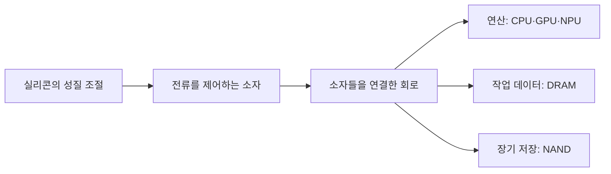

## 먼저 전체 흐름부터

**반도체를 이해하려면 재료, 소자, 회로, 제품을 순서대로 연결해야 한다.** 실리콘이 바로 메모리인 것도, 트랜지스터 하나가 곧바로 CPU인 것도 아니다.



## 1. 반도체는 전기가 절반만 통하는 물질일까?

**반도체의 핵심은 전기가 얼마나 잘 흐르는지를 조절할 수 있다는 점이다.** 단순히 도체와 부도체 사이의 고정된 중간값으로 생각하면 트랜지스터 동작이 잘 연결되지 않는다.

전자는 재료 안에서 아무 에너지 상태나 가질 수 있는 것이 아니다. 전자가 있을 수 있는 에너지 영역 사이의 간격을 **밴드갭**이라고 한다. 계단의 층 사이 간격을 떠올리면 조금 쉽다. 실제 전자가 작은 계단 위를 걸어 다닌다는 뜻은 아니고, 허용되는 에너지 상태가 구분된다는 비유다.

온도, 빛, 넣어준 원소 등은 전류를 운반할 수 있는 전하의 상태에 영향을 준다. 반도체 소자는 이런 성질에 구조와 전기장을 더해 전류를 제어한다.

실리콘이 널리 쓰이는 이유에는 재료 확보, 결정 성장과 공정 기술, 표면 산화막을 활용할 수 있다는 점 등이 함께 있다. 모든 반도체가 실리콘으로 만들어지는 것은 아니다. 전력 소자 등에서는 SiC와 GaN 같은 재료도 사용한다. [Applied Materials의 전력 반도체 설명](https://www.appliedmaterials.com/in/en/semiconductor/markets-and-inflections/icaps/power.html)에서 다른 재료의 활용을 볼 수 있다.

## 2. 도핑은 필요한 원소를 의도적으로 넣는 작업이다

**도핑은 불순물을 없애는 세정과 방향이 다르다. 필요한 원소를 정해진 위치와 양으로 넣어 전기적 성질을 바꾼다.**

실리콘은 주변 원자와 결합을 만든다. 여기에 다른 원자가 전자 수를 가진 원소를 소량 넣으면, 이동 가능한 전자나 정공이 많아지는 효과를 낼 수 있다.

| 종류 | 다수 캐리어 | 처음 이해할 때의 관점 |
|---|---|---|
| N형 | 전자 | 움직일 수 있는 전자가 많아지도록 조절한다 |
| P형 | 정공 | 전자가 빈 상태의 이동을 양의 전하 이동처럼 다룬다 |

의자가 한 칸 비어 있는 줄을 생각해보자. 옆 사람이 빈 의자로 이동하면 빈자리는 반대 방향으로 옮겨간다. 정공은 이 빈자리와 비슷하게 설명할 수 있다. 실제로 양성자가 결정 안을 계속 이동한다는 뜻은 아니다.

N형 전체가 음전하 덩어리이고 P형 전체가 양전하 덩어리라는 의미도 아니다. 캐리어와 이온화된 도펀트를 함께 고려하면 재료는 대체로 전기적으로 중성이다.

## 3. PN 접합에서는 경계가 중요하다

**P형과 N형이 만나면 경계에서 캐리어가 재분포하고, 이동을 제어하는 전기장이 형성된다.** 양쪽에 많은 캐리어가 서로 퍼져 나가면서 경계 부근에 자유롭게 움직일 캐리어가 적은 공핍 영역이 생긴다.

이 경계에 외부 전압을 가하면 장벽을 낮추거나 높이는 방향으로 작용한다. 그래서 PN 접합 다이오드는 전류를 한 방향으로 더 쉽게 흐르게 하는 성질을 가진다. 물이 역류하지 않게 하는 밸브를 떠올릴 수 있지만, 실제로는 물리적인 문이 움직이는 것이 아니라 전기적 장벽이 달라진다.

다이오드의 두 영역을 이해했다고 MOSFET의 채널 형성까지 자동으로 설명되는 것은 아니다. 이제 절연막 너머에서 전기장으로 전하를 제어하는 구조를 보자.

## 4. MOSFET, 절연막 너머에서 길을 여는 스위치

**MOSFET의 게이트는 채널을 제어한다. 전류를 흘려보낼 길은 소스와 드레인 사이에 생긴다.** 아래에서는 기본적인 N채널 MOSFET을 단순화했다.

| 부분 | 역할 |
|---|---|
| 소스·드레인 | 채널 양끝에서 전하가 들어가고 나오는 접점 |
| 기판·바디 | 소자가 만들어지는 반도체 바탕 |
| 게이트 절연막 | 게이트와 반도체를 전기적으로 분리하는 얇은 막 |
| 게이트 | 전압으로 절연막 아래의 전하 분포를 바꾸는 전극 |
| 채널 | 전류가 흐를 수 있도록 형성되는 통로 |

::semiconductor-explorer{scene="mosfet"}
::

먼저 **재생**을 눌러 ON 상태에서 소스 → 드레인으로 전자가 이동하는 모습을 보자. 관습적 전류 방향은 그 반대다. 일시정지한 뒤 게이트 전압을 조절하면 낮은 전압에서는 소스와 드레인을 잇는 채널이 사라진다. 게이트 전압을 높이면 P형 바탕의 표면에 전자가 모여 반전 채널이 형성된다. 드레인과 소스 사이에 전압이 걸려 있다면 이 경로를 따라 전류가 흐를 수 있다.

여기서는 전자가 소스에서 드레인으로 움직이는 상황을 설명한다. 관습적으로 정의하는 전류 방향은 그 반대다. 게이트를 통해 전자가 쏟아져 내려와 통로를 채우는 모습으로 이해하면 안 된다. 게이트는 절연막을 사이에 둔 전기장으로 제어한다. [Toshiba의 MOSFET 동작 설명](https://toshiba.semicon-storage.com/us/semiconductor/knowledge/e-learning/discrete/chap3/chap3-7.html)과 [Intel의 소자 설명](https://www.intel.com/content/www/us/en/newsroom/tech101/the-transistor-explained.html)을 함께 참고했다.

실제 MOSFET은 문턱전압, 누설전류, 전압에 따른 동작 영역 등이 있고, 스위치처럼만 사용하는 것도 아니다. 이 모형의 목적은 정밀한 전류 계산보다 **절연막, 게이트, 채널의 위치 관계**를 이해하는 것이다. BJT의 이미터·베이스·컬렉터와 MOSFET의 단자 이름도 섞지 말자.

## 5. CMOS는 서로 보완하는 소자를 연결한다

**CMOS는 N채널과 P채널 MOSFET을 함께 사용하는 회로 방식이다.** 가장 작은 예로 입력을 반대로 만드는 인버터를 생각할 수 있다.

```text
입력이 낮음 → 위쪽 P채널 소자가 켜지고 아래쪽 N채널 소자는 꺼짐 → 출력이 높음
입력이 높음 → 위쪽 P채널 소자가 꺼지고 아래쪽 N채널 소자는 켜짐 → 출력이 낮음
```

둘을 조합하면 안정된 상태에서 전원과 접지 사이의 큰 직접 전류를 줄일 수 있다. 그렇다고 소비 전력이 항상 0은 아니다. 상태가 바뀔 때 전하를 충전·방전하고, 실제 소자에는 누설전류도 있다. 자세한 인버터 동작은 [Toshiba의 CMOS 설명](https://toshiba.semicon-storage.com/us/semiconductor/knowledge/e-learning/cmos-logic-basics/chap2/chap2-3.html)에서 확인할 수 있다.

## 6. DRAM은 전하를 저장하고 다시 채운다

**DRAM 셀은 작은 전하 저장 공간과 그곳에 접근하는 스위치를 기본으로 이해할 수 있다.** 대표적인 1T1C 구조에서는 트랜지스터 하나가 접근을 제어하고 커패시터 하나가 전하를 저장한다.

커패시터를 작은 통, 접근 트랜지스터를 밸브라고 생각해보자. 밸브를 열면 데이터를 나타내는 전하 상태를 바꿀 수 있다. 시간이 지나면 저장 상태가 약해지므로 주기적으로 읽고 복원하는 **리프레시**가 필요하다. 물통은 전하 저장을 위한 비유이고, 실제 내부에 액체가 있는 것은 아니다.


워드라인은 어느 셀에 접근할지 제어하는 쪽, 비트라인은 데이터를 전달하는 쪽이라고 구분해두면 된다. 읽을 때의 작은 전압 차이를 감지하고 저장 상태를 복원하는 주변 회로도 필요하다. 셀 하나만으로 메모리 제품 전체가 동작하는 것은 아니다.

### 쓰고, 보관하고, 읽고, 복원하기

**재생을 누르면 한 셀에 높은 저장 상태를 쓰고, 보관한 뒤 읽어 복원하는 과정이 이어진다.** 가운데 접근 스위치가 켜지면 비트라인과 저장 전극 사이로 노란 표식이 이동한다. 스위치가 꺼진 보관 단계에서는 이동이 멈추고, 누설로 저장 상태가 조금 약해지는 모습을 볼 수 있다.

::semiconductor-explorer{scene="dram-cell"}
::

읽기에서는 준비된 비트라인과 셀이 전하를 공유해 작은 전압 차이를 만든다. 감지 회로가 그 차이로 값을 판별한 뒤, 비트라인을 구동해 셀의 상태를 다시 복원한다. 그래서 **DRAM의 읽기는 저장 상태를 건드리고, 복원까지 이어진다.** 리프레시도 이러한 감지·복원을 이용한다. 저장과 리프레시는 [삼성전자의 DRAM 설명](https://semiconductor.samsung.com/support/tools-resources/dictionary/semiconductor-glossary-dram/), 전하 공유와 복원은 [ETH Zurich의 HiFi-DRAM 논문 2~3쪽](https://comsec.ethz.ch/wp-content/files/hifidram_isca24.pdf)으로 확인할 수 있다.

커패시터는 두 전극 사이에 절연막을 둔 구조다. 화면의 노란 표식이 움직이는 곳은 배선과 열린 트랜지스터이며, 커패시터 절연막을 가로질러 흐르는 장면은 없다. 전극 옆 표시의 길이는 저장 상태를 비교하기 위한 상대값이다. 실제 전하량·전압·시간 비율이나 0·1의 보편적인 대응을 뜻하지 않는다. **옆에서 보기**와 **단면 보기**를 함께 사용하면 전극과 절연막을 구분하기 쉽다.

이 모형은 연결을 보기 위해 소자를 평면에 펼쳤다. 실제 커패시터 모양, 반대 전극의 바이어스 연결, 비교용 비트라인과 감지 회로 내부는 생략했다. 실제 DRAM 명령의 타이밍도 여섯 단계의 재생 시간과 다르다.

## 7. NAND는 저장한 전하가 읽기 기준을 바꾼다

**NAND 플래시는 절연된 저장 영역의 전하 상태가 트랜지스터의 문턱전압에 영향을 주는 원리를 이용한다.** 읽을 때는 정해진 조건에서 전류가 흐르는지 확인해 상태를 구분한다.

문을 여는 데 필요한 힘이 달라진다고 비유할 수 있다. 같은 힘을 주었는데 어떤 문은 열리고 어떤 문은 열리지 않는다면, 문마다 저장된 상태를 구별할 수 있다. 여기서 힘에 해당하는 것이 전압 조건이고, 문이 열리는 것은 채널이 전류를 흘리는 상태에 해당한다.


플로팅 게이트는 도전성 저장 영역을, 차지 트랩은 전하를 붙잡는 절연층을 이용한다. 구현에 따라 차이가 있으며, 둘을 같은 구조로 그리지 않는다. 전원이 꺼져도 저장 상태를 유지할 수 있지만, 보존 시간이 무한하거나 쓰기·지우기를 무제한 반복할 수 있다는 뜻은 아니다. [KIOXIA의 NAND 신뢰성 설명](https://americas.kioxia.com/content/dam/kioxia/en-us/business/memory/mlc-nand/asset/KIOXIA_TBW_WAF_NAND_Endurance_Technical_Brief.pdf)을 참고했다.

## 8. 제품은 어떤 역할을 맡나?

**CPU·GPU·NPU는 주로 연산, DRAM은 작업 중인 데이터, NAND는 장기 저장을 맡는다.** 실제 제품에는 제어기와 캐시 등 여러 회로가 함께 들어가므로 아래 표는 주된 역할을 설명한다.

| 구분 | 먼저 떠올릴 역할 | 비유 |
|---|---|---|
| CPU | 다양한 명령과 제어 흐름 처리 | 작업 순서를 정하고 여러 일을 처리하는 담당자 |
| GPU | 많은 연산을 병렬로 처리 | 유사한 일을 동시에 수행하는 많은 작업자 |
| NPU | 신경망 연산에 맞춘 처리 | 자주 반복하는 작업에 맞춘 전용 작업대 |
| DRAM | 연산 중 필요한 데이터 보관 | 지금 펼쳐놓고 사용하는 작업 공간 |
| NAND | 전원이 꺼져도 보관할 데이터 저장 | 작업이 끝난 뒤 자료를 넣어두는 보관함 |

연산 장치가 빨라도 데이터가 늦게 도착하면 기다려야 한다. 그래서 AI 시스템을 볼 때는 연산 성능만큼 메모리 용량, 대역폭, 데이터 이동을 함께 본다. 이 연결이 [4편의 HBM](/ax/semiconductor/part-4/)으로 이어진다.

## AX 연결: 제품에 따라 검사 기준이 달라진다

**같은 분류 모델이라도 무엇을 불량으로 정의하는지에 따라 필요한 데이터와 평가가 달라진다.** 아래는 학습용 문제 정의 예시다.

| 제품의 관심사 | 발생 데이터 | 개선할 결정 | 지표 |
|---|---|---|---|
| 저장 상태가 유지되는가 | 온도·시간별 메모리 검사 | 어떤 조건에서 추가 검사할까 | 불량 미탐률, 추가 검사 시간 |
| 정해진 속도에서 동작하는가 | 전압·주파수별 테스트 | 어떤 성능 등급으로 분류할까 | 등급 판정 오류, 재검 비율 |
| 연산기가 데이터를 기다리는가 | 실행 시간, 메모리 사용량, 전송량 | 모델·배치·메모리 구성을 어떻게 바꿀까 | 처리량, 지연시간, 전력 |

모델 점수만 보기 전에 실제 사용 조건과 검사 기준부터 맞춰야 한다. 단순 모형의 ON/OFF를 실제 제품의 양품·불량 판정으로 연결해서는 안 된다.

## 이해 확인

1. 게이트는 절연되어 있는데 어떻게 소스와 드레인 사이 전류를 제어할까?
2. DRAM의 리프레시와 NAND의 비휘발성은 어떤 저장 구조 차이에서 출발할까?
3. GPU가 빨라져도 AI 처리 속도가 같은 비율로 빨라지지 않을 수 있는 이유는 무엇일까?

## 참고자료와 다음 글

- [Intel: 트랜지스터 구조와 발전](https://www.intel.com/content/www/us/en/newsroom/tech101/the-transistor-explained.html)
- [Toshiba: MOSFET 구조와 동작](https://toshiba.semicon-storage.com/us/semiconductor/knowledge/e-learning/discrete/chap3/chap3-7.html)
- [Toshiba: CMOS의 기본 동작](https://toshiba.semicon-storage.com/us/semiconductor/knowledge/e-learning/cmos-logic-basics/chap2/chap2-3.html)
- [삼성전자: DRAM 저장과 리프레시](https://semiconductor.samsung.com/support/tools-resources/dictionary/semiconductor-glossary-dram/)
- [ETH Zurich: HiFi-DRAM, 전하 공유와 감지·복원](https://comsec.ethz.ch/wp-content/files/hifidram_isca24.pdf)
- [KIOXIA: NAND의 쓰기·지우기와 신뢰성](https://americas.kioxia.com/content/dam/kioxia/en-us/business/memory/mlc-nand/asset/KIOXIA_TBW_WAF_NAND_Endurance_Technical_Brief.pdf)

설명, 도식, 3D 모형은 직접 작성했다. 모형의 색과 치수는 재료 구분을 위한 것으로 실제 소자의 외관·비율을 뜻하지 않는다.

**시리즈:** [1. 산업](/ax/semiconductor/part-1/) → **2. 제품과 소자** → [3. 공정](/ax/semiconductor/part-3/) → [4. 메모리 기술](/ax/semiconductor/part-4/)
