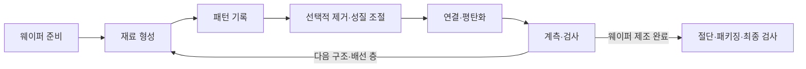
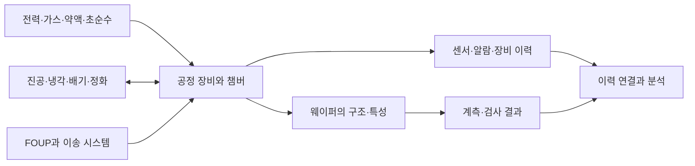

## 먼저 전체 흐름부터

**반도체 공정은 평평한 원판에 그림을 한 번 인쇄하고 끝내는 작업이 아니다. 여러 재료의 입체 구조를 조금씩 만들어가는 과정이다.**

처음에는 네 가지 질문만 따라가보자. **무엇을 쌓았나? 어디를 열었나? 무엇을 제거했나? 그래서 전기적으로 무엇이 달라졌나?**



이 화살표는 역할을 연결한 지도다. 모든 제품이 정확히 같은 순서로 한 번씩 지나가는 레시피는 아니다. 세정과 검사는 중간중간 반복되고, 구조와 재료에 따라 공정의 순서와 횟수가 달라진다.

## 1. 웨이퍼는 구조를 만들 바탕이다

**웨이퍼는 소자와 배선을 만들 얇은 기판이다.** 실리콘 웨이퍼는 정제한 원료로 결정 잉곳을 만들고, 얇게 자른 다음 표면을 다듬는 과정을 거친다.

책상을 조립하기 전에 평평한 작업판을 준비하는 것과 비슷하다. 바탕이 고르지 않거나 오염되어 있으면 그 위에 정밀한 작업을 반복하기 어렵다. 다만 웨이퍼 자체도 전기적 성질을 가진 재료이고, 항상 단순한 받침대로만 남는 것은 아니다. 소자의 일부 영역은 웨이퍼 내부에 형성된다.

아래 실험실의 네모난 판은 **원형 웨이퍼의 작은 영역을 확대해 잘라 본 모습**이다. 한 판 전체가 네모난 웨이퍼라는 뜻은 아니다. [삼성전자의 제조 개요](https://semiconductor.samsung.com/news-events/tech-blog/a-short-introduction-to-semiconductor-fabrication/)를 참고했다.

## 2. 먼저 손으로 공정을 넘겨보자

**아래 모형은 절연막에 홈을 만들고 금속을 남기는 간단한 배선 예시다.** 완성된 트랜지스터 전체를 이 아홉 단계만으로 만든다는 의미는 아니다. 배리어·시드막, 아래층 연결 등 세부 단계는 생략했다.

::semiconductor-explorer{scene="wafer-process"}
::

처음에는 3D를 켜지 않고 **다음 단계**만 눌러도 된다. 전후 구조도를 비교하면서 감광액과 절연막, 금속이 어느 순간에 사라지고 남는지 보자. 이후 3D의 **옆에서**와 **단면 보기**를 켜면 높이 차이를 확인하기 쉽다.

| 모형의 단계 | 들어오는 것 또는 하는 일 | 남는 결과 |
|---|---|---|
| 바탕 준비 | 가공할 영역을 준비한다 | 실리콘 바탕 |
| 절연막 증착 | 절연 재료를 쌓는다 | 표면을 덮은 절연막 |
| PR 도포 | 빛에 반응하는 재료를 덮는다 | 임시 기록 층 |
| 노광 | 선택한 위치에 빛을 쬔다 | 일부 성질이 달라진 PR |
| 현상 | 이 예시에서는 노광된 PR을 제거한다 | 열린 창과 보호 영역 |
| 식각 | 창 아래의 절연막을 제거한다 | 절연막에 생긴 홈 |
| PR 제거·세정 | 임시 막과 잔류물을 없앤다 | 금속을 채울 깨끗한 구조 |
| 금속 채움 | 홈과 윗면에 금속을 형성한다 | 아직 윗면까지 이어진 금속 |
| CMP | 윗면의 과도한 금속을 제거한다 | 홈 안에 분리되어 남은 금속선 |

## 3. 산화와 증착, 둘 다 막을 만들지만 출발이 다르다

**열산화는 실리콘 표면 자체가 반응해 산화막으로 바뀌는 과정이고, 증착은 외부에서 공급한 재료로 막을 형성하는 과정이다.** 결과가 얇은 막이라고 해서 같은 작업은 아니다.

실험실에서 **산화와 증착 비교**를 선택해보자. 산화에서는 바탕 실리콘이 일부 소비되어 경계가 아래로 내려간다. 새로 생긴 산화막은 원래 표면 바깥으로도 자란다. 이어지는 증착 예시는 바탕을 유지한 채 외부 재료를 올리는 경우다. 화면의 두께 비율은 원리를 보여주기 위해 단순화했다.

도색은 표면에 재료를 더하고, 표면 반응은 원래 재료 일부의 성질을 바꾼다고 비교하면 이해하기 쉽다. 반도체 산화막은 실제로 절연과 표면 보호 등의 역할을 한다. 산화막을 만드는 방법과 용도는 다양하므로 이 설명은 실리콘 열산화의 기본 원리에 한정한다. [삼성전자의 산화 공정 설명](https://semiconductor.samsung.com/support/tools-resources/fabrication-process/eight-essential-semiconductor-fabrication-processes-part-2-oxidation-to-protect-the-wafer/)을 참고했다.

증착도 한 가지 방식만 있는 것이 아니다.

| 방식 | 처음 잡을 개념 | 주의할 구분 |
|---|---|---|
| PVD | 물리적인 방법으로 원료를 이동시켜 막을 형성 | 형상에 따른 도달 방향 등을 고려한다 |
| CVD | 공급한 기체의 화학 반응으로 막을 형성 | Chemical Vapor Deposition의 약자다 |
| ALD | 표면에서 일어나는 자기 제한 반응을 순차적으로 반복 | 두께와 복잡한 형상 피복을 정밀하게 제어하는 데 활용한다 |

실제 방법 선택에는 재료, 온도, 균일도, 생산성 등 조건이 함께 들어간다. 하나의 방식이 모든 구조에서 가장 좋은 것은 아니다.

## 4. 포토, 원하는 위치를 임시 층에 기록한다

**노광은 빛으로 감광액의 성질을 바꾸는 단계이고, 현상은 그 차이를 이용해 패턴을 드러내는 단계다.**

스텐실 작업처럼 “열어둘 부분과 가릴 부분을 정한다”고 생각하면 쉽다. 다만 반도체 포토 공정은 처음부터 구멍 난 종이를 얹는 작업과 다르다. 먼저 감광액인 **포토레지스트, PR**을 도포하고, 선택한 위치에 빛을 쬔 뒤, 현상해 필요한 모양을 만든다.

실험실에서는 양성 PR을 사용한다. 노광된 영역을 현상액으로 제거하므로 그 아래 막이 드러난다. 음성 PR에서는 빛을 받은 영역이 남도록 동작하는 등 재료에 따라 방향이 달라진다.

**노광 직후에는 아래 절연막이 깎이지 않는다.** 화면에서 노광된 PR을 황색으로 표시한 것은 물질이 금으로 변했다는 뜻이 아니라, 빛에 반응한 영역을 구분하기 위한 표시다. [ASML의 포토·식각 설명](https://www.asml.com/en/company/stories/2021/semiconductor-manufacturing-process-steps)을 참고했다.

## 5. 식각, 열린 영역의 재료를 제거한다

**식각은 임시 패턴을 아래 재료의 실제 모양으로 옮기는 작업이다.** PR이 남은 곳은 보호하고, 창이 열린 곳은 제거한다.

벽에 홈을 파는데 남겨야 할 부분을 보호 테이프로 덮었다고 생각해보자. 노광과 현상은 보호 영역을 준비하는 과정, 식각은 실제 벽의 재료를 제거하는 과정에 해당한다.

습식 식각은 액체 화학물질을, 건식 식각은 기체나 플라즈마 등을 사용한다. 방향성, 선택비, 손상 등을 함께 고려해야 한다. **선택비**는 제거하려는 재료와 남겨야 할 재료가 얼마나 다르게 제거되는지를 나타내는 중요한 개념이다.

실험실의 두 홈은 단면을 이해하기 쉽게 수직으로 그렸다. 실제로는 옆면 기울기, 바닥 잔류물, 지나친 식각 같은 문제가 생길 수 있다. 3D NAND처럼 깊은 홀에서는 이러한 형상 제어가 더 중요해진다. [KIOXIA의 메모리 홀 식각 설명](https://www.kioxia.com/en-jp/rd/technology/topics/topics-30.html)에서 이 문제를 확인할 수 있다.

## 6. 세정, 다음 공정에 남기지 말아야 할 것을 없앤다

**세정은 전체 공정 중간에 반복해서 필요한 작업이다.** PR 제거 이후뿐 아니라 식각, 연마 등 여러 작업 뒤에 입자와 잔류물을 관리해야 한다.

책상에 접착제를 바르기 전에 먼지를 닦는다고 생각해보자. 앞 단계의 찌꺼기가 남으면 다음 재료가 의도대로 붙지 않거나, 원하지 않는 연결과 결함이 생길 수 있다.

PR 제거와 세정은 목적과 제거 대상이 다를 수 있다. “보호막을 없앴으니 이제 무조건 깨끗하다”고 단정하지 않는다. 어떤 오염을 없애야 하는지, 남겨야 할 구조를 손상시키지 않는지가 중요하다. [삼성전자의 세정 설명](https://semiconductor.samsung.com/support/tools-resources/dictionary/zero-residue-zero-contaminants-semiconductor-cleaning/)을 참고했다.

## 7. 이온주입과 열처리, 내부의 전기적 성질을 바꾼다

**이온주입은 실리콘 안에 도펀트를 넣는 과정이고, 뒤이은 열처리는 결정 손상 회복과 도펀트 활성화 등에 사용된다.**

실험실에서 **도핑과 열처리**를 선택하고 단면을 열어보자. 보호막의 창을 통해 들어간 점들이 바탕 내부에 표시된다. 표면에 보라색 판을 한 장 붙이는 것이 아니라 내부의 전기적 성질을 바꾸는 작업이다.

이온의 에너지와 주입량 등은 깊이와 농도 분포에 영향을 준다. 주입했다고 모두 원하는 전기적 역할을 바로 하는 것은 아니므로 열처리 조건도 중요하다. 확산은 열에 의해 원자가 이동하는 현상이며, 도핑이나 후속 공정에서 고려해야 한다. 모형의 경계가 뚜렷한 색 영역은 실제 분포를 단순화한 표시다.

## 8. 배선과 CMP, 연결할 곳만 연결한다

**소자가 있어도 서로 연결되지 않으면 필요한 회로가 되지 않는다.** 금속 배선과 층 사이 연결인 비아를 통해 신호와 전원을 전달한다.

실험실 마지막에서 금속을 채우면 홈뿐 아니라 윗면에도 금속이 남는다. 이대로면 원래 분리하려던 선들이 서로 이어질 수 있다. **CMP, Chemical Mechanical Planarization**은 화학 반응과 기계적 연마를 함께 이용해 표면을 다듬는다.

타일 틈을 채운 후 표면의 남는 재료를 닦아내는 장면과 비슷하다. 하지만 실제 CMP는 정밀한 압력과 재료 제거량 제어가 필요한 공정이다. 너무 많이 제거하면 필요한 금속도 사라지고, 너무 적게 제거하면 원치 않는 연결이 남는다. [Applied Materials의 CMP 설명](https://www.appliedmaterials.com/us/en/semiconductor/products/shape/cmp.html)을 참고했다.

이후 다른 층의 절연막과 배선을 형성하며 연결을 반복한다. 이런 관점에서 보면 칩은 단순한 평면 그림보다 **소자와 연결이 겹쳐진 입체 구조**에 가깝다.

## 9. 계측과 검사, 무엇이 달라졌는지 확인한다

**계측은 치수·두께·정렬 같은 특성을 재고, 검사는 결함이 있는 위치와 유형을 찾는 데 초점을 둔다.** 실제 시스템에서는 두 역할이 연결된다.

| 확인 대상 | 질문 | 결과가 쓰이는 곳 |
|---|---|---|
| 막 두께 | 목표 두께에 맞게 쌓였나 | 증착·연마 조건 조정 |
| 선폭·홀 모양 | 의도한 크기와 형상인가 | 포토·식각 조건 검토 |
| 오버레이 | 위층과 아래층 패턴이 맞게 정렬됐나 | 노광 보정 |
| 결함 위치·영상 | 어디에 어떤 이상이 있나 | 영향 범위 확인과 원인 조사 |
| 전기적 특성 | 실제 회로가 기준대로 동작하나 | 양품 판정과 성능 분류 |

측정값을 모으는 것으로 끝나는 것이 아니라, 어떤 조건을 바꿀지 판단하는 데 사용한다. [ASML의 계측과 공정 제어 설명](https://www.asml.com/technology/lithography-principles/measuring-accuracy)에서도 측정 데이터를 노광 보정으로 연결하는 흐름을 볼 수 있다.

## 10. 패키징, 칩을 보호하고 바깥과 연결한다

**패키징은 다이에 전원과 신호를 연결하고, 보호와 열 관리가 가능하도록 조립하는 과정이다.** 칩을 자르는 작업만을 뜻하지 않는다.

::semiconductor-explorer{scene="packaging"}
::

모형에서는 검사한 웨이퍼를 얇게 만들고, 잘라낸 다이를 기판에 올린다. 여기서의 검사·박막화·절단 순서는 이해를 돕는 대표 흐름이며, 실제 제품의 공정 순서는 달라질 수 있다.

**연결 방식**을 바꾸면 회로 면과 연결부의 위치를 비교할 수 있다. 와이어 본딩에서는 칩 위쪽 접점을 가느다란 와이어로 연결한다. 플립칩에서는 칩의 활성면을 아래로 향하게 해 범프를 통해 연결한다. 모형의 초록색 면이 회로 면이다.

연결 이후에는 몰딩, 언더필, 덮개와 방열 구조 등 제품에 필요한 보호 방식을 적용한다. 모든 패키지가 같은 방식으로 봉해지는 것은 아니다. 마지막에는 조립 상태와 전기적 동작을 다시 검사한다. [삼성전자의 제조·조립 개요](https://semiconductor.samsung.com/news-events/tech-blog/a-short-introduction-to-semiconductor-fabrication/)를 참고했다.

또한 웨이퍼 제조와 패키징을 전공정·후공정이라고 구분하는 용법과, 웨이퍼 내부의 소자·배선 형성을 FEOL·BEOL로 나누는 용법은 범위가 다르다. 영문 약어를 볼 때 어떤 문맥인지 먼저 확인하자.

## 11. 팹은 장비만 모아놓은 공간이 아니다

**공정 장비가 일정한 결과를 내려면 주변 설비가 온도, 압력, 물질 공급과 오염 상태를 안정적으로 유지해야 한다.** 장비가 바뀌지 않았는데 결과가 변했다면 장비 밖의 조건도 확인해야 한다.



**챔버**는 공정 반응이 일어나는 공간, **FOUP**은 웨이퍼를 담아 운반하고 보관하는 용기다. 진공 펌프는 필요한 압력 조건을, 칠러는 냉각을 지원한다. 배기·정화 설비는 공정 후 배출되는 물질을 처리한다. 실제 연결과 운영 조건은 설비별로 다르다.

청정실 역시 “먼지가 절대 없는 방”이 아니다. 입자, 온도, 습도 등 필요한 환경을 기준에 맞춰 관리하는 공간이다. 눈에 보이는 큰 먼지만 문제가 되는 것이 아니라는 점을 기억하면 된다.

## 12. 직무와 유지보수, 서로 다른 질문을 맡는다

**공정 엔지니어와 설비 엔지니어, 품질·제조·SW 담당자는 같은 결과를 보더라도 출발 질문이 다르다.** 기업의 공식 직무명은 달라질 수 있으므로 여기서는 역할 중심으로 정리한다.

| 역할 | 대표 질문 |
|---|---|
| 설계 | 필요한 기능을 어떤 회로와 구조로 구현할까 |
| 공정 | 어떤 재료와 조건으로 목표 특성을 만들까 |
| 설비 | 장비가 정해진 상태를 유지하고 있나 |
| 품질·검사 | 결과가 기준에 맞고 신뢰할 수 있나 |
| 제조·생산관리 | 어떤 순서로 처리해야 납기와 생산량을 맞출까 |
| SW·데이터 | 이력을 어떻게 연결하고 판단을 지원할까 |

유지보수도 고장이 난 뒤 수리하는 방식, 정해진 주기에 예방 정비하는 방식, 상태를 보고 점검 시점을 판단하는 방식으로 구분할 수 있다. 약어는 조직마다 용법이 달라질 수 있으므로 이름보다 **언제, 어떤 근거로, 무엇을 바꾸는가**를 확인하는 것이 좋다.

## AX 연결: 불량에서 거꾸로 이력을 따라가자

**공정 지식은 센서 숫자와 실제 불량 사이에 어떤 연결을 의심할지 정하는 데 필요하다.** 다음은 가상의 식각 이상 조사 예시다. 실제 설비의 진단 결과가 아니다.

```text
관찰: 특정 기간에 홀 형상 불량이 증가했다.
→ 가설: 장비 상태, 재료, 레시피 또는 측정 조건이 달라졌을 수 있다.
→ 연결: Lot / Wafer / 공정 단계 / 장비 / 챔버 / 시간 키로 이력을 맞춘다.
→ 비교: 같은 제품과 조건에서 정상 기간과 이상 기간을 비교한다.
→ 결정: 추가 계측, 점검, 실험 또는 담당자 검토의 우선순위를 정한다.
```

| 문제 | 필요한 데이터 | AI가 보조할 수 있는 결정 | 함께 확인할 지표 |
|---|---|---|---|
| 이상을 늦게 발견 | 센서 시계열, 알람, 정비 이력 | 점검 우선순위 | 미탐률, 오탐 건수, 탐지 지연 |
| 결함 분류가 오래 걸림 | 결함 영상, 판정 이력 | 사람이 먼저 볼 결함 | 유형별 재현율, 검토 시간 |
| 원인 후보가 많음 | 공정 조건, 계측, 웨이퍼 이력 | 확인할 조건과 장비 | 조사 시간, 재발 여부 |

센서 값이 불량과 함께 움직였다고 바로 원인이라고 단정할 수는 없다. 제품 종류, 정비 시점, 측정 방식이 함께 바뀌었을 수 있다. 학습·평가 데이터를 나눌 때도 같은 웨이퍼나 같은 시점의 거의 동일한 샘플이 양쪽에 섞이지 않게 해야 한다.

모델의 추천을 장비 제어에 곧바로 연결하기 전에, 담당자가 검토하고 제한된 범위에서 효과를 확인하는 단계를 둔다. **분류 점수와 수율, 비계획 정지 시간은 서로 다른 지표**이므로 각각 측정해야 한다.

## 이해 확인

1. 노광 직후, 현상 직후, 식각 직후에는 각각 어떤 재료가 남아 있는가?
2. 금속을 충분히 채웠는데도 CMP가 필요한 이유는 무엇인가?
3. 검사 불량과 센서 이상을 연결하려면 어떤 이력 정보가 필요한가?

## 참고자료와 다음 글

- [ASML: 주요 제조 공정의 역할](https://www.asml.com/en/company/stories/2021/semiconductor-manufacturing-process-steps)
- [삼성전자: 반도체 제조 개요](https://semiconductor.samsung.com/news-events/tech-blog/a-short-introduction-to-semiconductor-fabrication/)
- [삼성전자: 산화 공정](https://semiconductor.samsung.com/support/tools-resources/fabrication-process/eight-essential-semiconductor-fabrication-processes-part-2-oxidation-to-protect-the-wafer/)
- [삼성전자: 세정](https://semiconductor.samsung.com/support/tools-resources/dictionary/zero-residue-zero-contaminants-semiconductor-cleaning/)
- [Applied Materials: CMP](https://www.appliedmaterials.com/us/en/semiconductor/products/shape/cmp.html)
- [KIOXIA: 메모리 홀의 식각 형상](https://www.kioxia.com/en-jp/rd/technology/topics/topics-30.html)
- [ASML: 계측과 공정 제어](https://www.asml.com/technology/lithography-principles/measuring-accuracy)

본문의 공정 모형과 흐름도는 직접 만든 교육용 설명이다. 실제 장비의 운전 조건이나 제조 레시피를 재현하지 않는다.

**시리즈:** [1. 산업](/ax/semiconductor/part-1/) → [2. 제품과 소자](/ax/semiconductor/part-2/) → **3. 공정** → [4. 메모리 기술](/ax/semiconductor/part-4/)
