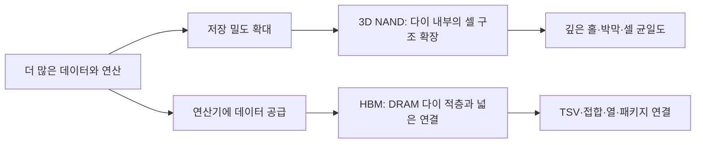

## 먼저 전체 흐름부터

**3D NAND와 HBM은 둘 다 쌓는 구조지만, 쌓는 대상과 목적이 다르다.** “층수가 많으면 좋은 메모리”라고 한 문장으로 묶으면 제조 과정도 성능도 헷갈리기 쉽다.



이 글은 **2026년 9월 7일 기준으로 확인한 공개 자료를 바탕으로 기술의 원리를 정리한 글**이다. 기업별 최신 양산 순위나 제품 로드맵을 대신하는 자료는 아니다.

## 1. DRAM과 NAND의 발전 방향부터 나누자

**DRAM은 작업 데이터의 빠른 접근, NAND는 많은 데이터의 비휘발성 저장이라는 서로 다른 요구에서 출발한다.** 같은 면적에 많은 데이터를 담고 싶은 요구는 공통이지만, 이를 구현하는 소자와 읽기·쓰기 방식은 다르다.

DRAM의 대표적인 셀은 접근 트랜지스터와 커패시터로 구성된다. 면적이 작아져도 구분 가능한 전하 상태를 유지해야 하므로 커패시터 구조, 재료, 누설과 공정 제어가 중요해진다. NAND는 저장 영역의 전하가 만드는 문턱전압 상태를 구분한다. 미세화와 다중 비트 저장은 용량을 늘리지만 상태 구분과 신뢰성 요구도 높인다.

DRAM의 셀 구조, DRAM 다이의 패키지 적층, NAND의 수직 셀 구조는 서로 다른 수준의 이야기다. 아래 두 모형을 볼 때도 **한 칩 내부인가, 칩과 칩 사이인가**를 먼저 확인하자.

## 2. 3D NAND, 한 다이 안에 수직 구조를 만든다

**3D NAND는 수직으로 이어지는 채널과 여러 높이의 게이트를 이용해 메모리 셀을 배치한다.** 화면의 판 한 장이 완성된 NAND 칩 하나인 것은 아니다.

::semiconductor-explorer{scene="nand-3d"}
::

먼저 **층 형성→메모리 홀 식각→저장막·채널 형성**을 순서대로 살펴보자. 전체 구조에서는 판들이 겹쳐 보이지만, **단면 보기**를 누르면 가운데 채널과 주위의 막을 구분하기 쉽다. **살펴볼 셀**을 움직이면 다른 높이의 워드라인과 저장 영역이 강조된다.

여러 장의 얇은 판에 같은 위치로 구멍을 뚫어 하나의 세로 통로를 만드는 모습을 떠올릴 수 있다. 실제 공정에서는 층을 쌓고, 깊은 홀을 만들고, 홀 안에 필요한 막과 채널을 형성한다. 층마다 완성된 메모리 제품을 하나씩 조립하는 모습과는 다르다.

모형은 여섯 층과 두 채널만 표시하고, 주변 회로와 선택 소자, 게이트 교체 등 세부 공정을 생략했다. 제조사와 세대마다 재료 및 공정 순서가 다르므로 특정 제품의 전체 레시피로 읽으면 안 된다. [KIOXIA의 3D 플래시 설명](https://www.kioxia.com/en-jp/rd/technology/bics-flash.html)을 바탕으로 위치 관계를 새로 구성했다.

### 무엇이 어려워질까?

**층을 높이는 일에는 깊은 구조를 일정한 모양으로 만드는 문제가 따라온다.** 위쪽은 넓고 아래쪽은 좁아지는 등 홀 형상이 달라지면 각 위치의 특성과 후속 막 형성도 달라질 수 있다.

긴 빨대를 끝까지 고른 굵기로 만드는 상황을 생각하면 된다. 겉에서 입구가 잘 보인다고 맨 아래까지 같은 형상이라고 보장할 수는 없다. 따라서 식각 깊이와 옆면 형상, 막 두께, 전기적 검사 결과를 함께 본다. [KIOXIA의 홀 식각 기술 설명](https://www.kioxia.com/en-jp/rd/technology/topics/topics-11.html)을 참고했다.

차지 트랩과 게이트 구조도 계속 발전한다. 예를 들어 Micron은 전하 저장 방식과 게이트 재료를 바꾸는 replacement-gate NAND를 공개적으로 설명한다. 이런 차이는 모든 회사의 구조를 동일한 그림 하나로 설명하기 어렵다는 뜻이다. [Micron의 NAND 구조 설명](https://www.micron.com/products/storage/nand-flash/176-layer-nand)을 참고했다.

## 3. HBM, 완성된 DRAM 다이를 쌓는다

**HBM은 개별 DRAM 다이를 쌓아 연결하는 메모리다.** 이 모형의 파란 판 하나는 하나의 DRAM 다이를 뜻한다. NAND 모형의 워드라인 층과는 대상이 다르다.

::semiconductor-explorer{scene="hbm"}
::

**TSV 연결→적층→GPU와 연결**을 넘겨본 뒤 분해 보기를 켜보자. **TSV는 실리콘 안을 관통하는 연결**, **접합부는 다이와 다이 사이를 잇는 부분**이다. 둘은 같은 역할의 한 덩어리로 그리면 안 된다.

각 층에 방이 있고 층 사이로 통신선이 이어진다고 생각해보자. 층 하나가 개별 다이이고, 내부를 관통하는 선과 층 경계의 연결부가 함께 필요하다. 다만 실제 데이터 통로는 한두 줄이 아니며, 모형의 몇 개 선은 많은 연결을 대표한다.

여기서는 DRAM 네 개와 베이스 다이를 표시했다. 실제 제품의 적층 수와 베이스 다이 기능은 세대와 설계에 따라 달라진다. [삼성전자의 TSV 패키징 설명](https://semiconductor.samsung.com/news-events/news/samsung-electronics-develops-industrys-first-12-layer-3d-tsv-chip-packaging-technology/)을 구조 참고자료로 사용했으며, 해당 자료의 제품 사양을 현재 최신 사양으로 취급하지 않았다.

## 4. HBM은 높아서만 빠른 것이 아니다

**대역폭을 이해하려면 동시에 데이터를 나르는 통로의 폭과 각 통로의 전송 속도를 함께 봐야 한다.** 저장 용량과 대역폭, 지연시간은 다른 지표다.

| 지표 | 질문 | 비유 |
|---|---|---|
| 용량 | 얼마나 담을 수 있나 | 보관함의 크기 |
| 대역폭 | 일정 시간에 얼마나 전달하나 | 동시에 물건을 나르는 통로들의 처리량 |
| 지연시간 | 요청한 결과가 도착하기까지 얼마나 걸리나 | 물건 하나가 도착하는 데 걸리는 시간 |

아래는 실제 HBM 사양이 아닌 **단위 이해용 가상 계산**이다.

```text
동시에 사용하는 데이터 선: 8개
각 선의 전송률: 초당 2 Gb
이론적 합계: 8 × 2 = 16 Gb/s = 2 GB/s

제어·대기·접근 패턴 등의 영향은 생략했다.
실제 프로그램 처리량이 이 값과 같다는 뜻은 아니다.
```

같은 인터페이스에서 저장 다이만 늘리면 용량이 늘어날 수 있지만, 인터페이스 폭이나 전송률이 그대로라면 대역폭이 같은 비율로 늘지는 않는다. HBM의 이점은 적층뿐 아니라 넓은 인터페이스와 시스템 연결 방식에서 함께 나온다. [Micron의 HBM 시스템 설명](https://assets.micron.com/adobe/assets/urn%3Aaaid%3Aaem%3A275edf31-79e3-4b6c-8bbd-a233babe9281/renditions/original/as/micron-hbm2e-memory-wp.pdf)을 참고했다.

## 5. 인터포저, 가까이 놓인 칩들을 연결한다

**인터포저는 칩 사이의 연결을 담당하는 중간 배선 구조다.** HBM과 GPU를 물리적으로 가까이 두었다고 자동으로 통신하는 것은 아니다.

작은 접점이 촘촘한 두 부품을 연결하려면 그 사이를 이어줄 배선이 필요하다. 모형 마지막 단계에서 HBM 아래와 GPU 아래를 이어주는 판이 인터포저다. 베이스 다이, 인터포저, 패키지 기판은 위치도 역할도 다르다.

다이들을 옆으로 배치하고 중간 연결 구조를 사용하는 방식을 흔히 2.5D 패키징이라고 부르며, 다이를 직접 위아래로 연결하는 3D 집적과 구분해 설명하기도 한다. HBM 자체의 수직 적층과 GPU·HBM의 패키지 내 배치가 한 시스템에 함께 존재할 수 있다.

## 6. 접합 방식, 붙이는 과정도 성능과 수율에 영향을 준다

**칩을 많이 쌓을수록 각 연결의 정렬, 열, 재료와 기계적 안정성을 함께 관리해야 한다.** 위아래로 붙어 보인다고 전기적으로 잘 연결됐다고 단정할 수는 없다.

| 방식·용어 | 원리 중심 설명 | 함께 볼 문제 |
|---|---|---|
| TC-NCF | 비전도성 필름을 이용하며 열과 압력으로 접합하는 방식 | 정렬, 접합 조건, 필름과 공간 충진 |
| MR-MUF | 적층한 연결부를 리플로우하고 몰드 언더필로 보강하는 방식 | 충진, 열 관리, 뒤틀림과 공정 제어 |
| 하이브리드 본딩 | 금속과 절연체의 접합을 결합하는 방식 | 표면 청정도, 평탄도, 정렬 |

어느 방식이 항상 우월하다는 순위표가 아니다. 제품 구조와 세대, 적용 조건에 따라 선택과 개선 과제가 달라진다. [SK hynix의 MR-MUF 설명](https://news.skhynix.com/en/rulebreaker-revolutions-mr-muf-unlocks-hbm-heat-control/)과 [이종 집적 패키징 설명](https://news.skhynix.com/en/the-value-of-semiconductor-packaging-technology-in-the-era-of-heterogeneous-integration/)을 참고했다.

TSV도 구멍 하나 뚫고 끝나는 작업이 아니다. 식각, 절연막·금속 형성, 도금과 평탄화 등 여러 공정 기술이 연결된다. [Applied Materials의 TSV 설명](https://www.appliedmaterials.com/eu/en/semiconductor/markets-and-inflections/heterogeneous-integration/tsv.html)을 보면 패키징에도 앞에서 배운 공정들이 다시 등장한다.

## 7. 칩렛과 첨단 패키징, 제품 단위에서 다시 최적화한다

**칩렛은 기능을 여러 다이로 나누고 패키지 안에서 연결해 시스템을 구성하는 접근이다.** 큰 칩 하나에 모든 기능을 넣는 방식과 비교해 설계 재사용, 제조 공정 선택 등에서 다른 선택지를 제공한다.

한 작업 공간에 모든 기능을 몰아넣는 대신 역할별 공간을 연결한다고 생각해보자. 각 공간을 따로 개선하기는 쉬워질 수 있지만 공간 사이 이동은 새로운 비용이 된다. 칩렛도 연결 대역폭, 지연, 전력, 테스트와 조립 수율을 고려해야 한다.

RDL은 접점을 필요한 위치로 다시 연결하는 재배선층이다. WLP는 웨이퍼 상태에서 패키징 공정을 수행하는 접근, PLP는 패널을 활용하는 접근으로 이해할 수 있다. 모든 기존 패키지가 한 번에 특정 방식으로 바뀌는 것은 아니다. 제품별 비용과 성능 조건에 맞춰 여러 방식이 공존한다.

공개된 최근 기술 흐름의 예로 Applied Materials는 **2026년 6월 25일** DRAM과 첨단 패키징을 위한 공정 장비를 발표했다. 발표의 제품 효과를 독립 검증된 성과로 취급하지 않고, 얇은 다이의 안정성과 패키징용 증착·CMP가 함께 중요해지고 있다는 연구·개발 방향의 사례로 참고한다. [공식 발표](https://ir.appliedmaterials.com/news-releases/news-release-details/applied-materials-introduces-new-systems-accelerate-dram-and)

## AX 연결: 어떤 층과 연결에서 문제가 생겼나?

**같은 적층 제품이라도 NAND 내부 형상 문제와 HBM 접합 문제는 관찰 대상이 다르다.** 모델을 고르기 전에 물리적 구조와 검사 위치부터 맞춰야 한다.

| 대상 | 학습용 문제 예시 | 연결할 데이터 | 개선할 결정·지표 |
|---|---|---|---|
| NAND | 위치에 따라 셀 특성이 달라진다 | 홀 형상·막 두께·전기 검사·공정 이력 | 조사할 공정 우선순위, 불량 미탐과 재발률 |
| HBM | 적층 후 일부 연결이 불안정하다 | 정렬·접합 조건·검사·다이 이력 | 추가 검사 대상, 조립 불량률과 검토 시간 |
| AI 시스템 | GPU가 메모리를 기다린다 | 실행 시간·전송량·메모리 사용량 | 배치·데이터 배치 전략, 처리량과 지연 |

예를 들어 적층 후 불량이 생겼다면 처음부터 불량이던 다이인지, 접합 중 생긴 문제인지, 검사 조건이 달라진 것인지 나눠봐야 한다. 최종 검사값만으로는 구분이 어려우므로 개별 다이부터 조립까지 이력을 연결해야 한다.

이러한 모형은 구조를 이해하는 도구다. 실제 공장과 실시간 데이터를 연결하고 상태를 검증한 디지털 트윈을 구현한 것은 아니다. AX 성과 역시 별도의 현장 비교와 검증이 필요하다.

## 이해 확인

1. NAND 모형의 판 한 장과 HBM 모형의 판 한 장은 각각 무엇인가?
2. TSV, 다이 사이 접합부, 인터포저는 어디에 있으며 무엇을 연결하는가?
3. DRAM 적층 수를 늘렸는데도 대역폭이 같은 비율로 늘지 않을 수 있는 이유는 무엇인가?

## 참고자료와 시리즈 다시 보기

- [KIOXIA: 3D 플래시 구조와 형성 원리](https://www.kioxia.com/en-jp/rd/technology/bics-flash.html)
- [KIOXIA: 깊은 메모리 홀과 식각 기술](https://www.kioxia.com/en-jp/rd/technology/topics/topics-11.html)
- [Micron: replacement-gate NAND](https://www.micron.com/products/storage/nand-flash/176-layer-nand)
- [삼성전자: TSV를 이용한 DRAM 적층](https://semiconductor.samsung.com/news-events/news/samsung-electronics-develops-industrys-first-12-layer-3d-tsv-chip-packaging-technology/)
- [Micron: HBM2E의 시스템 연결과 대역폭](https://assets.micron.com/adobe/assets/urn%3Aaaid%3Aaem%3A275edf31-79e3-4b6c-8bbd-a233babe9281/renditions/original/as/micron-hbm2e-memory-wp.pdf)
- [SK hynix: MR-MUF 기술](https://news.skhynix.com/en/rulebreaker-revolutions-mr-muf-unlocks-hbm-heat-control/)
- [SK hynix: 이종 집적과 패키징](https://news.skhynix.com/en/the-value-of-semiconductor-packaging-technology-in-the-era-of-heterogeneous-integration/)
- [Applied Materials: TSV 공정](https://www.appliedmaterials.com/eu/en/semiconductor/markets-and-inflections/heterogeneous-integration/tsv.html)

설명과 모형은 직접 작성했다. 참고자료의 사진·표·브랜드 이미지를 복제하지 않았다. 과거 제품 자료는 구조를 이해하는 데 사용하며 현재 최신 사양으로 제시하지 않는다.

**시리즈:** [1. 산업](/ax/semiconductor/part-1/) → [2. 제품과 소자](/ax/semiconductor/part-2/) → [3. 공정](/ax/semiconductor/part-3/) → **4. 메모리 기술**
