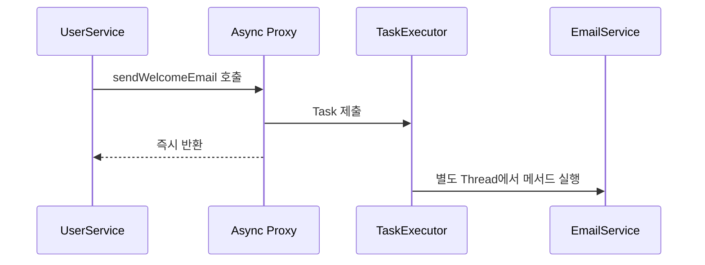

## Spring 기초 Part 10: 비동기 처리와 `@Async`

> 비동기 처리는 작업의 완료를 기다리는 대신 다른 실행 흐름에 작업을 맡기고, 호출한 쪽은 다음 작업을 진행하는 방식이다.

이메일 발송에 5초가 걸린다고 해보자.

```text
동기 처리

회원 저장 0.1초
   ↓
이메일 전송 5초
   ↓
응답
```

```text
비동기 처리

회원 저장
   ↓
이메일 작업 제출 ─────→ 다른 Thread에서 전송
   ↓
바로 응답
```

---

### 1. 먼저 알아둘 단어

| 용어 | 정의 | 쉽게 말하면 |
|---|---|---|
| 동기(Synchronous) | 이전 작업이 끝날 때까지 기다린 뒤 다음 작업 실행 | 순서대로 하나씩 처리 |
| 비동기(Asynchronous) | 작업을 맡긴 뒤 완료를 기다리지 않고 다음 작업 진행 | 다른 실행 흐름에 맡기기 |
| Thread | 코드를 실행하는 하나의 흐름 | 실제 작업자 |
| Thread Pool | 미리 준비한 여러 Thread를 재사용하는 구조 | 작업자 대기실 |
| Task | Executor에 맡길 실행 단위 | 이메일 한 건 발송 |
| Executor | Task를 어떤 Thread에서 실행할지 관리하는 객체 | 작업 배정 관리자 |
| Future | 나중에 완료될 결과를 표현하는 객체 | 결과 수령표 |
| `CompletableFuture` | 비동기 결과를 연결하고 조합할 수 있는 Future | 완료 후 다음 작업 연결 |

비동기라고 해서 작업 자체의 실행 시간이 무조건 줄어드는 것은 아니다. 호출자가 기다리지 않고 다른 일을 할 수 있도록 실행 흐름을 분리하는 것이 핵심이다.

---

### 2. `@Async` 활성화

Spring에서 `@Async`를 사용하려면 비동기 실행 기능을 활성화한다.

```java
@Configuration
@EnableAsync
public class AsyncConfig {
}
```

| 어노테이션 | 역할 |
|---|---|
| `@Configuration` | 설정 클래스를 Spring Bean으로 등록 |
| `@EnableAsync` | `@Async` 어노테이션 처리 활성화 |
| `@Async` | 해당 메서드 호출을 TaskExecutor에 제출 |

Spring의 기본 `@Async` 처리 방식은 Proxy 기반이다.

```text
호출자
  → Async Proxy
  → TaskExecutor에 작업 제출
  → 호출자는 다음 작업 진행

TaskExecutor
  → 다른 Thread에서 실제 메서드 실행
```

---

### 3. 가장 간단한 `@Async`

```java
@Service
public class EmailService {

    @Async
    public void sendWelcomeEmail(String email) {
        System.out.println(Thread.currentThread().getName());
        // 이메일 전송
    }
}
```

다른 Bean에서 호출한다.

```java
@Service
public class UserService {

    private final EmailService emailService;

    public UserService(EmailService emailService) {
        this.emailService = emailService;
    }

    public void register(String email) {
        // 회원 저장
        emailService.sendWelcomeEmail(email);

        // 이메일 완료를 기다리지 않고 다음 코드 실행
    }
}
```

**@Async 호출 흐름**



---

### 4. 결과가 필요한 경우

결과가 필요하다면 `CompletableFuture`를 반환할 수 있다.

```java
@Async
public CompletableFuture<String> createReport(Long userId) {
    String result = reportGenerator.generate(userId);
    return CompletableFuture.completedFuture(result);
}
```

호출한 쪽은 완료 후 실행할 작업을 연결할 수 있다.

```java
CompletableFuture<String> future = reportService.createReport(userId);

future.thenAccept(result -> {
    System.out.println("보고서 생성 완료: " + result);
});
```

`join()`이나 `get()`을 바로 호출하면 결과가 나올 때까지 현재 Thread가 기다리므로 비동기 효과가 줄어들 수 있다.

```java
String result = future.join(); // 이 지점에서 완료까지 대기
```

---

### 5. Thread Pool 설정

운영 환경에서는 작업량에 맞는 Executor를 명시적으로 설정하는 것이 좋다.

```java
@Configuration
@EnableAsync
public class AsyncConfig {

    @Bean(name = "emailExecutor")
    public Executor emailExecutor() {
        ThreadPoolTaskExecutor executor = new ThreadPoolTaskExecutor();

        executor.setCorePoolSize(2);
        executor.setMaxPoolSize(5);
        executor.setQueueCapacity(100);
        executor.setThreadNamePrefix("email-");
        executor.initialize();

        return executor;
    }
}
```

```java
@Async("emailExecutor")
public void sendWelcomeEmail(String email) {
    // emailExecutor에서 실행
}
```

| 설정 | 의미 |
|---|---|
| `corePoolSize` | 기본적으로 유지할 Thread 수 |
| `maxPoolSize` | 최대로 늘어날 수 있는 Thread 수 |
| `queueCapacity` | 실행을 기다리는 Task의 Queue 크기 |
| `threadNamePrefix` | 로그에서 Thread를 구분할 이름 |

Thread를 많이 만들면 무조건 빨라지는 것이 아니다. CPU, 메모리, 외부 시스템 처리량을 고려해 설정해야 한다.

---

### 6. 자기 호출 문제

`@Async`도 기본적으로 Proxy를 통해 동작한다.

같은 객체 안에서 비동기 메서드를 직접 호출하면 Proxy를 거치지 않아 현재 Thread에서 실행될 수 있다.

```java
@Service
public class EmailService {

    public void registerAndSend() {
        sendEmail(); // 자기 호출
    }

    @Async
    public void sendEmail() {
        // 비동기로 실행되지 않을 수 있음
    }
}
```

비동기 메서드를 별도 Bean으로 분리하고 외부에서 호출한다.

```text
UserService
  → EmailService Proxy
  → TaskExecutor
  → EmailService.sendEmail()
```

---

### 7. 예외 처리

#### `CompletableFuture` 반환

비동기 결과를 통해 예외를 처리할 수 있다.

```java
reportService.createReport(userId)
        .exceptionally(exception -> {
            System.out.println(exception.getMessage());
            return "보고서 생성 실패";
        });
```

#### `void` 반환

`void` 메서드에서 발생한 예외는 호출자에게 직접 전달할 수 없다. 기본적으로 로그에 남을 수 있으며, 필요하면 `AsyncUncaughtExceptionHandler`를 설정한다.

```java
@Override
public AsyncUncaughtExceptionHandler getAsyncUncaughtExceptionHandler() {
    return (exception, method, params) -> {
        System.out.println(method.getName());
        System.out.println(exception.getMessage());
    };
}
```

중요한 비동기 작업은 실패 여부를 저장하고 재시도하거나 메시지 Queue를 사용하는 방식도 고려해야 한다.

---

### 8. 트랜잭션과 `@Async`

일반적인 Spring 트랜잭션은 현재 Thread에 연결된다. 따라서 호출자 Thread의 트랜잭션이 새 비동기 Thread로 자동 전달되지 않는다.

```java
@Transactional
public void register(User user) {
    userRepository.save(user);
    emailService.sendWelcomeEmail(user.getEmail());
}
```

```text
요청 Thread
→ register()의 트랜잭션

비동기 Thread
→ 기존 트랜잭션을 자동으로 이어받지 않음
```

비동기 메서드에서 별도의 DB 트랜잭션이 필요하면 해당 비동기 Bean의 메서드에 트랜잭션 경계를 따로 설정한다.

또한 `register()`가 커밋되기 전에 비동기 작업이 시작될 수 있다. 반드시 커밋 후 실행해야 하는 작업이라면 트랜잭션 이벤트와 메시징 같은 방법을 고려해야 한다.

---

### 9. 언제 사용하면 좋은가

| 적합한 작업 | 주의할 작업 |
|---|---|
| 이메일과 알림 발송 | 결과가 즉시 필요한 작업 |
| 독립적인 외부 API 호출 | 하나의 트랜잭션으로 묶여야 하는 DB 작업 |
| 이미지 변환과 보고서 생성 | 실패하면 반드시 즉시 사용자에게 알려야 하는 작업 |
| 부가적인 로그 처리 | 순서 보장이 중요한 작업 |

`@Async`는 단일 서버의 메모리와 Thread Pool에 작업을 맡긴다. 서버가 종료되면 아직 처리하지 못한 작업을 잃을 수 있다. 반드시 처리해야 하는 작업은 Kafka, RabbitMQ 같은 메시지 시스템이나 별도의 작업 Queue가 더 적합할 수 있다.

---

### 핵심 정리

| 개념 | 한 줄 정리 |
|---|---|
| 비동기 | 완료를 기다리지 않고 다른 실행 흐름에 작업을 맡김 |
| `@EnableAsync` | Spring의 비동기 어노테이션 처리 활성화 |
| `@Async` | 메서드 작업을 TaskExecutor에 제출 |
| TaskExecutor | 비동기 Task와 Thread를 관리 |
| `CompletableFuture` | 나중에 완료될 결과와 후속 작업 표현 |
| 자기 호출 | 같은 객체 내부 호출은 Async Proxy를 거치지 않음 |
| 트랜잭션 | 호출자 Thread의 트랜잭션이 비동기 Thread로 자동 전달되지 않음 |

> `@Async`의 핵심은 작업을 무조건 빠르게 만드는 것이 아니라, 기다리는 작업을 별도 실행 흐름에 맡기는 것이다.

### 참고 자료

- [Spring Framework Task Execution and Scheduling](https://docs.spring.io/spring-framework/reference/integration/scheduling.html)
