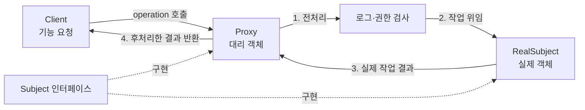
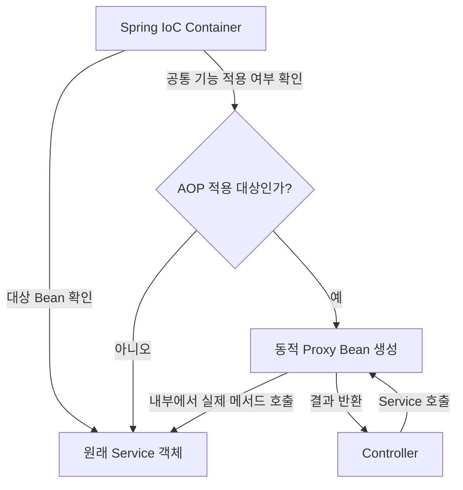

# Proxy 패턴

## Proxy가 뭔데

Proxy는 원래 법률이나 정치 분야에서 사용하는 **대리인**이라는 뜻에서 나왔다.

- Proxy Vote, 직접 투표할 수 없는 사람을 대신해 다른 사람이 투표하는 것
- Proxy Server, 사용자의 요청을 대신 받아 실제 서버에 전달하는 서버

프로그래밍에서도 의미는 비슷하다.

> Proxy 패턴은 Client가 실제 객체를 바로 호출하지 않고, 대리 객체인 Proxy를 거쳐 실제 객체를 호출하도록 만드는 구조다.

Proxy와 실제 객체는 같은 인터페이스를 사용한다. 그래서 Client는 자신이 Proxy를 호출하는지 실제 객체를 호출하는지 몰라도 된다.

## 먼저 알아둘 단어

| 용어 | 정의 | 쉽게 설명하면 |
|---|---|---|
| Client | 기능을 요청하는 객체 | 메서드를 사용하는 쪽 |
| Subject | Proxy와 실제 객체가 함께 구현하는 인터페이스 | 둘이 지켜야 하는 공통 사용법 |
| RealSubject | 실제 기능을 수행하는 객체 | 진짜 일을 하는 객체 |
| Proxy | RealSubject 대신 요청을 먼저 받는 객체 | 실제 객체 앞에 서 있는 대리인 |
| Wrapping | 어떤 객체를 다른 객체 내부에 보관하는 구조 | Proxy가 실제 객체를 감싸서 들고 있는 것 |
| Delegation | 자신이 받은 작업을 다른 객체에 넘기는 것 | Proxy가 RealSubject에게 진짜 작업을 맡기는 것 |
| Overriding | 부모 클래스나 인터페이스의 메서드를 구현 클래스에서 다시 정의하는 것 | 같은 메서드 이름으로 각 클래스의 동작을 정하는 것 |
| 전처리 | 실제 메서드가 실행되기 전에 수행하는 작업 | 로그 기록, 권한 확인, 입력값 검사 |
| 후처리 | 실제 메서드가 실행된 후 수행하는 작업 | 결과 가공, 실행 시간 기록 |
| 동적 Proxy | 실행 시점에 자동으로 만들어지는 Proxy | 개발자가 Proxy 클래스를 매번 직접 작성하지 않아도 됨 |
| Reflection | 실행 중에 클래스와 메서드 정보를 확인하고 호출하는 Java 기능 | 어떤 메서드인지 실행 중에 찾아서 처리하는 기능 |
| Bytecode | Java 소스가 컴파일된 중간 코드 | JVM이 실행하는 `.class` 파일의 코드 |
| AOP | 핵심 기능과 공통 기능을 분리하는 방식 | 여러 메서드에 필요한 로그, 보안, 트랜잭션을 따로 관리 |
| Bean | Spring IoC Container가 생성하고 관리하는 객체 | Spring이 대신 만들어 보관하는 객체 |

## Proxy 패턴의 기본 구조

Proxy는 `RealSubject`를 내부에 보관한다. Client의 요청을 먼저 받은 후 필요한 전처리를 하고, 실제 작업은 `RealSubject`에 위임한다. 실제 작업이 끝나면 후처리도 추가할 수 있다.

**Proxy 패턴의 호출 흐름**



흐름만 간단히 보면 다음과 같다.

```text
Client
  → Proxy
  → 전처리
  → RealSubject의 실제 기능 실행
  → 후처리
  → Client에게 결과 반환
```

## Proxy 패턴 예시 코드

```java
// Proxy와 RealSubject가 함께 지켜야 하는 공통 사용법
interface Subject {
    String operation(String name);
}

// 실제 기능을 수행하는 객체
class RealSubject implements Subject {

    @Override
    public String operation(String name) {
        // 실제 업무를 처리하는 부분
        System.out.println("RealSubject가 작업을 수행한다.");
        return name;
    }
}

// RealSubject에 대한 접근을 대신 처리하는 Proxy
class Proxy implements Subject {

    // Proxy가 실제 객체를 내부에 감싸서 보관한다.
    private RealSubject realSubject;

    @Override
    public String operation(String name) {
        // 실제 객체가 아직 없을 때만 생성한다.
        // 필요한 순간에 객체를 만드는 지연 생성 방식이다.
        if (realSubject == null) {
            realSubject = new RealSubject();
        }

        // 전처리: 실제 기능 실행 전에 값을 가공한다.
        String fullName = "pre:" + name;

        // 위임: 실제 작업은 RealSubject가 처리한다.
        fullName = realSubject.operation(fullName);

        // 후처리: 실제 기능 실행 결과에 값을 추가한다.
        fullName = fullName + ":post";

        return fullName;
    }
}

// 기능을 사용하는 Client 코드
public class ProxyPatternExample {

    public static void main(String[] args) {
        // 변수 타입은 Subject이지만 실제 객체는 Proxy다.
        Subject subject = new Proxy();

        // Client는 RealSubject를 직접 호출하지 않는다.
        String result = subject.operation("honggildong");

        System.out.println(result);
        // 출력 결과: pre:honggildong:post
    }
}
```

여기서 중요한 부분은 다음 코드다.

```java
fullName = realSubject.operation(fullName);
```

Proxy가 자신이 받은 작업을 실제 객체인 `RealSubject`에 넘기고 있다. 이것을 **위임(Delegation)**이라고 한다.

## 왜 Proxy를 사용하는데

핵심은 **실제 업무 코드와 부가 기능을 분리하기 위해서**다.

예를 들어 회원을 조회하는 Service의 진짜 목적은 회원을 찾는 것이다.

```java
public User findUser(Long id) {
    // 이 메서드의 핵심 기능은 회원을 조회하는 것이다.
    return userRepository.findById(id).orElseThrow();
}
```

그런데 실행 로그, 권한 검사, 실행 시간 측정까지 Service 안에서 직접 처리하면 다음과 같이 된다.

```java
public User findUser(Long id) {
    // 부가 기능 1: 실행 시간을 측정한다.
    long startTime = System.currentTimeMillis();

    // 부가 기능 2: 누가 메서드를 실행했는지 로그를 남긴다.
    System.out.println("회원 조회 시작");

    // 핵심 기능: 회원을 조회한다.
    User user = userRepository.findById(id).orElseThrow();

    // 부가 기능 3: 실행 결과와 시간을 기록한다.
    System.out.println("회원 조회 완료");
    System.out.println(System.currentTimeMillis() - startTime);

    return user;
}
```

이 코드도 실행은 된다. 하지만 회원 조회라는 핵심 기능 사이에 로그와 시간 측정 코드가 섞여 있다.

이런 코드가 여러 Service 메서드에 들어가면 다음 문제가 생긴다.

| Proxy가 없을 때 생기는 문제 | 쉽게 설명하면 |
|---|---|
| 중복 코드 증가 | 여러 메서드마다 같은 로그, 권한 검사 코드를 반복해서 작성해야 함 |
| 핵심 코드가 복잡해짐 | 회원 조회 코드와 상관없는 코드가 섞여서 읽기 어려워짐 |
| 수정 범위 증가 | 로그 형식을 바꾸려면 로그가 들어간 모든 메서드를 수정해야 함 |
| 처리 누락 가능성 | 어떤 메서드에는 권한 검사나 트랜잭션 설정을 빼먹을 수 있음 |
| 테스트가 어려워짐 | 핵심 기능과 부가 기능이 붙어 있어 각각 따로 확인하기 어려움 |

Proxy를 사용하면 부가 기능을 Proxy로 옮기고, 실제 Service에는 핵심 기능만 남길 수 있다.

```java
public class UserServiceProxy implements UserService {

    private final UserService target;

    public UserServiceProxy(UserService target) {
        // target은 실제 회원 조회 기능을 가진 Service다.
        this.target = target;
    }

    @Override
    public User findUser(Long id) {
        // 전처리: 실제 Service를 호출하기 전에 실행한다.
        long startTime = System.currentTimeMillis();
        System.out.println("회원 조회 시작");

        // 핵심 기능은 실제 Service에 맡긴다.
        User user = target.findUser(id);

        // 후처리: 실제 Service의 실행이 끝난 후 처리한다.
        System.out.println("회원 조회 완료");
        System.out.println(System.currentTimeMillis() - startTime);

        return user;
    }
}
```

이제 실제 `UserService`는 회원 조회만 담당하고, `UserServiceProxy`는 로그와 시간 측정을 담당한다.

```text
UserService      → 회원 조회라는 핵심 기능에 집중
UserServiceProxy → 로그, 시간 측정 같은 부가 기능 담당
```

즉 Proxy를 사용하는 이유는 실제 객체를 없애기 위해서가 아니다. 실제 객체 앞에 대리 객체를 두고 **요청이 실제 객체에 도착하기 전과 후를 제어하기 위해서**다.

## Proxy로 얻는 장점

| 사용하는 이유 | Proxy가 해결하는 방법 |
|---|---|
| 핵심 기능과 부가 기능 분리 | 실제 객체는 업무만 처리하고 Proxy가 공통 기능을 처리 |
| 중복 제거 | 공통 기능을 Proxy 한 곳에 작성해 여러 메서드에 적용 |
| 변경 범위 축소 | 로그나 권한 정책이 바뀌어도 실제 업무 코드는 그대로 유지 |
| 접근 제어 | 권한이 있는 요청만 실제 객체로 전달 |
| 실행 시점 제어 | 트랜잭션 시작, 캐시 확인 등을 실제 메서드 앞뒤에서 처리 |
| 객체 생성 지연 | 실제 객체가 필요한 순간에 생성해 불필요한 생성을 줄임 |
| Client 코드 유지 | Client는 같은 인터페이스를 사용하므로 실제 객체인지 Proxy인지 몰라도 됨 |

Proxy가 실제 객체 앞뒤에서 추가할 수 있는 기능은 다음과 같다.

| 추가할 기능 | Proxy가 하는 일 |
|---|---|
| 로그 | 메서드 실행 전후에 기록을 남김 |
| 권한 검사 | 실제 메서드를 실행하기 전에 접근 권한을 확인 |
| 트랜잭션 | 메서드 시작 전 트랜잭션을 열고 성공하면 커밋, 실패하면 롤백 |
| 캐시 | 저장된 결과가 있으면 실제 메서드를 호출하지 않고 바로 반환 |
| 실행 시간 측정 | 시작 시각과 종료 시각의 차이를 계산 |
| 비동기 실행 | 요청한 작업을 별도의 스레드에서 실행 |

## 언제 사용하면 좋은데

모든 객체에 Proxy가 필요한 것은 아니다. 실제 객체를 호출하기 전이나 후에 공통 처리가 필요할 때 사용하는 것이 좋다.

```text
단순히 메서드 한 번 호출
  → Proxy까지 만들 필요가 없을 수 있음

여러 메서드에 로그, 권한, 트랜잭션, 캐시가 반복됨
  → Proxy로 분리하면 관리하기 쉬움
```

Proxy를 추가하면 호출 구조가 한 단계 늘어나기 때문에 처음에는 실행 흐름을 찾기 어려울 수도 있다. 따라서 반복되는 공통 기능이나 접근 제어가 있을 때 사용하는 것이 핵심이다.

# Spring Proxy 구현 방식

Spring은 **동적 Proxy(Dynamic Proxy)**를 사용한다. 개발자가 작성한 핵심 코드를 직접 수정하지 않고도 트랜잭션, 캐시, 비동기 처리 같은 공통 기능을 추가할 수 있다.

Spring에서 주로 사용하는 방식은 JDK Dynamic Proxy와 CGLIB Proxy다.

| 구분 | JDK Dynamic Proxy | CGLIB Proxy |
|---|---|---|
| 기준 | 인터페이스 기반 | 클래스 기반 |
| 인터페이스 | 반드시 필요 | 없어도 가능 |
| 생성 방식 | `java.lang.reflect.Proxy`와 Reflection 사용 | 대상 클래스를 상속한 Proxy 클래스 생성 |
| 메서드 처리 | 인터페이스의 메서드를 대신 호출 | 대상 메서드를 Overriding해서 호출 |
| 주의점 | 인터페이스에 없는 메서드는 Proxy로 호출하기 어려움 | `final` 클래스나 `final` 메서드는 상속, Overriding할 수 없음 |

**Spring이 Proxy Bean을 만드는 흐름**



즉 Controller가 Service를 호출한다고 생각하지만, 공통 기능이 적용된 경우 실제로는 Spring이 만든 Proxy Bean을 먼저 호출하게 된다.

```text
Controller
  → Spring Proxy
  → 트랜잭션 시작
  → 실제 Service 메서드 실행
  → 트랜잭션 커밋 또는 롤백
  → Controller에 결과 반환
```

## Spring Proxy를 사용하는 대표 기능

아래 기능들이 항상 CGLIB만 사용하는 것은 아니다. 대상 객체에 인터페이스가 있는지, Proxy 설정이 어떻게 되어 있는지에 따라 JDK Dynamic Proxy 또는 CGLIB Proxy가 사용될 수 있다.

| 기능 | Annotation | 쉽게 설명하면 |
|---|---|---|
| AOP | `@Aspect` | 여러 곳에서 반복되는 로그, 권한 검사 등을 따로 분리 |
| 트랜잭션 | `@Transactional` | 작업이 모두 성공하면 저장하고, 실패하면 이전 상태로 되돌림 |
| 캐시 조회 | `@Cacheable` | 같은 결과가 저장돼 있으면 메서드를 다시 실행하지 않고 바로 반환 |
| 캐시 제거 | `@CacheEvict` | 오래되거나 변경된 캐시 데이터를 삭제 |
| 비동기 실행 | `@Async` | 메서드를 호출한 흐름과 별도의 스레드에서 작업 실행 |
| 메서드 검증 | `@Validated` | 메서드 매개변수와 반환값이 규칙에 맞는지 검사 |

### `@Cacheable` 예시

```java
@Cacheable(value = "products", key = "#productId")
public ProductDto getProductById(Long productId) {
    // 첫 번째 요청에서는 Repository를 통해 DB를 조회한다.
    // 같은 productId로 다시 요청하면 캐시에 저장된 결과를 반환할 수 있다.
    return productRepository.findById(productId)
            .map(ProductDto::from)
            .orElseThrow();
}
```

실행 흐름은 다음과 같다.

```text
getProductById(1) 호출
        ↓
Proxy가 products 캐시 확인
        ↓
캐시가 있나?
  ├─ 있음 → 캐시 결과 바로 반환
  └─ 없음 → 실제 메서드 실행 → DB 조회 → 결과를 캐시에 저장
```

## `@Transactional`에서 Proxy가 하는 일

```java
@Transactional
public void updateUser(Long id, String name) {
    // 이 코드 앞에서 Proxy가 트랜잭션을 시작한다.
    User user = userRepository.findById(id).orElseThrow();

    // Entity의 값을 변경한다.
    user.setName(name);

    // 메서드가 정상 종료되면 Proxy가 커밋한다.
    // 예외가 발생하면 Proxy가 롤백을 처리한다.
}
```

개발자가 직접 작성한 메서드에는 회원 수정 로직만 있다. 트랜잭션 시작, 커밋, 롤백은 Spring Proxy가 메서드 앞뒤에서 처리한다.

## 수동으로 Proxy Bean 만들기

`@Service` 없이도 `@Configuration`과 `@Bean`을 사용하면 객체를 직접 만들어 Spring Bean으로 등록할 수 있다.

먼저 Service의 공통 사용법을 인터페이스로 만든다.

```java
public interface UserService {
    String findUserName(Long id);
}
```

실제 기능을 처리하는 클래스를 만든다.

```java
public class UserServiceImpl implements UserService {

    private final UserRepository userRepository;

    public UserServiceImpl(UserRepository userRepository) {
        // Spring이 전달한 Repository를 필드에 저장한다.
        this.userRepository = userRepository;
    }

    @Override
    public String findUserName(Long id) {
        // 실제 회원 조회 작업을 수행한다.
        return userRepository.findById(id)
                .map(User::getName)
                .orElse("사용자 없음");
    }
}
```

실제 Service를 감싸는 Proxy를 만든다.

```java
public class UserServiceProxy implements UserService {

    // 실제 작업을 수행할 대상 객체다.
    private final UserService target;

    public UserServiceProxy(UserService target) {
        this.target = target;
    }

    @Override
    public String findUserName(Long id) {
        // 전처리: 실제 메서드를 호출하기 전에 로그를 남긴다.
        System.out.println("회원 조회 시작");

        // 실제 작업은 target에게 위임한다.
        String result = target.findUserName(id);

        // 후처리: 실제 메서드가 끝난 뒤 로그를 남긴다.
        System.out.println("회원 조회 종료");

        return result;
    }
}
```

마지막으로 `@Configuration`에서 Proxy를 Bean으로 등록한다.

```java
@Configuration
public class AppConfig {

    @Bean
    public UserService userService(UserRepository userRepository) {
        // 1. 실제 기능을 수행할 객체를 만든다.
        UserService target = new UserServiceImpl(userRepository);

        // 2. 실제 객체를 Proxy로 감싼다.
        // 3. 반환된 Proxy가 Spring Bean으로 등록된다.
        return new UserServiceProxy(target);
    }
}
```

Spring Container에는 `UserServiceImpl`을 직접 등록한 것이 아니라, 실제 객체를 감싼 `UserServiceProxy`가 `UserService` Bean으로 등록된다.

```text
Controller
  → UserService Bean 요청
  → UserServiceProxy 호출
  → UserServiceImpl 호출
  → UserRepository 호출
```

## 주의할 점

Spring Proxy는 **Proxy를 거쳐 들어오는 호출**에 공통 기능을 적용한다. 같은 클래스 내부에서 자신의 메서드를 직접 호출하면 Proxy를 거치지 않을 수 있다.

```java
@Service
public class PaymentService {

    public void order() {
        // 같은 객체 내부에서 직접 호출한다.
        // 이런 내부 호출은 Proxy를 거치지 않아 @Transactional이 적용되지 않을 수 있다.
        pay();
    }

    @Transactional
    public void pay() {
        // 결제 처리
    }
}
```

이것을 **Self-invocation(자기 호출)** 문제라고 한다. `@Transactional` 같은 기능을 사용할 때는 호출이 실제로 Spring Proxy를 거치는지 확인해야 한다.

## 정리

| 구분 | 핵심 내용 |
|---|---|
| Proxy | 실제 객체 대신 요청을 먼저 받는 대리 객체 |
| Subject | Proxy와 RealSubject가 함께 사용하는 인터페이스 |
| RealSubject | 실제 업무를 수행하는 객체 |
| Wrapping | Proxy가 실제 객체를 내부에 보관하는 구조 |
| Delegation | Proxy가 실제 객체에게 작업을 넘기는 것 |
| Spring Dynamic Proxy | 실행 시점에 Spring이 자동으로 생성하는 Proxy |
| JDK Dynamic Proxy | 인터페이스를 기준으로 Proxy 생성 |
| CGLIB Proxy | 클래스를 상속해 Proxy 생성 |
| 주요 용도 | AOP, 트랜잭션, 캐시, 비동기 실행, 검증 |

결국 Proxy의 핵심은 다음 한 줄로 정리할 수 있다.

> Client와 실제 객체 사이에 대리 객체를 두고, 실제 코드를 크게 건드리지 않으면서 공통 기능을 앞뒤에 추가하는 방식이다.
