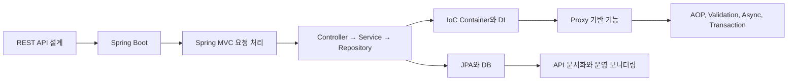

# 전체 데이터 구조 

# 1. 핵심 개녕 정리 

## A. REST API

REST는 "웹의 자원(RESORECE)" 을 URI 로 식별하고, HTTP Method로 조작하고, JSON 형태로 주고 받는 방ㅅ기 

| 요소 | 역할 | 예시 |
|---|---|---|
| Resource | 서버가 제공하는 대상, 명사로 표현 | User, Product, Order |
| URI | 자원이 무엇인지 식별 | `/users/10` |
| HTTP Method | 자원에 할 행동 표현 | GET, POST, PUT, PATCH, DELETE |
| Representation | 자원을 전달하는 데이터 형식 | JSON, XML, 파일 |

GET /users/10
→ “10번 사용자를 조회한다”

POST /users
→ “사용자 컬렉션에 새 사용자를 생성한다”

REST 설계의 핵심은 URI에 동사를 넣지 않는 것. 

좋음 : GET/users/10 
나쁨 : GET/getUser?id=10

| REST 원칙 | 뜻 |
|---|---|
| Client-Server | 화면 역할과 서버의 데이터·비즈니스 역할을 분리 |
| Stateless | 서버가 이전 요청의 상태를 기억하지 않고, 각 요청이 필요한 정보를 포함 |
| Cacheable | 응답의 재사용 가능 여부를 HTTP 캐시로 표현 |
| Uniform Interface | URI, Method, 상태 코드, JSON 형식을 일관되게 사용 |
| Layered System | Gateway, 인증 서버, 로드밸런서 등이 중간에 있어도 클라이언트는 몰라도 됨 |
| Code on Demand | 서버가 JavaScript 같은 실행 코드를 내려줄 수 있음, 선택 사항 |

## B. Spring과 Spring Boot 

| 용어 | 정의 |
|---|---|
| Spring | Java 객체의 생성, 연결, 공통 기능 처리를 도와주는 프레임워크 |
| Spring Boot | Spring 설정을 자동화하고 내장 서버로 빠르게 실행하게 만든 플랫폼 |
| Starter | 목적별 의존성을 묶어 제공하는 라이브러리 묶음 |
| Auto Configuration | 추가된 라이브러리와 설정을 보고 필요한 Bean을 자동 설정하는 기능 |
| Embedded Server | Tomcat 같은 서버를 애플리케이션 내부에 포함해 JAR만으로 실행하는 방식 |
| Bean | Spring IoC Container가 생성하고 관리하는 객체 |
| Component Scan | 특정 패키지 아래에서 Bean 후보 클래스를 찾아 자동 등록하는 기능 |

예시로 @SpringBootApplication은 아래 기능을 묶는다. 

@SpringBootApplication
= @Configuration
+ @EnableAutoConfiguration
+ @ComponentScan

## C. Spring MVC와 Controller 

Spring MVC는 DispatcherServlet은 모든 HTTP 요청의 첫 관문인 Front Controller

클라이언트 
-> Tomcat이 HTTP 요청 수신 
-> DispatchServlet 
-> HandlerMapping이 URL에 맞는 Controller 메서드 탐색 
-> HandlerAdapter가 Controller 메서드 호출 
-> Controller -> Service -> Repository 
-> HTTPMessageConverter가 Java 객체를 JSON으로 변환
-> 응답 전송 

| 용어 | 정의 |
|---|---|
| DispatcherServlet | 모든 요청을 받아 적절한 Controller 처리로 연결하는 Front Controller |
| HandlerMapping | URL과 HTTP Method에 맞는 Controller 메서드를 찾는 역할 |
| HandlerAdapter | 찾은 Controller 메서드를 실제로 호출하는 역할 |
| HTTPMessageConverter | JSON 요청 본문을 Java 객체로, Java 반환 객체를 JSON으로 변환 |
| `@Controller` | 주로 View 이름을 반환하는 MVC Controller |
| `@RestController` | `@Controller + @ResponseBody`, 반환값을 HTTP Body로 보내는 REST Controller |
| `ResponseEntity` | Body뿐 아니라 HTTP 상태 코드와 헤더까지 명시적으로 구성하는 객체 |

주요 데이터 바인딩은 이렇게 구분 

| 어노테이션 | 받는 데이터 |
|---|---|
| `@PathVariable` | `/users/{id}`의 경로 값 |
| `@RequestParam` | `?name=min` 같은 쿼리 파라미터 |
| `@RequestBody` | JSON Body를 Java DTO로 변환 |
| `@RequestHeader` | Authorization 등의 HTTP Header |
| `@CookieValue` | HTTP Cookie 값 |

## D. 계층 구저 : Controller, Service, Repository 

Controller : HTTP 요청, 응답, URL 매핑, DTO 변환, 검증
Service : 비즈니스 규칙, 여러 Repositrory 조합, 트랜잭션 경계 
Repository : DB CRUD와 데이터 접근 기술을 숨기는 계층 

| 계층 | 넣어야 할 것 | 넣지 않는 편이 좋은 것 |
|---|---|---|
| Controller | HTTP 요청 처리, DTO 검증, 상태 코드 결정 | 복잡한 비즈니스 규칙, SQL |
| Service | 업무 규칙, 트랜잭션, Repository 조합 | HTTP,  JSON 세부 처리 |
| Repository | 조회·저장·삭제 | 서비스 정책, 화면 요구사항 |

## E. IoC와 DI

| 용어 | 정의 |
|---|---|
| Dependency | 한 객체가 기능 수행을 위해 다른 객체를 사용하는 관계 |
| DI, Dependency Injection | 필요한 객체를 직접 `new`하지 않고 외부에서 주입받는 방식 |
| IoC, Inversion of Control | 객체 생성, 조립의 제어권이 개발자에서 Spring Container로 넘어가는 원리 |
| IoC Container | Bean 생성, 의존성 주입, 생명주기 관리를 담당하는 Spring의 객체 관리 공간 |
| ApplicationContext | 실무에서 주로 사용하는 Spring IoC Container 구현체 |
| Singleton Bean | 기본적으로 Container 하나당 하나만 생성되어 공유되는 Bean |

## F. Proxy와 AOP 

이 둘은 구분해야 한다. 

> AOP적 설계를 구현하는 좋은 방법 : Proxy 

| 개념 | 역할 |
|---|---|
| AOP | 무엇을, 어디에 적용할지 정하는 설계 방식 |
| Proxy | 실제 메서드 호출을 앞뒤에서 가로채는 대리 객체 |
| Spring | Bean을 Proxy로 감싸 AOP 기능을 자동 적용하는 프레임워크 |

Controller
→ Service Proxy
  → Before / Around Advice
  → 실제 UserService
  → After Advice
→ Controller

| 용어 | 정의 |
|---|---|
| Proxy Pattern | 실제 객체 대신 같은 인터페이스, 기능을 가진 대리 객체가 호출을 제어하는 패턴 |
| AOP | 로깅, 보안, 트랜잭션처럼 여러 기능에 공통으로 걸리는 관심사를 분리하는 방식 |
| Aspect | 공통 관심사를 구현한 클래스 |
| Target | Proxy가 감싸는 실제 Bean |
| Pointcut | Advice를 적용할 메서드 범위 |
| Advice | 실제 실행 전, 후에 추가로 수행할 코드 |
| `@Before` | 대상 메서드 실행 전 수행 |
| `@After` | 성공, 실패와 상관없이 실행 후 수행 |
| `@AfterReturning` | 정상 반환한 뒤 수행 |
| `@AfterThrowing` | 예외 발생 후 수행 |
| `@Around` | 실행 전, 후, 예외 처리를 모두 제어할 수 있는 Advice |

## G. DTO와 입력값 검증

| 용어 | 정의 |
|---|---|
| DTO | 계층 또는 네트워크 사이에서 데이터를 전달하기 위한 객체 |
| Entity | DB 테이블과 매핑되고 JPA가 관리하는 도메인 객체 |
| `@Valid` | Controller에서 요청 DTO의 유효성을 검증하는 표준 어노테이션 |
| `@Validated` | Spring의 확장 검증 어노테이션, 메서드 수준 검증과 AOP 기반 검증에 사용 |
| `@NotBlank` | null, 빈 문자열, 공백 모두 허용하지 않음 |
| `@NotNull` | null을 허용하지 않음 |
| `@Email` | 이메일 형식 검증 |
| `@Min`, `@Max` | 숫자 범위 검증 |

Entity를 API 응답에 바로 쓰지 않고 DTO를 쓰는 이유는 다음과 같습니다.
- 비밀번호 같은 내부 필드 노출 방지
- API 요구사항과 DB 구조의 분리
- 요청 DTO와 응답 DTO의 역할 분리
- 양방향 연관관계 JSON 직렬화 문제 방지

HTTP JSON 요청
→ Request DTO
→ @Valid 검증
→ Service
→ Entity
→ DB

DB Entity
→ Response DTO
→ JSON 응답

##  H. Async

@Async는 호출한 스레드와 별도 스레드에서 메서드를 실행하게 하는 기능

Controller
→ Async Proxy
→ Thread Pool에 작업 위임
→ Controller는 즉시 응답 가능
→ 별도 Thread가 실제 작업 수행

| 용어 | 정의 |
|---|---|
| `@EnableAsync` | Spring의 비동기 기능을 활성화 |
| `@Async` | 해당 Bean 메서드를 별도 스레드에서 실행하도록 지정 |
| TaskExecutor | 비동기 작업을 수행할 스레드 풀 |
| `CompletableFuture` | 비동기 작업의 미래 결과를 표현하고 조합하는 객체 |
| Blocking | `.get()`처럼 결과가 나올 때까지 현재 스레드를 기다리게 하는 방식 |
| Non-blocking | Future를 반환하거나 콜백으로 처리해 현재 스레드를 기다리지 않게 하는 방식 |

## I. JPA와 Repository

| 용어 | 정의 |
|---|---|
| ORM | Java 객체와 관계형 DB 테이블 사이를 연결하는 기술 |
| JPA | Java ORM의 표준 명세 |
| Hibernate | JPA 명세를 실제로 구현한 대표 라이브러리 |
| Entity | 테이블과 매핑되어 영속성 컨텍스트가 관리하는 객체 |
| `@Entity` | 클래스를 JPA 관리 대상으로 지정 |
| `@Id` | 기본키 필드 지정 |
| `@GeneratedValue` | 기본키 자동 생성 전략 지정 |
| `@Column` | 필드와 DB 컬럼의 세부 매핑 지정 |
| `@Enumerated(EnumType.STRING)` | Enum을 숫자가 아닌 문자열로 DB에 저장 |
| `@Transient` | DB 컬럼으로 저장하지 않을 필드 지정 |
| `JpaRepository` | CRUD, 페이징, 정렬 등을 제공하는 Spring Data JPA 인터페이스 |
| Query Method | `findByEmail`처럼 메서드 이름 규칙으로 쿼리를 자동 생성하는 방식 |

## J. 연관관계와 영속성 컨텍스트

| 용어 | 정의 |
|---|---|
| 외래키, FK | 한 테이블이 다른 테이블의 기본키를 참조하는 컬럼 |
| `@ManyToOne` | 여러 객체가 하나의 객체를 참조하는 N:1 관계 |
| `@OneToMany` | 한 객체가 여러 객체를 가지는 1:N 관계 |
| 연관관계 주인 | 외래키를 관리하며 실제 관계 변경 SQL을 만드는 쪽 |
| `@JoinColumn` | 외래키 컬럼 이름을 지정 |
| LAZY Loading | 연관 객체를 즉시 조회하지 않고 실제 접근 시 가져오는 방식 |
| EAGER Loading | 부모 객체 조회 시 연관 객체도 즉시 함께 가져오는 방식 |
| EntityManager | 엔티티의 CRUD와 영속성 컨텍스트를 관리하는 JPA 핵심 객체 |
| 영속성 컨텍스트 | 엔티티를 1차 캐시에 보관하고 상태 변화를 추적하는 작업 공간 |
| Dirty Checking | 영속 상태 엔티티의 변경을 감지해 UPDATE SQL을 자동 생성하는 기능 |
| Flush | 영속성 컨텍스트의 변경 내용을 DB에 동기화하는 작업 |
| Write-behind | SQL을 바로 실행하지 않고 모아 두었다가 Flush, Commit 시점에 처리하는 방식 |

## K. Transaction과 동시성

@Transactional은 단순히 “DB 저장 어노테이션”이 아닙니다. Spring이 Transaction Proxy를 만들고, 메서드 시작 전 트랜잭션을 열며, 성공하면 Commit, 기본적으로 RuntimeException이 발생하면 Rollback.

Service Proxy
→ BEGIN
→ 실제 Service 메서드
→ 영속성 컨텍스트의 변경 감지
→ Flush
→ COMMIT 또는 ROLLBACK

| 용어 | 정의 |
|---|---|
| Transaction | 여러 DB 작업을 하나의 논리적 작업 단위로 묶는 것 |
| ACID | 원자성, 일관성, 격리성, 지속성이라는 트랜잭션의 핵심 성질 |
| Commit | 변경 내용을 최종 반영 |
| Rollback | 작업 중 오류가 나면 변경을 취소 |
| `readOnly = true` | 조회 중심 트랜잭션임을 명시해 최적화와 의도를 표현 |
| Propagation | 기존 트랜잭션이 있을 때 새 메서드가 참여·분리되는 방식 |
| Self-invocation | 같은 클래스 내부에서 메서드를 직접 호출해 Proxy를 거치지 않는 문제 |
| Optimistic Lock | 충돌이 드물다고 보고, 버전 비교로 Commit 시점에 충돌을 감지하는 방식 |
| Pessimistic Lock | 충돌이 잦다고 보고 DB Lock으로 다른 트랜잭션 접근을 미리 막는 방식 |
| `@Version` | 낙관적 Lock에서 변경 횟수를 관리하는 필드 |

# L. API 문서화와 운영 

| 용어 | 정의 |
|---|---|
| OpenAPI | REST API의 경로, 요청, 응답 규격을 표현하는 표준 |
| Swagger UI | OpenAPI 문서를 웹 화면에서 조회, 테스트하는 도구 |
| Actuator | Spring Boot 애플리케이션의 상태와 지표를 노출하는 운영 기능 |
| Health | 애플리케이션, DB 등 핵심 구성 요소의 정상 여부 |
| Metrics | JVM 메모리, CPU, 요청 수, 응답 시간 등의 수치 |
| Liveness Probe | 프로세스가 살아 있는지 확인하는 상태 검사 |
| Readiness Probe | 현재 트래픽을 받을 준비가 됐는지 확인하는 상태 검사 |
| Prometheus | 모니터링 시스템이 수집할 수 있는 형식으로 Metrics를 제공하는 도구 |

주관식 퀴즈 연습 

1. REST : 웹페이지가 가진 객체, URI : 요청한 데이터의 인덱스, 이를 통해 식별해야할 대상을 알 수 있다. Http Method : 데이터 통신 방법. Representation : 데이터 표현 방법

2. /users/10이 더 적합하다 REST에서는 명사형으로 작성하는 게 더 권장되기 때문이다. 

3. POST 데이터 삽입 요청, ?? 나머지는 모르겠는데?

4. 서버가 사용자를 기억할 필요가 없어서, 서버의 수평확장이 용이하다. 

5. DB에서 다시 불러올 필요없이, 캐시 메모리에서 꺼내므로 데이터 절약과 프로세싱 비용 절약으로 이어진다. 

6. Spring은 자바를 이용해서 백엔드를 구현하는 프레임워크고, Spring Boot는 Spring 세팅을 도와주는 라이브러리다. 

7. @SpringBootApplication -> ? 

8. @가 붙은 클래스를 Bean으로 등록하여 관리하낟. 

9.모르겠는데? 

10. DispatcherServlet -> HandlerMapping ->  HandlerAdapter : 요청 분배해주는 거 아냐?

11. @Pathvariable -> 각 사용자의 아이디를 링크 뒤에 넣어주는 거 밖에 모르겠는데? 

12. 기능별로 분리해서 구현을 쉽게 하는 게 목표고, 각 계층에서 Controller의 경우에는 링크를 보고, 서비스로 넘겨주고, 서비스에서 실제 기능을 처리하고, Repositroy에서 DB와 데이터를 관리해. 

13. 모르겠다. 

14. 가짜 필드가 들어가는 걸 방지하기 위해서 필드 주입보다 생성자 주입이 더 선호된다. 

15. Bean이 일반 Java 객체와 다른 점을 생명주기와 의존성 주입 관점에서 설명 -> Bean이 알아서 생명주기와 의존성 주입을 진행해서 사용자가 관리할 필요가 없다. 

16. AoP는 반복되는 코드를 재작성하는 것을 방지하기 위해서 기능별로 묶은 것이고, Proxy는 이를 구현하는 방법 중 하나이다. 
proxy의 경우에 실행할 메서드 위에 선언하면, 메서드가 실행되기 전에 가로채서 먼저 자신의 메서드를 먼저 실행하고, 가로친 메서드를 실행하고, 그리고 자신의 메서드를 after로 선언하면 한번 더 실행하낟. 

17. ? 

18. 첨 듣는데 

19. Entity를 그대로 전하면 비밀번호가 노출될 수 있다. 따라서 DTO로 변경해야 할 필요가 있다. 

20. ? 모르겠는데 

21. ?

22. ?

23. JPA는 자바를 쿼리를 바꿔서 DB에 접근하게 해주는 클래스, 이 기능은 hibernate를 통해서 구현된다. Spring Data

24. @Entity : 엔터티 / 테이블 정의 @Id : 주식별자  @GeneratedValue : 식별자 생성  @Column : 컬럼 생성 

25. @ManyToOne 관계에서 외래키를 관리하는 쪽이 연관관계 주인이 되는 이유를 설명하세요. 그렇게 설정했으니까?

26. 필요할 때만 로딩

27. 모르겠는데 

28. flush는 DB에 요청된 쿼리를 처리하고 한 번에 방출하는 기능이고, 그리고 Commit은 트랜젝션을 확정하는 기능 

29. @Transactional이 붙은 Service 메서드 호출 시 Proxy가 시작, 종료 시점에 하는 일을 설명 -> 

30. 낙관적 Lock은 트랜젝션을 일단하고, 오류가 나면 롤백함. 비관적 Lock은 하나하나 트랜젝션이 끝나야 트랜젝션을 진행하는 방식이다,

31. 아 Self-invocation이 뭔지 모르겠는데? 

32. Acutator는 백엔드의 헬스 체크를 위한 기능이다. Swagger은 뭐냐 Swag임? 

33. ?

# ------------ 정답 

1. DispatchServler -> 요청 접수, HandlerMapping -> 어떤 Controller 메서드인지 검색, HandelrAdapter -> 파라미터를 만들고 Controller 메서드 실행, HTTPMessageConverter -> Java 객체를 JSON으로 응답 

2. IoC 와 DI 

DI = UserService가 필요한 UserRepository를 외부에서 받는 것 
IoC = 그 객체를 생성하고 주입하는 제어권을 Spring이 가지는 것 

3. AOP, Proxy 

AOP :  어떤 공통 기능을 어디에 적용할지 정의 
Proxy : 실제 호출을 가로채 공통 기능을 실행하는 객체 
Spring : Target Bean을 Proxy로 자동 포장 

4. JPA 실행 구조

* 영속성 컨텍스트 : 이 객체는 지금 DB의 어떤 데이터와 연결되어 있어~ 라고 관리해주는 것 
JPA는 Member 객체를 DB에서 가져온 뒤 영속성 컨텍스트에 보관합니다. 이후 같은 회원을 또 조회하면, 보통 DB를 다시 조회하기보다 먼저 이 공간에서 찾습니다. 이것이 1차 캐시

JpaRepository -> EntityManager -> 영속성 컨텍스트 -> Hibernate -> JDBC -> DB 

- JPA는 표준
- Hibernate는 JPA 구현체
- Spring Data JPA는 Repository 추상화 

5. transaction 실행

Controller -> Transaction Proxy -> BEGIN -> 실제 서비스 -> Dirty Checking -> Flush -> COMMIT 

RuntimeException 
-> ROLLBACK 

# 문제 

REST에서 Resource, URI, HTTP Method, Representation은 각각 무엇이며 어떻게 연결되나요?

/users/10과 /getUser?id=10 중 REST 관점에서 더 적절한 URI를 고르고 이유를 설명하세요.

POST, PUT, PATCH의 역할 차이를 사용자 수정 예시로 설명하세요.

REST의 Stateless 원칙이 서버 확장에 유리한 이유를 설명하세요.

REST의 Cacheable 원칙이 서버 성능에 어떤 도움을 주나요?

Spring과 Spring Boot의 차이를 자동 설정, 내장 서버, 실행 방식 관점에서 설명하세요.

@SpringBootApplication이 수행하는 대표 기능 세 가지를 설명하세요.

Component Scan은 어떤 클래스를 어떻게 Bean으로 등록하나요?

@Controller와 @RestController의 차이를 응답 처리 방식 기준으로 설명하세요.

브라우저 요청이 Controller 메서드에 도착할 때까지 DispatcherServlet, HandlerMapping, HandlerAdapter의 역할을 순서대로 설명하세요.

@PathVariable, @RequestParam, @RequestBody의 사용 상황을 각각 예로 드세요.

Controller, Service, Repository를 분리하는 이유와 각 계층의 책임을 설명하세요.

IoC와 DI의 차이를 “개발자 관점”과 “Spring Container 관점”으로 나누어 설명하세요.

생성자 주입이 필드 주입보다 권장되는 이유를 세 가지 설명하세요.

Bean이 일반 Java 객체와 다른 점을 생명주기와 의존성 주입 관점에서 설명하세요.

Proxy와 AOP의 관계를 “무엇을 정하는가, 어떻게 가로채는가” 관점으로 구분해 설명하세요.

@Around Advice가 @Before와 @After보다 할 수 있는 일을 설명하세요.

Spring AOP가 적용되지 않는 self-invocation 문제는 왜 발생하나요?

DTO와 Entity를 분리해야 하는 이유를 보안과 API 변경 관점에서 설명하세요.

@Valid와 @Validated의 사용 위치와 동작 방식 차이를 설명하세요.

@Async가 동작할 때 Proxy와 Thread Pool이 각각 하는 일을 설명하세요.

CompletableFuture.get()을 호출하면 비동기 코드가 왜 다시 대기 상태가 될 수 있나요?

JPA, Hibernate, Spring Data JPA의 관계를 설명하세요.

@Entity, @Id, @GeneratedValue, @Column의 역할을 각각 설명하세요.

@ManyToOne 관계에서 외래키를 관리하는 쪽이 연관관계 주인이 되는 이유를 설명하세요.

LAZY Loading이 무엇이며, 연관 객체에 접근할 때 어떤 일이 일어나나요?

영속성 컨텍스트의 1차 캐시와 Dirty Checking 기능을 설명하세요.

flush와 commit의 차이를 설명하세요.

@Transactional이 붙은 Service 메서드 호출 시 Proxy가 시작·종료 시점에 하는 일을 설명하세요.

낙관적 Lock과 비관적 Lock의 차이, 그리고 각각 적합한 상황을 설명하세요.

Transaction의 Self-invocation 문제를 피하기 위해 왜 별도 Bean으로 분리할 수 있나요?

Swagger UI와 Actuator의 목적 차이를 설명하세요.

Liveness Probe와 Readiness Probe를 Kubernetes 관점에서 구분해 설명하세요.
