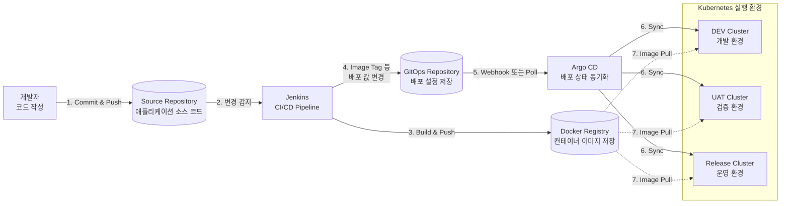

## 참고: CI/CD(Continuous Integration & Continuous Deployment)

애플리케이션을 컨테이너 이미지로 Build, Push한 후 실행 환경에 배포하는 흐름이다.



```text
개발자 → Source Repository → Jenkins → Docker Registry
                              │
                              └→ GitOps Repository ↔ Argo CD
                                                       ├→ DEV Cluster
                                                       ├→ UAT Cluster
                                                       └→ Release Cluster
```

| 단계 | 동작 | 결과 |
| --- | --- | --- |
| 1 | 개발자가 코드를 Commit하고 Source Repository에 Push | 소스 코드 변경 |
| 2 | Jenkins가 변경을 감지하여 CI/CD Pipeline 실행 | Build와 테스트 시작 |
| 3 | 컨테이너 이미지를 Build하고 Docker Registry에 Push | 배포할 이미지 저장 |
| 4 | GitOps Repository의 Image Tag 등 배포 설정 갱신 | 원하는 배포 상태 기록 |
| 5 | Argo CD가 Webhook 또는 Poll 방식으로 변경 감지 | 실제 상태와 원하는 상태 비교 |
| 6 | Argo CD가 각 Kubernetes Cluster에 설정 동기화 | DEV, UAT, Release 환경에 배포 |
| 7 | Kubernetes가 Registry에서 컨테이너 이미지를 Pull | 새 버전 컨테이너 실행 |

### CI와 CD의 역할

| 구분 | 의미 | 담당 작업 |
| --- | --- | --- |
| CI | Continuous Integration, 지속적 통합 | 코드 통합, Build, 테스트, 이미지 생성과 Push |
| CD | Continuous Deployment, 지속적 배포 | 배포 설정 변경 감지, 실행 환경 동기화, 컨테이너 배포 |

- Jenkins는 애플리케이션을 Build하고 컨테이너 이미지를 Registry에 Push한다.
- GitOps Repository에는 Kubernetes가 어떤 이미지 버전을 실행해야 하는지 기록한다.
- Argo CD는 GitOps Repository의 원하는 상태와 Kubernetes의 실제 상태를 비교하고 동기화한다.
- DEV, UAT, Release Cluster는 목적이 다른 실행 환경이며 동일한 방식으로 배포할 수 있다.
