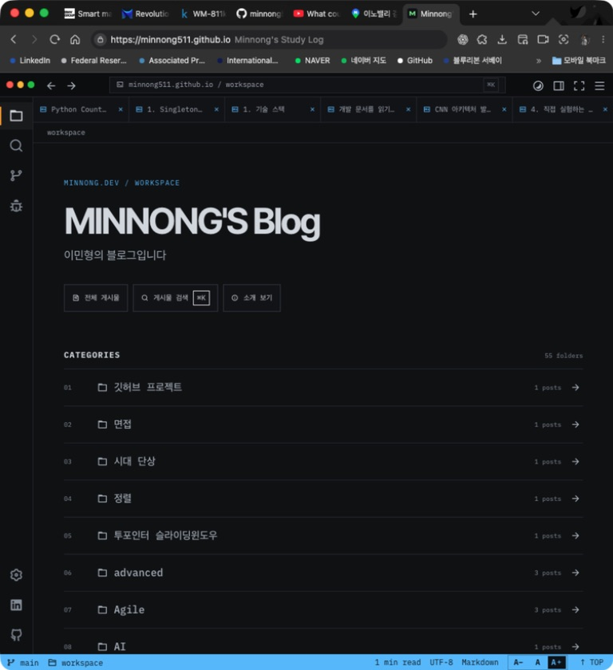
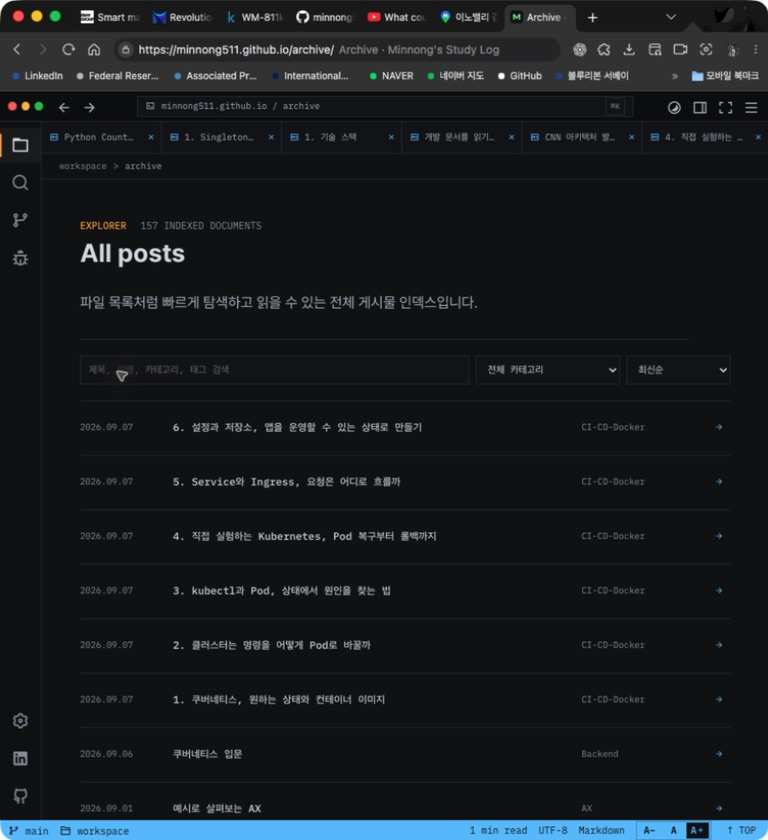
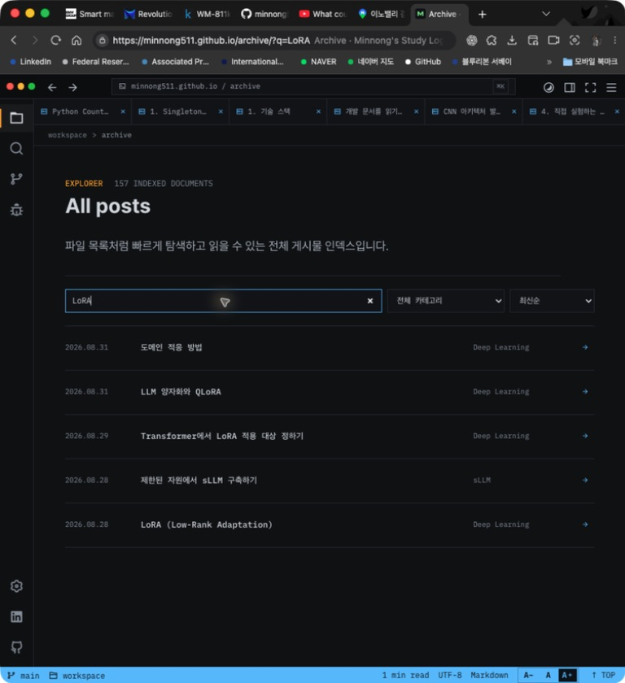
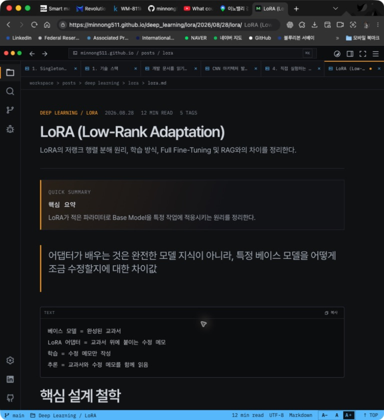
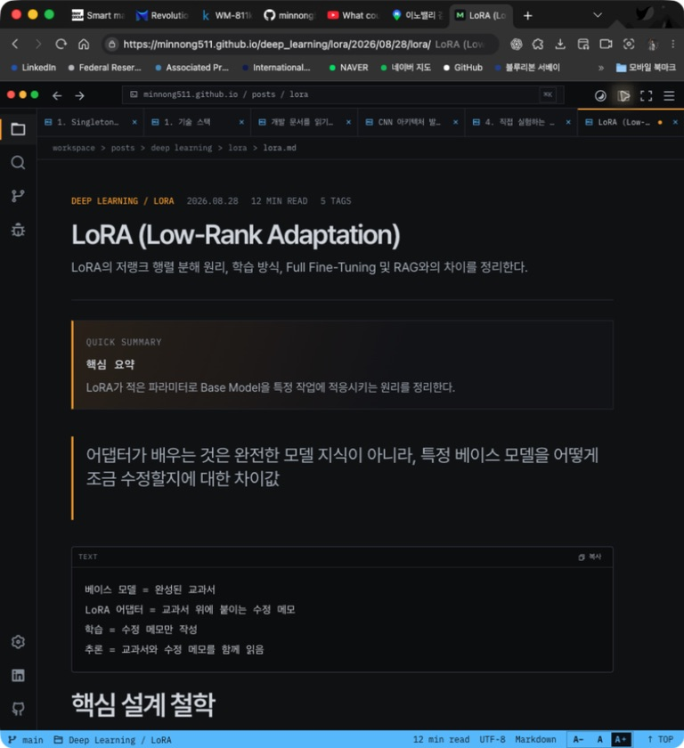
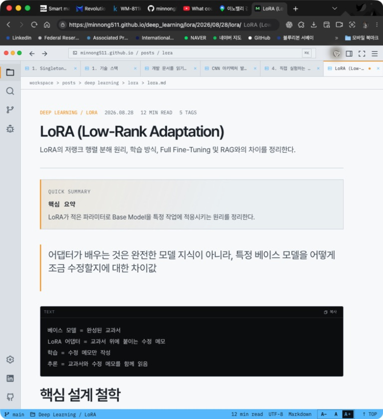
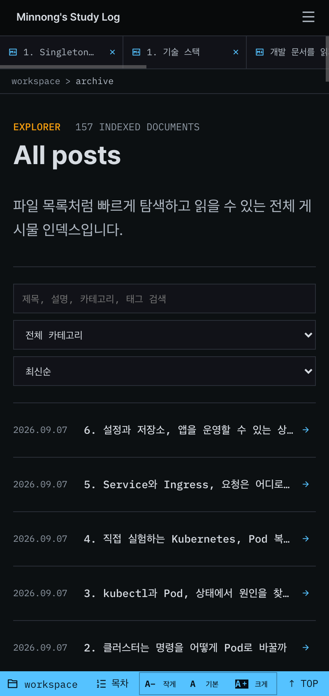

# 블로그 디자인 점검 · 2026-09-07

현재 가장 큰 문제는 글을 찾고 읽는 데 필요한 정보보다 편집기 UI와 세분된 분류가 먼저 보인다는 점이다. 어두운 배경, 얇은 구분선, 폴더와 탭이라는 표현은 일관적이다. 이 분위기를 유지하면서 홈의 정보 순서, 글 목록의 글자 크기, 목차 접근성을 개선하는 것이 효과적이다.

## 점검 범위와 근거

- 공개 사이트 `https://minnong511.github.io/`에서 홈 → 전체 게시물 → LoRA 검색 → LoRA 본문 → 목차 버튼 → 밝은 테마 → 모바일 목록 순서로 확인했다.
- 실제 브라우저 화면, 접근성 트리, 현재 작업 공간의 Vue/CSS를 함께 확인했다. 코드와 콘텐츠를 수정하거나 배포하지 않았다.
- 공개 사이트는 점검 시점 157개 글, 55개 카테고리를 표시했다. 로컬에는 아직 반영되지 않은 작업이 있으므로 이 수치는 공개 사이트 기준이다.
- 데스크톱 캡처는 브라우저 창을 포함한 768×840 이미지다. 이 이미지 크기를 CSS 뷰포트 크기로 취급하지 않는다. 모바일 목록은 DevTools의 400×844 CSS 픽셀 화면을 2배 해상도로 캡처했다.
- 모바일 초기 캡처에는 브라우저 확대 상태가 남아 있었다. 해당 이미지는 증거에서 제외하고 페이지 확대를 초기화한 목록 캡처만 채택했다. 확대 상태에서 보인 본문 잘림을 사이트 결함으로 판단하지 않았다.
- 실제 휴대폰, 스크린리더, 전체 키보드 순서, 200% 확대, 모든 게시물, 성능 지표는 검증하지 않았다. 접근성 전체 준수 판정은 아니다.

## 단계별 결과

| 단계 | 확인한 흐름 | 상태 | 주요 관찰 |
| --- | --- | --- | --- |
| 1 | 홈 첫 화면 | 개선 필요 | 최신 글보다 카테고리 55개가 먼저 나오며, 유사한 분류가 나뉘어 있다. |
| 2 | 전체 게시물 목록 | 이용 가능, 가독성 개선 필요 | 제목과 날짜가 작고 설명 없이 목록이 이어진다. |
| 3 | LoRA 검색 | 결과 동작 확인 | 관련 글 5개가 표시되지만 결과 수가 눈에 보이지 않고 일치 이유도 드러나지 않는다. |
| 4 | LoRA 본문 | 기본 읽기 구조 양호, 구조 문제 발견 | 제목·설명·요약·코드 구분은 분명하다. 본문 주요 장에 H1이 반복되어 목차 수집 규칙과 맞지 않는다. |
| 5 | 중간 너비 화면에서 목차 열기 | 동작 문제 재현 | 버튼의 이름은 ‘목차 패널 숨기기’로 바뀌지만 패널이 나타나지 않는다. |
| 6 | 밝은 테마로 전환 | 전환 동작 확인, 대비 개선 필요 | 일반 본문은 읽히지만 주황색 분류명과 하늘색 강조 요소가 흐리다. |
| 7 | 모바일 전체 게시물 | 배치 확인, 정보 우선순위 개선 필요 | 긴 제목이 한 줄에서 잘리고 상단 설명·도구가 화면의 절반 이상을 차지한다. |

## 우선순위별 문제와 개선안

### P1 · 목차 버튼이 중간 너비 화면에서 작동하지 않는다

**근거: 단계 4, 5.** 같은 화면에서 목차 열기 버튼을 눌렀을 때 접근성 이름은 ‘목차 패널 숨기기’로 바뀌었지만, 캡처와 접근성 트리에는 목차 패널이 나타나지 않았다.

현재 CSS는 `max-width: 1199px`에서 `.ide-context`를 숨긴다. 모바일용 패널은 `max-width: 767px`에서 별도로 정의된다. 따라서 768–1199px 구간에는 표시할 패널이 없는데 상단 버튼은 남는다.

- 개선: 이 구간에도 펼침 패널 또는 본문 상단 목차를 제공한다. ‘열기’ 상태라면 실제 목차가 보여야 한다.
- 완료 기준: 768px, 1024px, 1199px에서 목차 열기·닫기와 항목 이동이 동작한다.
- 코드: [반응형 목차 CSS](../../assets/css/ide.css:777), [상단 목차 버튼](../../app/components/IdeTitleBar.vue:69).

### P1 · 홈에서 최신 글이 너무 늦게 나온다

**근거: 단계 1.** 카테고리 55개 전체를 나열한 다음에 최근 글 6개가 나온다. 단일 카테고리 행의 최소 높이는 코드상 58px이어서 목록 자체만 최소 3,190px이다. 실제 스크롤 길이를 측정한 수치는 아니지만 최신 글이 첫 화면에서 멀리 떨어지는 이유를 설명한다.

`Deep Learning / DeepLearning`, `Basic / basics`, `CI-CD / CI-CD-Docker / DevOps`처럼 비슷하거나 서로 다른 분류 수준이 같은 목록에 놓여 있다. 첫 방문자는 어떤 분류를 눌러야 할지 판단해야 한다.

- 개선: 홈을 ‘짧은 소개 → 최근 글 또는 대표 글 → 대표 주제 6–8개 → 전체 분류 보기’로 구성한다.
- 개선: 상위 주제와 하위 기술을 구분한다. 예를 들어 ‘백엔드 → Java, Spring’, ‘AI → LLM, LoRA’처럼 탐색 구조를 만든다. 유사 이름은 실제 글 구성을 확인한 뒤 통합한다.
- 완료 기준: 첫 화면에 읽을 글이 보이고, 유사 분류의 명칭·소속 기준이 설명 가능하다.
- 코드: [홈 섹션 순서](../../app/pages/index.vue:71), [카테고리 행](../../assets/css/ide.css:675).

### P1 · 모바일에서 글 제목을 다 읽기 어렵다

**근거: 단계 2, 7.** 모바일 목록에서 ‘설정과 저장소, 앱을 운영할 수 있는 상…’, ‘Service와 Ingress, 요청은 어디로…’처럼 핵심 내용이 잘린다. 제목 왼쪽에는 날짜가 계속 자리를 차지한다.

데스크톱에서도 제목은 코드상 13px, 행 높이는 최소 68px이다. 공간은 있지만 제목이 작아 목록을 훑기가 어렵다. 제목에는 `white-space: nowrap`과 말줄임이 적용된다.

- 개선: 제목을 16–18px의 본문 계열 글꼴로 키우고 최대 두 줄까지 허용한다. 날짜와 카테고리는 제목 아래의 작은 보조 정보로 배치한다.
- 개선: 모바일의 긴 소개 문장은 줄이거나 생략하고, 최근 문서 탭은 접을 수 있게 한다. 검색 입력은 유지하되 필터와 정렬은 한 줄로 줄이는 방식을 검토한다.
- 완료 기준: 360–430px에서 대표적인 긴 제목을 구분할 수 있고 첫 화면에 더 많은 글이 보인다.
- 코드: [글 목록 행](../../assets/css/ide.css:688), [모바일 행 배치](../../assets/css/ide.css:833).

### P1 · 밝은 테마의 강조색 대비가 낮다

**근거: 단계 6과 현재 CSS 색상 정의.** 밝은 테마는 배경과 일반 글자 색을 바꾸지만 강조색 `#55c2ff`, `#f59e0b`는 그대로 쓴다.

현재 CSS 값을 WCAG 상대 휘도 공식으로 계산하면 밝은 본문 배경 `#f7f9fa`에 대해 하늘색은 약 1.89:1, 주황색은 약 2.03:1이다. 이는 픽셀 샘플링이나 모든 요소의 computed style 측정값이 아니라 **현재 소스의 지정 색상 조합에 대한 계산**이다. 일반 텍스트의 AA 최소 대비는 4.5:1이다. [W3C 대비 기준](https://www.w3.org/WAI/WCAG22/Understanding/contrast-minimum.html)

- 개선: 밝은 테마 전용의 더 진한 링크·강조 글자 색을 둔다. 상태 표시줄의 배경색은 별도 토큰으로 두어 링크 색을 바꿨을 때 함께 어두워지지 않게 한다.
- 개선: 본문 링크는 기본 상태에도 밑줄 등 색 이외의 표시를 제공한다.
- 참고: 어두운 배경 `#0d0f12` 위의 보조 글자 `#8e98a3`는 코드상 약 6.55:1이다. 어두운 테마 전체가 대비 부족이라고 판단하지 않는다. 작은 글자 크기는 별개의 가독성 문제다.
- 코드: [테마 색상](../../assets/css/tokens.css:1), [본문 링크](../../assets/css/ide.css:604).

### P2 · 검색 결과에 선택을 도와주는 정보가 부족하다

**근거: 단계 3.** `LoRA` 검색으로 ‘도메인 적응 방법’, ‘제한된 자원에서 sLLM 구축하기’ 등 5개 글이 나온다. 제목에 검색어가 없는 글은 왜 포함됐는지 목록만 보고 알기 어렵다. 화면 상단에는 여전히 전체 글 수인 157개가 표시된다.

검색 결과 수 자체는 `aria-live` 문장으로 구현되어 있으나 `sr-only`여서 화면에는 표시되지 않는다.

- 개선: ‘LoRA 검색 결과 5개’를 표시하고 결과마다 설명 1줄을 추가한다. 제목·설명·태그 중 실제 일치한 부분을 강조한다.
- 개선: 결과가 없을 때 검색어 지우기와 필터 초기화 버튼을 제공한다.
- 코드: [전체 게시물 페이지](../../app/pages/archive.vue).

### P2 · 편집기 메뉴의 이름과 블로그 독자의 목적이 다르다

**근거: 단계 1–4의 화면 및 메뉴 정의.** `Source Control`, `Run and Debug`, `Manage`, `workspace`, `UTF-8`, `Markdown`이 글 탐색과 함께 노출된다. 현재 코드를 보면 Source Control은 저장소 링크, Run and Debug는 GitHub Actions 설명과 링크를 제공한다.

- 개선: 주요 탐색을 ‘홈, 글 목록, 주제, 검색, 소개’로 명확히 한다. 저장소와 Actions 링크는 소개나 보조 메뉴에 둔다.
- 개선: 폴더·탭의 스타일은 유지하되 ‘Source Control’은 ‘블로그 소스’, ‘Run and Debug’는 ‘배포 기록’처럼 실제 내용을 알 수 있는 이름을 쓴다.
- 개선: 첫 소개를 ‘개발과 AI를 공부하며 실험한 내용을 정리합니다’처럼 다루는 내용을 드러내는 한 문장으로 다듬는다.
- 코드: [탐색 메뉴](../../app/components/IdeActivityBar.vue:6), [메뉴별 내용](../../app/components/IdeExplorer.vue:55).

### P2 · 본문 제목 단계와 목차 생성 규칙이 맞지 않는다

**근거: 단계 4의 접근성 트리, 모바일 목차의 접근성 트리, 현재 코드.** LoRA 글의 ‘1. What is LoRA’부터 주요 장은 H1이다. 목차 생성기는 본문 H2/H3만 수집한다. 실제 목차 트리에는 ‘Rank가 작으면’, ‘Rank가 크면’, ‘① Base Model 계산’, ‘Step 1. A가 입력을 압축’, ‘Step 2. B가 다시 확장’만 나타났다.

- 개선: 글 제목은 H1, 본문 장은 H2, 세부 절은 H3로 통일한다. 본문의 기존 구조를 확인하며 변환한다.
- 완료 기준: 글의 주요 장이 순서대로 목차에 나타나고, 섹션 제목의 크기와 간격이 계층에 맞는다.
- 코드: [목차 수집 대상](../../app/components/IdeCodeEnhancer.vue:93).
- 제한: 목차 항목 트리는 확인했지만 정상 배율의 모바일 목차 스크린샷은 채택하지 않았다. 이 문제는 화면 모양에 대한 추측이 아닌 읽기 구조와 코드 간 불일치다.

## 추가 확인할 본문 표시 문제

LoRA 글의 접근성 트리와 탐색 중 화면에서 `\boxed`, `\frac`, `\times` 같은 수식 표기가 그대로 보였다. 수식의 일부 줄이 H1로 해석된 사례도 있었다. 해당 구간의 별도 정상 배율 캡처를 확보하지 않았으므로 위의 확정 시각 문제와는 구분한다. 수식 렌더러 설정과 원문 구분자, Markdown 제목 해석을 함께 점검할 필요가 있다.

## 유지하면 좋은 점

- 폴더, 탭, 얇은 구분선의 스타일이 여러 페이지에서 일관적이다.
- 글 본문의 제목, 설명, 핵심 요약, 인용, 코드 영역이 구분된다.
- 검색 입력 후 목록이 실제로 좁혀지고 해당 글을 열 수 있다.
- 본문 글자 크기 조절, 밝은 테마, 본문 바로가기, 접근성 레이블이 구현되어 있다. 각 기능의 전체 접근성 검증을 마쳤다는 뜻은 아니다.
- 모바일 목록의 검색·필터·정렬은 세로로 재배치되어 입력 영역 자체가 화면 안에 들어온다.

## 권장 작업 순서

1. 목차의 중간 너비 표시와 본문 제목 계층을 수정한다.
2. 홈에 최근 글을 먼저 배치하고 카테고리를 상·하위로 정리한다.
3. 목록 제목 크기·줄바꿈·모바일 상단 높이를 조정한다.
4. 밝은 테마 색상과 검색 결과 설명을 보완한다.
5. 주요 메뉴 이름을 독자가 이해할 수 있는 표현으로 정돈한다.

## 채택한 화면 캡처

### 1. 홈 첫 화면

### 2. 전체 게시물 목록

### 3. LoRA 검색 결과

### 4. LoRA 본문

### 5. 목차 열기 버튼을 누른 뒤

### 6. 밝은 테마

### 7. 정상 배율의 모바일 목록 · 400×844 CSS 픽셀

